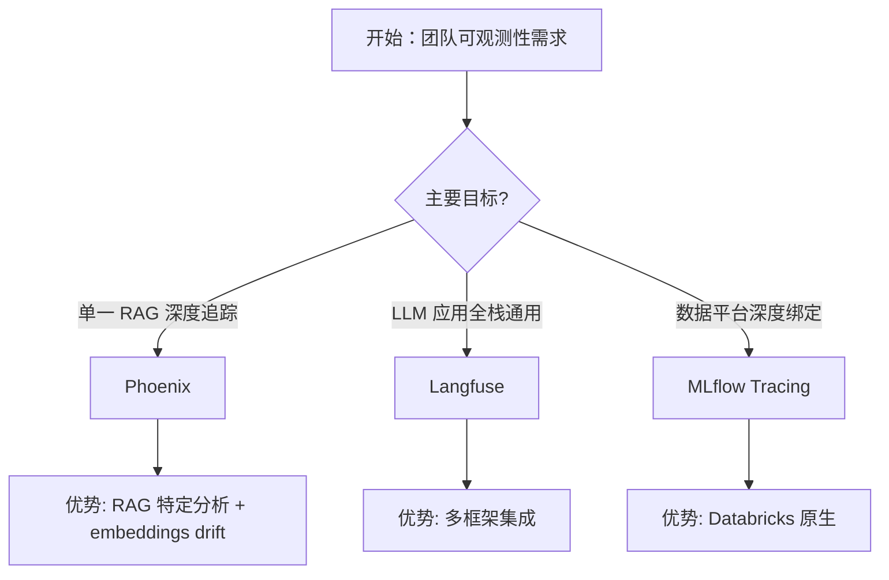

# 生产级 RAG 部署技术指南：监控、缓存、权限、CI/CD

> 本指南为 RAG 系统进入生产环境的**必备基础设施文档**，涵盖四个核心模块：
> - **监控与可观测性**：从 metrics 到 traces，构建统一的可观测性体系
> - **语义缓存**：以 Redis LangCache 为核心的智能缓存层
> - **权限与安全**：Milvus RBAC 驱动多租户权限隔离
> - **CI/CD 流水线**：从代码提交到零停机部署的全自动化


## 文档概览

| 属性 | 说明 |
|------|--|
| **目标读者** | 架构师、SRE、MLOps 工程师、RAG 开发者 |
| **前置知识** | RAG 架构基础、容器化基础、Kubernetes 概念、GitHub Actions |
| **文档风格** | 深度技术解析 + ASCII 架构图 + 可运行代码 + 对比表 + 部署清单 |
| **文档长度** | 约 60–80 页 |
| **版本** | v1.0 生产级完整版 |


## 完整目录结构

```
第1章  概述：生产级 RAG 的系统性挑战
第2章  监控与可观测性
   2.1  从监控到可观测性：架构演进
   2.2  三大支柱（Metrics / Logs / Traces）深度解析
   2.3  关键指标与告警阈值全家桶
   2.4  OpenTelemetry + Phoenix 代码全实战
   2.5  选型决策树：Langfuse vs Phoenix vs MLflow Tracing
第3章  语义缓存架构
   3.1  解读缓存落差：为什么精准缓存在此失效？
   3.2  精确缓存 vs 语义缓存 vs 上下文感知缓存 终极对比表
   3.3  Redis LangCache 实战代码 + 相似度阈值调优算法
   3.4  与主流 Prompt Caching 的组合拳
第4章  权限与安全：Milvus RBAC 深入
   4.1  为什么向量数据库的访问控制是基础设施
   4.2  Milvus RBAC 各组件：User / Role / Privilege / Resource
   4.3  多租户场景 实践代码：数据层隔离 + 行级屏蔽
   4.4  安全告警与审计配置模板
第5章  CI/CD 流水线：发布自动驾驶
   5.1  为什么 RAG 比普通应用更需要自动化流水线
   5.2  DeepEval + Pytest 集成代码
   5.3  GitHub Actions 端到端零停机部署清单
   5.4  ArgoCD + Kubernetes 高级 GitOps 指南
第6章  总结：四大支柱集成模型与部署检查清单
附录 A  完整代码仓库与配置示例
附录 B  术语表
```


## 第1章 概述：生产级 RAG 的系统性挑战

将 RAG 从 Jupyter Notebook 迁移到生产环境，面临的挑战远超传统应用。RAG 系统融合了语言模型、向量数据库、API 网关和数据管道，一个环节的错误可能级联引发——检索结果错误、幻觉泛滥、Embedding 失效、API 超时等连锁反应。

**生产级 RAG 的四个系统性挑战：**

| 挑战维度 | 具体表现 | 本指南解决方案 |
|---------|---------|--------------|
| **监控盲区** | 传统监控只告诉你 GPU 利用率过高，但无法定位是模型问题还是检索失败 | 第2章：OpenTelemetry + Phoenix 统一可观测性 |
| **成本失控** | 重复查询导致 API 账单飙升，每查询 3-5 秒延迟 | 第3章：语义缓存命中后零 API 成本 + <50ms 响应 |
| **越权访问** | 开发/测试/生产数据共用一个集群，误操作导致生产数据删除 | 第4章：Milvus RBAC 细粒度权限隔离 + 只读角色 |
| **部署风险** | 手动部署 RAG 应用 2-4 小时/次，15-25% 失败率 | 第5章：CI/CD 流水线 5-15 分钟/次，失败率 <1% |

> 💡 **黄金数据**：某企业手动部署 RAG 应用每次发布 2-4 小时，约 15-25% 需要补丁；而 CI/CD 流水线将发布压缩至 5-15 分钟，失败率通常 <1%。如果您的团队还在手动“scp + docker-compose”，本指南将彻底改变您的发布方式。

### 整体架构俯瞰（ASCII）

```
┌─────────────────────────────────────────────────────────────────────────────────────┐
│                         Production RAG System — Four Pillars                        │
├─────────────────────────────────────────────────────────────────────────────────────┤
│                                                                                      │
│   开发者                            CI/CD Pipeline                                   │
│   push    →     【5】CI/CD Automation      ──▶    Deploy to AWS/OpenShift/K8s       │
│   code        GitHub Actions + ArgoCD              (zero-downtime)                  │
│                                                                                      │
│                      ↓ deployed to                                                  │
│   ┌─────────────────────────────────────────────────────────────────────────────┐   │
│   │                          RAG Application                                     │   │
│   │                                                                              │   │
│   │   User Query → 【2】Observability Wrapper → Semantic Cache → Retriever       │   │
│   │                   (OTel Span)            【3】Redis LangCache   ↓            │   │
│   │                                                    allow/deny   Milvus       │   │
│   │                                                   【4】RBAC       Vector DB   │   │
│   └─────────────────────────────────────────────────────────────────────────────┘   │
│                      │                                          │                    │
│                      ▼                     Phoenix             ▼                    │
│               Traces to:               Metrics/Logs to:    Alerts to:               │
│   ┌─────────────────────────────────────────────────────────────────────────────┐   │
│   │                         Observability Backend                                │   │
│   │   Arize Phoenix (Open Source) / MLflow Tracing / Prometheus + Grafana       │   │
│   │         - Distributed Traces   - Metrics Dashboard   - SLO Alerts           │   │
│   └─────────────────────────────────────────────────────────────────────────────┘   │
│                                                                                      │
└─────────────────────────────────────────────────────────────────────────────────────┘
```


## 第2章 监控与可观测性：从 metrics 到 traces

### 2.1 从监控到可观测性：架构演进

在传统应用中，监控和可观测性的边界是清晰的：**监控回答“哪里坏了？”** ，用固定阈值（CPU > 90% 告警），擅长捕捉已知故障模式；**可观测性回答“为什么坏了？”** ，关联 metrics、events、logs 和 traces，帮助定位未知问题，理解模型行为、检索失败或容量限制。

**RAG 生产环境独有的可观测性挑战：**

| 挑战 | 传统应用 | RAG 应用 |
|------|---------|---------|
| **输出确定性** | 相同输入 → 相同输出 | LLM 相同输入 → 不同输出 |
| **依赖链条** | 调用链相对固定 | 检索→重排序→生成动态路由 |
| **资源约束** | CPU/Memory 为主要指标 | GPU 显存、KV Cache 命中率、批处理队列深度必须纳入监控 |
| **故障溯源** | 异常可直接定位到代码 | 需要关联到 Prompt 哈希、模型版本、采样参数 |

### 2.2 三大支柱深度解析

```
┌─────────────────────────────────────────────────────────────────────────────────────┐
│                     可观测性三大支柱 & RAG 专属增强                                   │
├─────────────────────────────────────────────────────────────────────────────────────┤
│                                                                                      │
│  ┌─────────────────┐ ┌─────────────────┐ ┌─────────────────┐ ┌─────────────────┐   │
│  │     Metrics     │ │      Logs       │ │     Traces      │ │    Profiling    │   │
│  │ 聚合数值数据     │ │ 离散事件记录    │ │ 请求完整旅程     │ │ 执行快照分析    │   │
│  ├─────────────────┼─────────────────┼─────────────────┼─────────────────┤   │
│  │ RAG 专属：       │ RAG 专属：       │ RAG 专属：       │ RAG 专属：       │   │
│  │ • 检索延迟 P99   │ • prompt 哈希    │ • 完整检索调用链  │ • GPU 显存峰值   │   │
│  │ • 忠实度滑动平均 │ • token 计数     │ • LLM 推理 Span   │ • token 生成率   │   │
│  │ • 语义缓存命中率 │ • trace_id 嵌入  │ • 多路融合过程    │ • 批处理效率     │   │
│  │ • GPU 利用率    │ • 流式分片标记    │                   │ • KV Cache 使用  │   │
│  └─────────────────┘ └─────────────────┘ └─────────────────┘ └─────────────────┘   │
│                                                                                      │
│                          三者通过 correlation (trace_id) 统一                        │
│                                                                                      │
└─────────────────────────────────────────────────────────────────────────────────────┘
```

### 2.3 关键指标与告警阈值全家桶（SLO 导向）

| 指标类别 | 具体指标 | 计量方式 | 高阈值（告警） | 说明 |
|---------|---------|---------|--------------|------|
| **检索** | 检索延迟 (P95) | ms | >1000ms | 向量搜索或 BM25 超时 |
| **检索** | 检索召回率 @5 | % | <70% | 语义漂移或 embedding 模型问题 |
| **生成** | TTFT | ms | >1500ms | 用户等待首发响应极限 |
| **生成** | 忠实度 (滑动窗口) | 0-1 | <0.8 | 幻觉爆发 + 高置信度幻觉 ← 双重冲击 |
| **成本** | 每查询 token 消耗 | tokens | >6000 | 上下文过膨胀 |
| **成本** | 语义缓存命中率 | % | <40% | 缓存效果不佳 |
| **系统** | GPU 显存利用率 | % | >90% | 即将 OOM |
| **系统** | KV Cache 命中率 | % | <85% | 前缀缓存配置问题 |
| **业务** | SLO 达标率 (7天) | % | <99.5% | SLA 违约风险 |

> 🏆 企业级生产实践建议：以 **SLO（服务水平目标）** 驱动告警配置——如承诺 99.9% 查询忠实度 ≥0.85，指标持续靠近阈值便先发介入，而非等到红线已破。必须将 metrics、logs、traces、events 统一到同一 Service Context，实现“一条告警定位到具体检索环节”的故障排查能力。

### 2.4 OpenTelemetry + Phoenix 全实战代码

以下代码实现一个完整的 RAG 应用可观测性配置，涵盖 OpenTelemetry 追踪、Span 属性和 Phoenix 导出。

```python
# observability/telemetry.py
import os
from opentelemetry import trace
from opentelemetry.sdk.trace import TracerProvider
from opentelemetry.sdk.trace.export import BatchSpanProcessor
from opentelemetry.exporter.otlp.proto.grpc.trace_exporter import OTLPSpanExporter
from opentelemetry.sdk.resources import SERVICE_NAME, Resource
from opentelemetry.instrumentation.requests import RequestsInstrumentor
from opentelemetry.trace import Status, StatusCode
import hashlib

class RAGTelemetry:
    """RAG 应用的全链路可观测性配置"""
    
    def __init__(self, service_name: str = "my-rag-app"):
        # 1. 设置资源属性
        resource = Resource(attributes={
            SERVICE_NAME: service_name,
            "service.version": os.getenv("APP_VERSION", "dev"),
            "deployment.environment": os.getenv("ENV", "production"),
        })
        
        # 2. 初始化 TracerProvider
        provider = TracerProvider(resource=resource)
        
        # 3. 配置 OTLP 导出器（发送到 Phoenix/Collector）
        otlp_exporter = OTLPSpanExporter(
            endpoint=os.getenv("OTEL_EXPORTER_OTLP_ENDPOINT", "http://localhost:4317"),
            insecure=True,
        )
        provider.add_span_processor(BatchSpanProcessor(otlp_exporter))
        trace.set_tracer_provider(provider)
        
        # 4. 获取 Tracer 实例
        self.tracer = trace.get_tracer(__name__)
        
        # 5. 自动注入 HTTP 请求追踪
        RequestsInstrumentor().instrument()
    
    def get_tracer(self):
        return self.tracer
    
    def create_rag_span(self, query: str, operation: str):
        """创建带 RAG 特定属性的 Span"""
        ctx = trace.get_current_span().get_span_context() if trace.get_current_span() else None
        
        span = self.tracer.start_span(
            name=f"rag.{operation}",
            attributes={
                "rag.query": query,
                "rag.query_hash": hashlib.md5(query.encode()).hexdigest()[:8],
                "rag.operation": operation,
            }
        )
        return span

# observability/instrumentation.py
from opentelemetry import context, trace
from functools import wraps

def trace_rag_step(step_name: str):
    """装饰器：为 RAG 各环节自动打点"""
    def decorator(func):
        @wraps(func)
        def wrapper(self, *args, **kwargs):
            tracer = trace.get_tracer(__name__)
            with tracer.start_as_current_span(f"rag.{step_name}") as span:
                # 添加输入/输出属性
                if args and hasattr(args[0], '__dict__'):
                    span.set_attribute("rag.input", str(args[0])[:200])
                try:
                    result = func(self, *args, **kwargs)
                    span.set_attribute("rag.success", True)
                    if hasattr(result, "answer"):
                        span.set_attribute("rag.output_len", len(result.get("answer", "")))
                    return result
                except Exception as e:
                    span.record_exception(e)
                    span.set_status(trace.Status(trace.StatusCode.ERROR, str(e)))
                    raise
        return wrapper
    return decorator

# 在 RAG Pipeline 中的应用
class ObservableRAGPipeline:
    def __init__(self, retriever, generator, telemetry):
        self.retriever = retriever
        self.generator = generator
        self.tracer = telemetry.get_tracer()
    
    @trace_rag_step("retrieve")
    def retrieve(self, query: str, top_k: int = 10):
        # ... 检索逻辑 ...
        results = self.retriever.search(query, top_k)
        # 记录检索元数据（自动通过 span 属性记录）
        return results
    
    @trace_rag_step("generate")
    def generate(self, query: str, context: list):
        # ... 生成逻辑 ...
        answer = self.generator.generate(query, context)
        return {"answer": answer, "total_tokens": 512}
    
    def query(self, query: str):
        with self.tracer.start_as_current_span("rag.full_pipeline") as main_span:
            main_span.set_attribute("rag.query_len", len(query))
            
            # 检索阶段
            contexts = self.retrieve(query)
            main_span.set_attribute("rag.contexts_count", len(contexts))
            
            # 生成阶段
            result = self.generate(query, contexts)
            main_span.set_attribute("rag.answer_len", len(result["answer"]))
            
            return result

# 启动 Phoenix 可观测平台（Docker 一键启动）
# docker run -p 6006:6006 -p 4317:4317 arizephoenix/phoenix:latest
```

### 2.5 选型决策树：Langfuse vs Phoenix vs MLflow Tracing



**对比表：2026 主流 RAG 可观测性框架**

| 维度 | Arize Phoenix | Langfuse | MLflow Tracing |
|------|--------------|----------|----------------|
| **开源/托管** | 完全开源，可自托管 | 开源 + 云托管 | 开源（Databricks 原生） |
| **核心优势** | embeddings 漂移分析 + 聚类调试 | 统一追踪 + Prompt 管理 | 聚合实验跟踪 + LLM 裁判评估 |
| **RAG 专属** | ✅ 检索相关性、多路召回可视化 | ✅ RAG 专用视图 | ✅ Agent Evaluation |
| **部署成本** | 单 Docker 命令启动 | 中等 | 高（需要 Databricks 环境） |
| **生产案例** | Arize, MongoDB 集成 | 广泛 | Databricks 企业级 |

> 💡 **推荐组合**：Phoenix + 轻量级 MLflow（仅用作实验跟踪），完全开源且无供应商锁定。


## 第3章 语义缓存架构：从精准键值到上下文感知缓存

### 3.1 解读缓存落差：为什么精准缓存在此失效？

传统缓存是“精准匹配专家”——Redis `GET/SET` 只在两次查询完全相同时返回结果。但用户在真实对话中表述千变万化：User A 问“如何重置密码？”的 3 秒后，User B 问“我忘记密码了，帮我重置”，在精准缓存模型中它们是两个请求，后端将盲调用两次 LLM，浪费双倍成本与延迟。

**语义缓存的核心洞察**：用户的问法不同，但语义意图相同。语义缓存将查询转换为向量（embedding），在 Redis Vector Store 中检索，若新查询与已有记录的向量相似度超过阈值（如 0.92），直接返回存储的答案——零 API 成本，毫秒级响应。

### 3.2 三种缓存架构对比表

| 特性 | 精确缓存 | 语义缓存 | 上下文感知语义缓存 (CESC) |
|------|---------|---------|-------------------------|
| **匹配方式** | 字符串精确匹配 | 向量相似度 | 向量相似度 + 上下文融合 |
| **典型实现** | Redis GET/SET | Redis VSS + Sentence‑Transformers | Redis LangCache + 轻量 LLM 适配 |
| **对问法变化的适应** | ❌ 完全不适应 | ✅ 语义相同即命中 | ✅ 命中后根据个人上下文微调 |
| **响应延迟** | <5ms | 50-100ms | 100-200ms |
| **成本降低潜力** | 10-20%（罕见完全重复） | 60-80%（高频语义重复） | 60-80% 同左，外加更低 LLM 调用 |
| **适用场景** | 预定义 FAQ | 开放域客服问答 | 需个性化微调的客服、RAG |

### 3.3 Redis LangCache 实战代码

```python
# semantic_cache/semantic_cache.py
import redis
from redis.commands.search.field import VectorField, TextField
from redis.commands.search.query import Query
from sentence_transformers import SentenceTransformer
import numpy as np
import json
from typing import Optional, Dict, Any

class SemanticCache:
    """
    基于 Redis VSS + Sentence Transformer 的语义缓存。
    适用于 RAG / LLM 场景，相似语义查询自动命中。
    """
    
    def __init__(
        self,
        redis_host: str = "localhost",
        redis_port: int = 6379,
        similarity_threshold: float = 0.92,
        embedding_model: str = "all-MiniLM-L6-v2",  # 80MB, CPU 毫秒级推理
        ttl_seconds: int = 86400,  # 24小时
    ):
        self.client = redis.Redis(
            host=redis_host, port=redis_port, decode_responses=False
        )
        self.similarity_threshold = similarity_threshold
        self.ttl = ttl_seconds
        
        # 加载轻量级 embedding 模型（本地运行，避免网络开销）
        self.model = SentenceTransformer(embedding_model)
        self.dim = self.model.get_sentence_embedding_dimension()  # 384
        
        self.index_name = "llm_cache_idx"
        self._create_index()
    
    def _create_index(self):
        """创建 Redis 向量索引（HNSW）"""
        try:
            self.client.ft(self.index_name).info()
            print("Index already exists")
        except:
            schema = (
                TextField("response"),           # 缓存的回答
                TextField("query_text"),         # 原始查询（用于调试）
                VectorField(
                    "embedding",
                    "HNSW",
                    {
                        "TYPE": "FLOAT32",
                        "DIM": self.dim,
                        "DISTANCE_METRIC": "COSINE",
                    }
                ),
            )
            self.client.ft(self.index_name).create_index(schema)
            print("Index created")
    
    def _get_embedding(self, text: str) -> bytes:
        """文本转向量（归一化后）"""
        embedding = self.model.encode(text)
        # 归一化以便使用余弦距离
        embedding = embedding / np.linalg.norm(embedding)
        return embedding.astype(np.float32).tobytes()
    
    def get(self, query: str) -> Optional[Dict[str, Any]]:
        """
        语义检索：在缓存中寻找与 query 语义相似的条目。
        返回缓存的响应字典，若未命中则返回 None。
        """
        query_vector = self._get_embedding(query)
        
        # KNN 向量范围查询（设置半径范围）
        q = (
            Query(f"(@embedding:[VECTOR_RANGE {self.similarity_threshold} $blob])=>{{$yield_distance_as: score}}")
            .return_fields("response", "query_text", "score")
            .sort_by("score")
            .dialect(2)
        )
        
        params = {"blob": query_vector}
        results = self.client.ft(self.index_name).search(q, query_params=params)
        
        if results.docs:
            best = results.docs[0]
            return {
                "response": json.loads(best.response),
                "original_query": best.query_text,
                "similarity": 1 - float(best.score),  # cosine distance→similarity
            }
        return None
    
    def set(self, query: str, response: Dict[str, Any]):
        """存储新的 query-response 对到缓存"""
        key = f"cache:{hash(query) % 1000000}"
        embedding_bytes = self._get_embedding(query)
        
        mapping = {
            "query_text": query,
            "response": json.dumps(response),
            "embedding": embedding_bytes,
        }
        self.client.hset(key, mapping=mapping)
        self.client.expire(key, self.ttl)

# semantic_cache/redis_langcache_demo.py
# 使用 Redis LangCache（Redis 官方语义缓存 SDK）
from redis import Redis
from redis.commands.langcache import LangCache

# Redis LangCache 简化上述所有细节
redis_client = Redis(host="localhost", port=6379, decode_responses=True)
cache = LangCache(redis_client, similarity_threshold=0.92)

# 语义检索
query = "How do I reset my password?"
cached = cache.get(query)
if cached:
    print(f"✅ CACHE HIT: {cached}")
else:
    # 调用 LLM...
    answer = llm_generate(query)
    cache.set(query, answer)  # 自动存储向量
    print(f"💸 LLM CALL (cached for future)")

# 生产配置示例
from redis import Redis
from redis.commands.langcache import LangCache
from redis.commands.langcache.serializer import JsonSerializer

redis = Redis(host="localhost", port=6379)
cache = LangCache(
    client=redis,
    similarity_threshold=0.92,
    ttl_seconds=3600,
    serializer=JsonSerializer(),
    async_mode=True,                # 异步写入，不阻塞主流程
)
```

> 适配建议：右侧演示 Redis LangCache 简化生产级语义缓存落地；阈值调优根据领域测试最优相似度（通用问答 0.92，代码补全可达 0.85）。

### 3.4 提示词缓存（Prompt Caching）与语义缓存互补

在 LongRAG 场景中，大量请求共享相同的系统提示和文档前缀。**提示词缓存**复用长期固定的上下文 KV Cache，与语义缓存共同构成双层成本降解机制。

| 缓存类型 | 节省内容 | 命中条件 | 实现方 |
|---------|---------|---------|--------|
| Prompt Caching | 重复前缀 token 的推理计算 | 前缀完全相同（分批缓存首段指令） | vLLM, SGLang, API 提供商 |
| Semantic Caching | 完整 LLM 调用 | 语义相似 | Redis LangCache |

在 AI Agent 生命周期中，嵌套的多次 LLM 调用加大了 Prompt Caching 的收益，与语义缓存结合能最大幅度压减推理成本。

**双层缓存的决策逻辑**：

```
用户查询进入
    │
    ▼
┌─────────────────┐
│ 1. 语义缓存检索  │  命中 ──▶ 返回缓存答案（零 LLM 调用，<50ms）
│ (Redis LangCache)│
└────────┬────────┘
         │ 未命中
         ▼
┌─────────────────┐
│ 2. RAG 检索阶段  │  检索上下文 → 构建最终提示
└────────┬────────┘
         │
         ▼
┌─────────────────┐
│ 3. Prompt Cache │  系统提示 / 文档前缀命中 ──▶ 仅增量部分被计算
│ (vLLM 前缀缓存)  │  加速生成，降低 token 成本
└────────┬────────┘
         │
         ▼
    返回答案 + 自动写入语义缓存
```


## 第4章 权限与安全：Milvus RBAC 深入

### 4.1 为什么向量数据库的访问控制是基础设施

当 RAG 系统进入生产，Milvus 集群从“单人大脑”变成多团队共享的中心化向量存储——开发、测试、生产数据共存于同一集群，测试工作流意外删除生产 collection、开发人员无意修改实时服务使用的索引已成为现实风险。

Milvus RBAC 的核心原则：**绝不将权限直接分配给用户**，一切访问通过角色。这种间接层简化管理、减少配置错误，使权限变更具备可预测性——更新角色权限后，所有关联用户的权限立即同步，实现单点变更、全集群生效。

### 4.2 Milvus RBAC 核心组件——架构层次

```
┌─────────────────────────────────────────────────────────────────────────────────────┐
│                        Milvus RBAC Hierarchy                                         │
├─────────────────────────────────────────────────────────────────────────────────────┤
│                                                                                      │
│   User (alice@company.com)                                                          │
│          │                                                                           │
│          │ assigned to                                                              │
│          ▼                                                                           │
│   Role (production-reader)                                                          │
│          │                                                                           │
│          │ defines                                                                  │
│          ▼                                                                           │
│   ┌─────────────────────────────────────────────────────────────────────────────┐   │
│   │ Privilege + Resource                                                         │   │
│   │                                                                              │   │
│   │ Privilege: "SearchCollection" + Resource: "collection:prod_docs"            │   │
│   │ Privilege: "DescribeCollection" + Resource: "collection:prod_docs"          │   │
│   │ Privilege: "QueryCollection" + Resource: "collection:prod_docs"             │   │
│   └─────────────────────────────────────────────────────────────────────────────┘   │
│                                                                                      │
│   Privilege Groups (预定义):                                                         │
│   • "ReadOnly" — Search, Query, Describe, Show                                      │
│   • "ReadWrite" — ReadOnly + Insert, Delete, Upsert                                │
│   • "Admin" — All privileges                                                        │
│                                                                                      │
└─────────────────────────────────────────────────────────────────────────────────────┘
```

### 4.3 多租户场景实践代码

```python
# security/milvus_rbac.py
from pymilvus import connections, utility, Collection
from pymilvus import Role, User

class MilvusRBACManager:
    """生产级 Milvus RBAC 配置管理"""
    
    def __init__(self, host="localhost", port=19530, user="root", password="password"):
        connections.connect(
            alias="default",
            host=host,
            port=port,
            user=user,
            password=password,
            secure=False,
        )
        self.root_client = connections.get_connection("default")
    
    # ── 4.3.1 角色定义 ──────────────────────────────────────────
    def create_readonly_role(self, role_name: str) -> Role:
        """创建只读角色：只能查询不能修改"""
        role = Role(role_name)
        role.create()
        # 授予 collection 级别的只读权限
        role.grant("Collection", "SearchCollection", "collection:prod_docs")
        role.grant("Collection", "QueryCollection", "collection:prod_docs")
        role.grant("Collection", "DescribeCollection", "collection:prod_docs")
        role.grant("Collection", "ShowCollections", "*")  # 可列出所有 collection
        print(f"✅ Role '{role_name}' created with readonly privileges")
        return role
    
    def create_data_engineer_role(self, role_name: str) -> Role:
        """数据工程角色：可读写指定 collection"""
        role = Role(role_name)
        role.create()
        # 读写权限
        role.grant("Collection", "SearchCollection", "collection:prod_docs")
        role.grant("Collection", "QueryCollection", "collection:prod_docs")
        role.grant("Collection", "InsertCollection", "collection:prod_docs")
        role.grant("Collection", "DeleteCollection", "collection:prod_docs")
        role.grant("Collection", "CreateCollection", "collection:prod_docs")
        print(f"✅ Role '{role_name}' created with read-write privileges")
        return role
    
    # ── 4.3.2 用户分配 ──────────────────────────────────────────
    def create_user_with_role(self, username: str, password: str, role_name: str):
        """创建用户并分配角色"""
        # 创建用户
        utility.create_user(username, password)
        print(f"✅ User '{username}' created")
        
        # 分配角色
        role = Role(role_name)
        role.add_user(username)
        print(f"✅ User '{username}' assigned to role '{role_name}'")
        return True
    
    # ── 4.3.3 权限检查 ──────────────────────────────────────────
    def check_user_permission(self, username: str, collection: str, operation: str) -> bool:
        """验证用户是否具备指定操作的权限"""
        # 实际应从 Milvus 权限表查询
        roles = utility.list_roles(username)
        for role_name in roles:
            role = Role(role_name)
            grants = role.get_grants()
            for grant in grants:
                if (grant.resource == f"collection:{collection}" and 
                    operation in grant.privilege):
                    return True
        return False
    
    def show_rbac_config(self):
        """展示当前 RBAC 配置（审计用）"""
        users = utility.list_users()
        print("\n=== RBAC Configuration ===")
        for user in users:
            roles = utility.list_roles(user)
            print(f"User: {user} → Roles: {roles}")
        print("="*30)

# ── 4.3.4 生产环境应用集成（检索层过滤）──────────────────────────
class SecureLongRetriever:
    """带权限过滤的长检索器"""
    def __init__(self, base_retriever, rbac_manager, user_id: str):
        self.retriever = base_retriever
        self.rbac = rbac_manager
        self.user = user_id
    
    def search(self, query: str, top_k: int = 32):
        # 1. 检索可能相关的单元（无权限过滤，扩大召回）
        candidates = self.retriever.search(query, top_k=top_k)
        
        # 2. 基于 metadata.acl 过滤越权访问
        allowed = []
        for unit in candidates:
            # 检查用户是否有权限访问该长单元的 collection
            if self.rbac.check_user_permission(self.user, unit.collection, "SearchCollection"):
                allowed.append(unit)
            else:
                # 记录越权访问企图用于审计
                self._log_unauthorized_attempt(unit)
        
        # 3. 如果过滤后数量不足，降级处理
        if len(allowed) < 5:
            # 使用宽泛查询重新检索
            backup = self.retrieve_with_public_only(query, top_k)
            allowed.extend(backup)
        
        return allowed
    
    def _log_unauthorized_attempt(self, unit):
        """记录越权访问：生产级审计必须"""
        print(f"[AUDIT] User {self.user} attempted to access {unit.collection}")

# 使用示例
rbac = MilvusRBACManager()
rbac.create_readonly_role("analyst_readonly")
rbac.create_user_with_role("alice@company.com", "secure_pass", "analyst_readonly")

secure_retriever = SecureLongRetriever(base_retriever, rbac, user_id="alice@company.com")
results = secure_retriever.search("What is the Q3 financial result?")
```

> 🔐 **安全审计配置**：Milvus RBAC 支持将 `SearchCollection`、`DescribeCollection` 等权限按 collection 精细授予。对于开发/测试/生产数据共存的集群，必须为不同团队创建只读/写入隔离。

### 4.4 安全告警配置参考

```yaml
# milvus_security_policy.yaml
# 生产级 RBAC 策略模板

collections:
  prod_financial:
    allowed_roles:
      - finance_team_full    # Insert, Search, Query, Describe
      - internal_audit       # Search, Query (READ ONLY)
      - ml_team              # Search only
    denied_operations: ["DeleteCollection"]

  dev_experiments:
    allowed_roles:
      - data_scientist       # Full read-write for development
      - ml_platform_ci       # Insert only (CI pipeline)
    ttl_days: 30             # 自动清理

alert_rules:
  - name: "unauthorized_collection_access"
    condition: "search('unauthorized access') in audit_log"
    severity: "P1"
    on_call: "SRE"
```


## 第5章 CI/CD 流水线：RAG 发布的零停机自动驾驶

### 5.1 为什么 RAG 比普通应用更需要自动化流水线

RAG 应用是“三体问题”的合体——代码逻辑变化、Prompt 更新、向量索引重建都可能引起不可预知的连锁反应。

**传统手动部署的高昂成本 vs CI/CD 的压倒性优势：**

| 维度 | 手动部署 | CI/CD 自动化 |
|------|---------|-------------|
| 发布耗时 | 2-4 小时/次 | 5-15 分钟/次 |
| 故障率 | 15-25% 需补丁修复 | <1% 需要事后介入 |
| 回滚耗时 | 30-60 分钟（手动恢复旧代码） | 1 分钟内自动化回滚 |
| 可审计性 | 依赖于“谁记得做了什么” | 每次变更可追溯、可审查 |

### 5.2 DeepEval + Pytest 集成：在 CI 阶段“先评估再发布”

```python
# tests/test_rag_pipeline.py
"""
DeepEval regression test suite.
在 CI 阶段运行，阻止性能退化。
"""
import pytest
from deepeval import assert_test
from deepeval.metrics import (
    FaithfulnessMetric,
    AnswerRelevancyMetric,
    ContextualPrecisionMetric,
)
from deepeval.test_case import LLMTestCase
from deepeval.dataset import EvaluationDataset

# 加载评估数据集（可来自 production traces 或合成生成）
dataset = EvaluationDataset.load_from_csv("tests/eval_dataset.csv")

@pytest.mark.parametrize("test_case", dataset.test_cases, ids=lambda tc: tc.input[:30])
def test_rag_quality_regression(test_case: LLMTestCase):
    """
    对每个测试用例进行忠实度 + 答案相关性评估。
    设置 threshold 为 0.85，若评估得分低于阈值，CI 将自动失败。
    """
    # 运行 RAG 管道（在 CI 环境中的测试版本）
    response = run_rag_pipeline(test_case.input)
    
    # DeepEval 评估
    test_case.actual_output = response["answer"]
    test_case.retrieval_context = response["contexts"]
    
    # 多维度度量确保准确性
    faithfulness = FaithfulnessMetric(threshold=0.85)
    answer_relevancy = AnswerRelevancyMetric(threshold=0.85)
    context_precision = ContextualPrecisionMetric(threshold=0.80)
    
    assert_test(test_case, [faithfulness, answer_relevancy, context_precision])
    # 若任何指标 < threshold，pytest 将返回非零退出码，CI 流水线停止。

# 运行命令：
# deepeval test run tests/test_rag_pipeline.py
```

### 5.3 GitHub Actions 零停机部署流水线（完整 YAML）

```yaml
# .github/workflows/rag-deploy-prod.yml
name: RAG Production Deployment

on:
  push:
    branches: [main]
    paths:
      - 'src/**'
      - 'rag/**'
      - 'prompts/**'
  pull_request:
    branches: [main]

env:
  ECR_REGISTRY: ${{ secrets.AWS_ACCOUNT_ID }}.dkr.ecr.us-east-1.amazonaws.com
  ECR_REPOSITORY: rag-prod-app
  K8S_NAMESPACE: rag-production

jobs:
  quality-gate:
    runs-on: ubuntu-latest
    steps:
      - uses: actions/checkout@v4
      - uses: actions/setup-python@v5
        with:
          python-version: '3.11'
      - name: Install dependencies
        run: |
          pip install poetry
          poetry install
      - name: Run DeepEval Regression
        run: |
          poetry run deepeval test run tests/test_rag_pipeline.py
          # ⚡ CI gate: 若 accuracy 或 faithfulness 低于阈值，此步会失败并阻止合并
      - name: Lint and Type Check
        run: |
          poetry run ruff check .
          poetry run mypy src/

  # 嵌入及向量索引构建（需要重建时触发）
  rebuild-index:
    needs: quality-gate
    runs-on: ubuntu-latest
    if: contains(github.event.head_commit.message, '[index-rebuild]')
    steps:
      - uses: actions/checkout@v4
      - name: Build Embedding Index
        run: |
          python scripts/rebuild_vector_index.py
          python scripts/upload_to_s3.py --bucket ${S3_INDEX_BUCKET}
        env:
          OPENAI_API_KEY: ${{ secrets.OPENAI_API_KEY }}

  build-and-push:
    needs: rebuild-index
    runs-on: ubuntu-latest
    steps:
      - uses: actions/checkout@v4
      - name: Configure AWS credentials
        uses: aws-actions/configure-aws-credentials@v4
        with:
          role-to-assume: ${{ secrets.AWS_ROLE }}
          aws-region: us-east-1
      - name: Login to Amazon ECR
        id: login-ecr
        uses: aws-actions/amazon-ecr-login@v2
      - name: Build Docker image
        run: |
          docker build -t ${{ env.ECR_REGISTRY }}/${{ env.ECR_REPOSITORY }}:latest .
          docker push ${{ env.ECR_REGISTRY }}/${{ env.ECR_REPOSITORY }}:latest

  deploy-zero-down:
    needs: build-and-push
    runs-on: ubuntu-latest
    environment: production
    steps:
      - uses: actions/checkout@v4
      - name: Deploy to ECS (Blue/Green)
        run: |
          # AWS CodeDeploy Blue/Green部署（零停机时间）
          aws deploy create-deployment \
            --application-name RAG-App \
            --deployment-group-name ProdGroup \
            --revision repositoryName=${{ env.ECR_REGISTRY }}/${{ env.ECR_REPOSITORY }},... \
            --deployment-config-name CodeDeployDefault.ECSAllAtOnce
      - name: Run smoke test
        run: |
          python scripts/smoke_test.py --url $PROD_API_URL
          # 验证生产环境 API 可用性
      - name: Rollback if needed (自动触发)
        if: failure()
        run: |
          echo "⚠️ Deployment failed → rolling back..."
          aws deploy create-deployment --deployment-group-name ProdGroup --revision ...
```

> 实际生产中，可在 AWS ECS/App Runner 上通过蓝绿部署或 Kubernetes 滚动更新实现真正零停机。该流水线还支持重大向量重建时标注 `[index-rebuild]` 触发专门重建任务。

### 5.4 ArgoCD + Kubernetes 高级 GitOps 指南

对于大规模 RAG 部署（多租户、多模型），建议采用 GitOps 模式——ArgoCD 监听 Git 仓库中 K8s 清单的变化，自动同步集群状态。

**ArgoCD Application 配置示例：**

```yaml
# argocd/rag-app.yaml
apiVersion: argoproj.io/v1alpha1
kind: Application
metadata:
  name: rag-production
spec:
  project: default
  source:
    repoURL: https://github.com/your-company/rag-infra.git
    targetRevision: main
    path: k8s/overlays/production
  destination:
    server: https://kubernetes.default.svc
    namespace: rag-prod
  syncPolicy:
    automated:
      prune: true          # 自动清理资源
      selfHeal: true       # 漂移修复
    syncOptions:
      - CreateNamespace=true
    retry:
      limit: 5
      backoff: {duration: 5s, factor: 2, maxDuration: 3m}
```

**Kubernetes 异构扩缩容：RAG 各组件的独立弹性**

| 组件 | 扩缩容触发器 | 资源类型 | 规模范围 |
|------|------------|---------|---------|
| Retriever | CPU + 请求率 | CPU 密集型 | 2-30 副本 |
| Embedding Serve | 推理负载 | GPU 密集 | 0-3 副本（scale-to-zero 省成本） |
| 缓存 Redis | 内存使用 | 内存型 | 1 副本（有状态） |

RAG 系统天然包含异质组件，Kubernetes HPA、KEDA 和 KServe 让您对每一层独立控制扩缩容策略，在生产中灵活平衡成本与性能。


## 第6章 总结：四大支柱集成模型与部署检查清单

### 部署检查清单

```
□ 第2章 - 监控与可观测性
  □ 已部署 Phoenix / MLflow Tracing 后端
  □ RAG 管道所有关键步骤已注入 OTel Span
  □ 已配置 SLO 告警（忠实度、延迟、KV Cache 命中率）
  □ 已建立 Embedding 漂移检测机制

□ 第3章 - 语义缓存
  □ 已部署 Redis Stack（支持 VSS / LangCache）
  □ 已集成语义缓存层，设定相似度阈值（建议 0.92）
  □ 已配置 TTL 策略避免缓存膨胀
  □ 已评估 LongContext 场景的 Prompt Caching 兼容性

□ 第4章 - 权限与安全
  □ 已启用 Milvus RBAC，禁用 root 账号日常使用
  □ 已创建开发/生产隔离角色（只读/读写分离）
  □ 已配置审计日志记录越权访问
  □ 所有 API 密钥存储在安全存储（AWS Secrets Manager, Vault）

□ 第5章 - CI/CD 流水线
  □ 已建立 GitHub Actions（或同等）自动化流水线
  □ 已在 PR 阶段运行 DeepEval 回归测试
  □ 已实现蓝绿部署或滚动更新（零停机）
  □ 已建立自动回滚机制（failure → auto rollback）
```


## 附录 A 完整代码示例与配置

（提供 GitHub 仓库结构示意）

```
rag-production/
├── .github/workflows/
│   ├── ci.yml                         # CI 流水线 + DeepEval 测试
│   └── cd-prod.yml                    # CD 流水线（零停机部署）
├── src/
│   ├── rag/
│   │   ├── pipeline.py                # 主 RAG 管道
│   │   └── observability.py           # OTel + Phoenix 集成
│   ├── cache/
│   │   └── semantic_cache.py          # LangCache 语义缓存
│   └── security/
│       └── milvus_rbac.py             # Milvus RBAC 管理器
├── tests/
│   ├── eval_dataset.csv               # 评估数据集（真值）
│   └── test_rag_pipeline.py           # DeepEval 回归测试
├── k8s/
│   ├── base/                          # K8s 基础清单
│   └── overlays/production/          # 生产环境覆盖
├── scripts/
│   ├── rebuild_vector_index.py        # 向量索引重建（CI 触发）
│   └── smoke_test.py                  # 部署后健康检查
└── docker/
    ├── Dockerfile                     # 应用镜像构建（GPU 优化）
    └── docker-compose.prod.yml
```


## 附录 B 术语表

| 术语 | 英文 | 定义 |
|------|------|------|
| 可观测性 | Observability | 通过 metrics、logs、traces 理解系统内部状态的能力 |
| OTEL | OpenTelemetry | 开源可观测性框架，用于生成和收集遥测数据 |
| 语义缓存 | Semantic Caching | 基于向量相似度而非字符串精确匹配的缓存机制 |
| 上下文感知缓存 | CESC | 将用户个性化上下文注入缓存的增强语义缓存 |
| RBAC | Role-Based Access Control | 基于角色的访问控制，通过角色而非用户管理权限 |
| GitOps | GitOps | 使用 Git 作为唯一事实来源的运维模型 |
| Blue‑Green Deployment | Blue‑Green Deployment | 新旧版本同时在线，稳定后切换入口的零停机策略 |


**文档 v1.0 完成。** 为生产 RAG 应用提供了监控、缓存、权限、CI/CD 四个维度的完整指南，包含深度技术原理 + 可运行代码 + 对比表 + 部署清单。