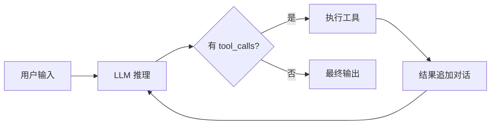

# LangChain 全解析

> **在知识图谱中的位置**：模块二 · 02_核心框架 · 第 1 节
> **难度**：⭐⭐⭐ | **前置知识**：Agent 基础概念

---

## 1. 概述

**LangChain** 是最流行的 Agent 开发框架（200K+ GitHub Stars）。它提供一套完整的 Agent 组件：链（Chain）、代理（Agent）、记忆（Memory）、工具（Tool）和输出解析器。

核心理念：**将 LLM 调用与其他组件连接成链**，让 Agent 像流水线一样工作。

---

## 2. 核心概念

### 2.1 LangChain 核心组件

```
LangChain 架构:
  ┌─────────────────────────────────────────┐
  │              LangChain                   │
  ├──────────┬──────────┬─────────┬─────────┤
  │  LLMs    │ Prompts  │ Chains  │ Agents  │
  │ (模型)   │ (提示)   │ (链)   │ (代理)   │
  ├──────────┼──────────┼─────────┼─────────┤
  │  Memory  │  Tools   │ Indexes │ Callbacks│
  │ (记忆)   │ (工具)   │ (索引) │ (回调)   │
  └──────────┴──────────┴─────────┴─────────┘
```

| 组件 | 功能 | 类比 |
|------|------|------|
| **LLMs** | 模型接口统一 | 模型适配器 |
| **Prompts** | 提示管理/模板化 | 提示模板库 |
| **Chains** | 多步骤串联 | 管道流水线 |
| **Agents** | 工具调用决策 | 决策引擎 |
| **Memory** | 对话历史管理 | 短期记忆 |
| **Tools** | 外部功能注册 | 工具库 |
| **Indexes** | 文档检索索引 | 知识库 |

### 2.2 Agent 类型

| 类型 | 特点 | 适用场景 |
|------|------|--|-|
| **ReAct Agent** | 推理+行动交替 | 通用 Agent |
| **OpenAI Functions Agent** | 基于 Function Calling | GPT-4 |
| **Conversational Agent** | 对话式 + 工具 | 客服 Agent |
| **XML Agent** | XML 格式输出 | 结构化输出 |
| **Self-Ask Agent** | 自我提问+回答 | 复杂推理 |
| **Plan-and-Execute** | 先规划后执行 | 多步任务 |

---

## 3. 技术原理

### 3.1 LangChain Agent 执行流程



### 3.2 ReAct Agent 核心代码

```python
from langchain.agents import create_react_agent, Tool
from langchain_openai import ChatOpenAI
from langchain import hub

# 1. 定义 LLM
llm = ChatOpenAI(model="gpt-4o", temperature=0)

# 2. 定义工具
tools = [
    Tool(
        name="get_weather",
        func=lambda loc: f"{loc}: 25°C 晴",
        description="获取指定城市天气"
    ),
    Tool(
        name="search_web",
        func=lambda q: f"搜索结果 for '{q}'",
        description="在网上搜索信息"
    )
]

# 3. 加载 ReAct 提示词模板
prompt = hub.pull("hwchase17/react")

# 4. 创建 Agent
agent = create_react_agent(
    llm=llm,
    tools=tools,
    prompt=prompt
)

# 5. 执行
agent_executor = {"agent": agent}
result = agent_executor.invoke({"input": "北京明天天气如何？"})
print(result["output"])
```

### 3.3 链式编排

```python
from langchain.chains import SequentialChain
from langchain.prompts import PromptTemplate

# 步骤 1: 理解用户意图
intent_prompt = PromptTemplate(
    input_variables=["text"],
    template="分析以下文本的情感: {text}"
)

# 步骤 2: 基于情感生成回复
reply_prompt = PromptTemplate(
    input_variables=["sentiment", "text"],
    template="以{sentiment}情感回复: {text}"
)

# 串联执行
chain = intent_prompt | llm | reply_prompt
```

---

## 4. 实践指南

### 4.1 完整 Agent 示例

```python
from langchain.agents import AgentExecutor, create_openai_functions_agent
from langchain_openai import ChatOpenAI
from langchain.tools import Tool
from langchain import hub
from langchain.memory import ConversationBufferMemory

# 工具
def get_weather(location: str) -> str:
    return f"{location}: 25°C, 晴"

def calculate_tax(income: float) -> str:
    return f"税额: {income * 0.2:.2f}元"

tools = [
    Tool(
        name="get_weather",
        func=get_weather,
        description="获取指定城市的天气"
    ),
    Tool(
        name="calculate_tax",
        func=calculate_tax,
        description="计算个人所得税"
    )
]

# Agent
llm = ChatOpenAI(model="gpt-4o", temperature=0)
prompt = hub.pull("hwchase17/openai-functions-agent")
memory = ConversationBufferMemory()

agent = create_openai_functions_agent(llm, tools, prompt)
agent_executor = AgentExecutor(
    agent=agent,
    tools=tools,
    verbose=True,
    memory=memory
)

# 运行
result = agent_executor.invoke({"input": "北京天气和年收入50万的税额"})
print(result["output"])
```

### 4.2 最佳实践

1. **Prompt 管理** — 用 hub.pull 加载标准提示词
2. **工具描述精确** — 每个工具描述要清晰
3. **Memory 选择** — 简单用 ConversationBufferMemory，复杂用 ConversationSummaryMemory
4. **错误处理** — 工具失败时返回错误信息给 Agent

### 4.3 常见陷阱

| 陷阱 | 解法 |
|------|------|
| 循环调用 | 设 max_iterations |
| 提示词冲突 | 简化工具描述 |
| 记忆爆炸 | 用 SummaryMemory |
| 工具调用失败 | 加 error_handling |

---

## 5. 方案对比

| 方案 | 优势 | 劣势 |
|------|------|------|
| LangChain | 生态最大 | 重, 版本迭代快 |
| LangGraph | 有状态 | 学习曲线 |
| LlamaIndex | RAG 最强 | Agent 弱 |
| OpenAI SDK | 轻量 | 仅 OpenAI |

---

## 6. 工具链

| 工具 | 用途 |
|------|------|
| LangSmith | LangChain 专用追踪 |
| LangServe | 部署 LangChain 应用 |
| hub.pull | 共享提示词模板 |

---

## 7. 参考资料

- [LangChain 官方文档](https://python.langchain.com/)
- [LangChain Hub](https://smith.langchain.com/hub)
- [LangChain Agents 文档](https://python.langchain.com/docs/modules/agents/)

---

## 8. 学习路径

1. **Level 1** — 用 LangChain 写一个 ReAct Agent
2. **Level 2** — 实现自定义工具链
3. **Level 3** — 理解 LangGraph 有向图编排
4. **Level 4** — 用 LangServe 部署
5. **Level 5** — 阅读 LangChain 源码架构
