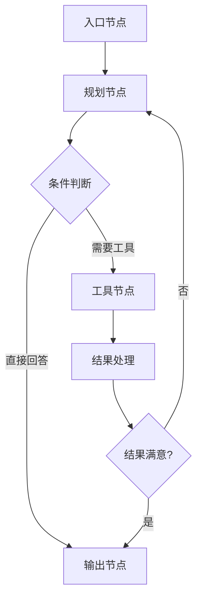

# LangGraph 有向图编排

> **在知识图谱中的位置**：模块二 · 02_核心框架 · 第 2 节
> **难度**：⭐⭐⭐ | **前置知识**：LangChain 基础

---

## 1. 概述

**LangGraph** 是 LangChain 团队推出的有向图编排框架，用于构建**有状态、可循环**的 Agent 工作流。

核心差异：LangChain 的 Chain 是**无状态链式**（线性执行），LangGraph 是**有状态图式**（可循环、可分支）。

---

## 2. 核心概念

### 2.1 LangGraph 的三大核心概念

| 概念 | 说明 | 类比 |
|------|------|------|
| **Node** | 图中的节点，执行具体逻辑 | 函数/步骤 |
| **Edge** | 节点之间的连线，定义流向 | 路由/分支 |
| **State** | 跨节点共享的状态数据 | 内存/上下文 |

### 2.2 图结构示例

```
         ┌─────→ 评估 →─────┐
         │                    │
  入口 → 规划 → 执行 → 反思   │
         │          ↑        │
         └──────────┴────────┘
              循环边（可反馈）
```

### 2.3 适用场景

- Agent 需要**循环决策**（执行→评估→修正→再执行）
- 工作流有**分支和合并**
- 需要**持久化状态**（跨步骤保存进度）
- Agent 需要**中断和恢复**

---

## 3. 技术原理

### 3.1 LangGraph 执行模型



### 3.2 完整代码示例

```python
from langgraph.graph import StateGraph, START, END
from typing import TypedDict, Annotated
import operator

# 1. 定义状态（跨节点共享）
class AgentState(TypedDict):
    messages: Annotated[list, operator.add]  # 消息列表（累加）
    step_count: int  # 步骤计数
    final_answer: str  # 最终答案

# 2. 定义节点（每个节点是一个函数）
def planner(state: AgentState) -> AgentState:
    """规划节点：分析任务并生成计划"""
    return {"messages": [{"role": "assistant", "content": "计划: 先查天气"}], "step_count": 1}

def tool_caller(state: AgentState) -> AgentState:
    """工具调用节点：执行具体工具"""
    result = get_weather("北京")  # 你的工具逻辑
    return {"messages": [{"role": "tool", "content": result}]}

def evaluator(state: AgentState) -> AgentState:
    """评估节点：检查结果是否满意"""
    if state["step_count"] > 3:
        return {"final_answer": "无法完成，超过最大步骤"}
    return {"messages": [{"role": "assistant", "content": "结果 OK"}]}

# 3. 定义图
graph_builder = StateGraph(AgentState)

# 添加节点
graph_builder.add_node("planner", planner)
graph_builder.add_node("tool_caller", tool_caller)
graph_builder.add_node("evaluator", evaluator)

# 添加边（路由逻辑）
graph_builder.add_edge(START, "planner")
graph_builder.add_conditional_edges(
    "evaluator",
    lambda s: "tool_caller" if s["step_count"] <= 3 else "final",
    {"tool_caller": "tool_caller", "final": END}
)
graph_builder.add_edge("tool_caller", "evaluator")
graph_builder.add_edge("planner", "evaluator")

# 4. 编译并运行
graph = graph_builder.compile()
result = graph.invoke({"messages": [{"role": "user", "content": "北京天气"}]})
```

### 3.3 状态持久化

```python
# LangGraph 内置检查点机制
from langgraph.checkpoint.memory import MemorySaver

checkpointer = MemorySaver()
graph = graph_builder.compile(checkpointer=checkpointer)

# 跨会话恢复
thread = {"config": {"configurable": {"thread_id": "session-001"}}}
result = graph.invoke({"input": "北京天气"}, thread)
# 后续可直接从 thread_id 恢复
```

---

## 4. 实践指南

### 4.1 最佳实践

1. **状态类型化** — 用 TypedDict 定义状态结构
2. **节点职责单一** — 每个节点只做一件事
3. **条件边明确** — 用 lambda 函数定义分支逻辑
4. **检查点必加** — 生产环境必须有持久化

### 4.2 常见陷阱

| 陷阱 | 解法 |
|------|------|
| 无限循环 | 加 step_count 限制 |
| 状态过大 | 定期压缩/摘要 |
| 分支太多 | 用子图拆分 |
| 调试困难 | 用 LangSmith 追踪 |

---

## 5. 方案对比

| 方案 | 循环能力 | 状态管理 | 复杂度 |
|------|------|------|--|-|
| LangGraph | ✅ 有向图 | ✅ TypedDict | 中 |
| LangChain Chain | ❌ 线性 | ❌ 无 | 低 |
| 代码 if-else | ✅ | 手动 | 中 |
| 工作流引擎 | ✅ | ✅ | 高 |

---

## 6. 参考资料

- [LangGraph 官方文档](https://langchain-ai.github.io/langgraph/)
- [LangGraph 博客](https://blog.langchain.dev/langgraph/)

---

## 7. 学习路径

1. **Level 1** — 写一个有向图 Agent
2. **Level 2** — 理解状态持久化
3. **Level 3** — 实现条件分支
4. **Level 4** — 用子图拆分复杂逻辑
5. **Level 5** — 阅读 LangGraph 源码
