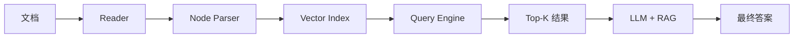

# LlamaIndex 检索优先

> **在知识图谱中的位置**：模块二 · 02_核心框架 · 第 3 节
> **难度**：⭐⭐ | **前置知识**：RAG 基础

---

## 1. 概述

**LlamaIndex**（原 GPT Index）是**检索优先**的 Agent 框架，专注于将私有数据连接到大语言模型。它不是通用 Agent 框架，而是**知识库 + 检索**专家。

核心理念：**数据先于模型** — 先构建索引，再用 Agent 检索。

---

## 2. 核心概念

### 2.1 LlamaIndex 核心组件

| 组件 | 功能 | 类比 |
|------|------|------|
| **Reader** | 文档加载器 | 文件阅读器 |
| **Node Parser** | 切分文档为节点 | 分块器 |
| **Index** | 构建检索索引 | 知识库索引 |
| **Query Engine** | 查询检索结果 | 语义搜索 |
| **Chat Engine** | 对话式问答 | RAG 聊天 |
| **Storage** | 持久化索引 | 索引缓存 |

### 2.2 索引类型

| 索引类型 | 适合场景 | 特点 |
|------|--|-|--|
| **VectorStoreIndex** | 语义检索 | 向量相似度 |
| **KeywordIndex** | 关键词检索 | 精确匹配 |
| **KnowledgeGraphIndex** | 知识图谱检索 | 实体关系 |
| **SummaryIndex** | 摘要检索 | 全文摘要 |
| **ListIndex** | 简单列表 | 顺序匹配 |

---

## 3. 技术原理

### 3.1 LlamaIndex Agent 工作流程



### 3.2 完整示例

```python
from llama_index.core import VectorStoreIndex, SimpleDirectoryReader, Settings
from llama_index.llms.openai import OpenAI
from llama_index.embeddings.openai import OpenAIEmbedding

# 1. 加载文档
documents = SimpleDirectoryReader("./data").load_data()

# 2. 设置模型
Settings.llm = OpenAI(model="gpt-4o")
Settings.embed_model = OpenAIEmbedding(model="text-embedding-3-small")

# 3. 构建索引
index = VectorStoreIndex.from_documents(documents)

# 4. 查询引擎
query_engine = index.as_query_engine(
    similarity_top_k=5,
    response_mode="tree_summarize"  # 多文档总结模式
)

# 5. 执行查询
response = query_engine.query("AI Agent 的核心技术是什么？")
print(response)

# 6. 对话模式
chat_engine = index.as_chat_engine(chat_mode="condense_question")
chat_response = chat_engine.chat("帮我总结一下")
print(chat_response.response)
```

### 3.3 高级查询模式

```python
# 混合检索（向量 + 关键词）
from llama_index.core.vector_stores import (
    MetadataFilter, MetadataFilters, FilterCondition
)

query_engine = index.as_query_engine(
    similarity_top_k=5,
    filters=MetadataFilters(
        filters=[
            MetadataFilter(key="year", value="2025"),
        ],
        condition=FilterCondition.AND,
    )
)
```

---

## 4. 实践指南

### 4.1 最佳实践

1. **文档预处理** — 清洗、分块大小 500-1000 tokens
2. **嵌入模型选择** — text-embedding-3-large 效果好但贵
3. **查询优化** — 用 Condense+Question 模式减少噪声
4. **索引更新** — 增量更新而非全量重建

### 4.2 常见陷阱

| 陷阱 | 解法 |
|------|------|
| 检索不相关 | 调整 chunk_size |
| 向量数据库漂移 | 定期重新索引 |
| 查询超时 | 设 similarity_top_k |
| Token 超限 | 用 response_mode=tree_summarize |

---

## 5. 工具链

| 工具 | 用途 |
|------|------|
| LlamaParse | 高级文档解析 |
| LlamaCloud | 托管索引服务 |
| Chroma/Pinecone | 向量存储后端 |

---

## 6. 参考资料

- [LlamaIndex 官方文档](https://docs.llamaindex.ai/)
- [LlamaIndex GitHub](https://github.com/run-llama/llama_index)

---

## 7. 学习路径

1. **Level 1** — 用 VectorStoreIndex 建知识库
2. **Level 2** — 理解不同索引类型
3. **Level 3** — 实现混合检索
4. **Level 4** — LlamaIndex + Agent 框架组合
5. **Level 5** — 贡献 LlamaIndex
