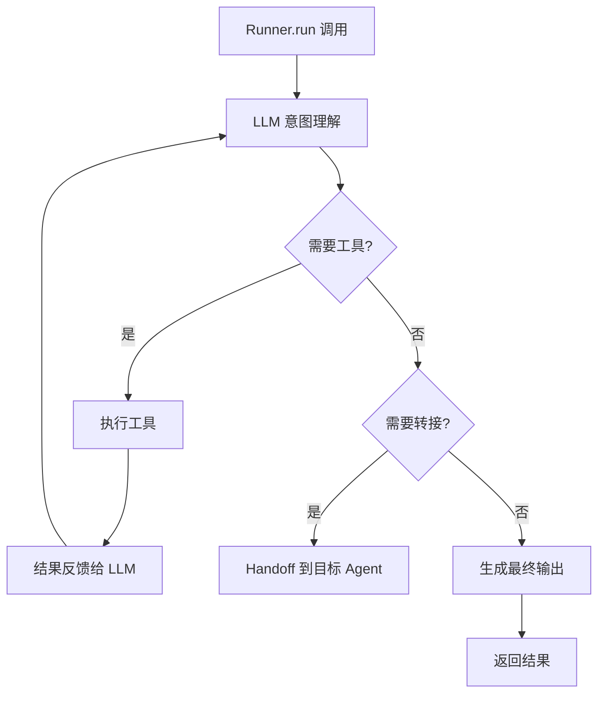

# OpenAI Agents SDK

> **在知识图谱中的位置**：模块二 · 02_核心框架 · 第 4 节
> **难度**：⭐⭐⭐ | **前置知识**：Agent 基础概念

---

## 1. 概述

**OpenAI Agents SDK** 是 OpenAI 官方推出的轻量 Agent SDK，核心理念是**最小代码实现 Agent** — 不需要 LangChain 那样的重型框架，直接定义 Agent（名称+指令+工具）即可运行。

这是 2025 年 AI Agent 领域最大的趋势之一：**框架退场，Agent 原生**。

---

## 2. 核心概念

### 2.1 Agent SDK 的三大核心对象

| 对象 | 功能 | 类比 |
|------|------|------|
| **Agent** | Agent 定义（名称+指令+工具） | Agent 实例 |
| **Handoff** | Agent 间交接 | 转接 |
| **Guardrail** | 输入/输出安全护栏 | 安全检查 |

### 2.2 Agent 的编排方式

| 编排方式 | 描述 | 示例 |
|------|------|------|
| **代码编排** | 手动控制 Agent 流程 | if-else + Runner |
| **LLM 编排** | 让 LLM 决定执行哪个 Agent | context 中定义多个 Agent |
| **混合编排** | 代码+LLM 混合 | 推荐方式 |

---

## 3. 技术原理

### 3.1 单 Agent 示例

```python
from agents import Agent, Runner

weather_agent = Agent(
    name="WeatherAgent",
    instructions="你是一个天气查询助手。当用户询问天气时，调用 get_weather 工具。",
    tools=[get_weather_tool],
    handoffs=[escalation_agent],  # 可转接的 Agent
    guardrails=[content_guardrail]  # 安全护栏
)

# 运行 Agent
result = await Runner.run(weather_agent, "北京明天天气怎么样？")
print(result.final_output)
```

### 3.2 多 Agent 编排

```python
from agents import Agent, Runner, Handoff

# 定义多个 Agent
researcher = Agent(
    name="Researcher",
    instructions="搜索最新 AI Agent 论文",
    tools=[arxiv_search_tool]
)

writer = Agent(
    name="Writer",
    instructions="将搜索结果整理成报告",
    handoffs=[]  # 最终 Agent
)

# 让 LLM 决定执行哪个 Agent
result = await Runner.run(
    researcher,
    "帮我搜索最近 3 天的 AI Agent 论文",
    # 在上下文传递 writer 让 LLM 判断是否需要
)
```

### 3.3 Agent 生命周期



---

## 4. 实践指南

### 4.1 Agent 设计原则

1. **职责单一** — 每个 Agent 只做一类事
2. **指令精确** — instructions 是 Agent 的"灵魂"
3. **工具描述** — 工具描述决定 LLM 何时调用
4. **Handoff 设计** — 明确什么条件下触发交接

### 4.2 最佳实践

1. **用 Guardrail 做安全** — 输入输出双向检查
2. **多 Agent 时设 system prompt** — 让 LLM 知道所有 Agent
3. **用 context 传递数据** — 跨 Agent 共享信息
4. **设 max_turns** — 防止无限循环

### 4.3 常见陷阱

| 陷阱 | 解法 |
|------|------|
| Agent 不知道该选哪个 | 加 system prompt |
| 工具描述不精确 | 加使用场景描述 |
| 多 Agent 混淆 | 用 Handoff 明确边界 |
| Token 浪费 | 压缩 context |

---

## 5. 方案对比

| 方案 | 代码量 | 灵活性 | 适合场景 |
|------|--|-|--|-|
| OpenAI SDK | 极少 | 中 | 快速开发 |
| LangGraph | 多 | 高 | 复杂工作流 |
| LangChain | 多 | 高 | 链式编排 |
| 自研 | 最多 | 最高 | 企业定制 |

---

## 6. 工具链

| 工具 | 用途 |
|------|------|
| OpenAI API | LLM 提供商 |
| OpenAI SDK | Agent SDK |
| Guardrail 库 | 安全护栏 |

---

## 7. 参考资料

- [OpenAI Agents SDK GitHub](https://github.com/openai/openai-agents-python)
- [OpenAI Agents SDK 文档](https://openai.github.io/openai-agents-python/)
- [OpenAI Agents SDK 教程](https://platform.openai.com/docs/guides/agents-sdk)

---

## 8. 学习路径

1. **Level 1** — 写一个单 Agent
2. **Level 2** — 实现多 Agent Handoff
3. **Level 3** — 添加 Guardrail
4. **Level 4** — 理解 LLM 编排原理
5. **Level 5** — 对比 OpenAI SDK vs LangGraph
