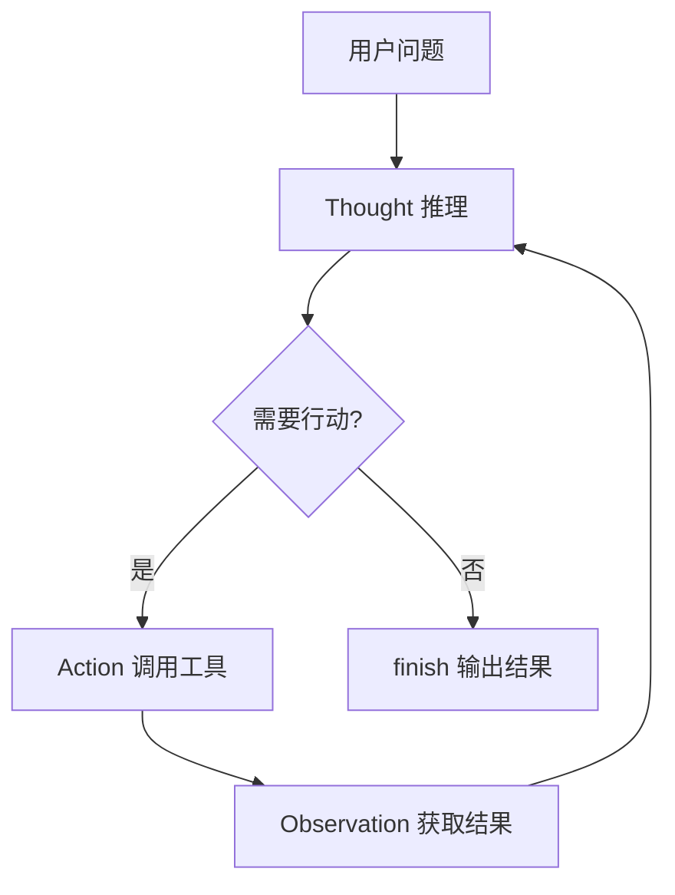

# ReAct 模式

> **在知识图谱中的位置**：模块三 · 03_高级模式 · 第 1 节
> **难度**：⭐⭐⭐ | **前置知识**：Agent 基础

---

## 1. 概述

**ReAct（Reasoning + Acting）**是 AI Agent 最经典的工作流模式，由 Yao et al. (2022) 在论文《ReAct: Synergizing Reasoning and Acting in Language Models》中首次提出。

核心思想：**让 LLM 交替进行「推理」和「行动」，而不是先推理完再行动**。

---

## 2. 核心概念

### 2.1 ReAct 的三个元素

ReAct 的输出包含三个交替元素：

| 元素 | 说明 | 示例 |
|------|------|------|
| **Thought（思考）** | LLM 的推理过程 | "我需要先查天气" |
| **Action（行动）** | 调用的工具 | "search: 北京天气" |
| **Observation（观察）** | 工具返回的结果 | "北京: 25°C 晴" |

```
Thought: 我需要查询北京的天气
Action: search(query="北京天气")
Observation: 北京: 25°C 晴
Thought: 天气信息已获取
Action: finish(answer="北京明天晴，25°C")
```

### 2.2 ReAct vs 传统 Chain of Thought

```
传统 CoT:   推理 → 推理 → 推理 → 回答（纯文字）
ReAct:      推理 → 行动 → 观察 → 推理 → 行动 → 回答（交替）
```

**ReAct 的优势**：
- 行动结果可以作为推理的输入
- 避免 LLM 在"真空"中推理
- 可以获取实时/外部信息

---

## 3. 技术原理

### 3.1 ReAct 执行循环



### 3.2 ReAct Prompt 模板

```
You are a helpful assistant. Answer the following question using 
thoughts and actions.

Format:
Thought: <your reasoning>
Action: <tool_name>(<tool_input>)
Observation: <tool_result>
... (Thought/Action/Observation repeats as needed) ...
Thought: I now know the final answer.
Final Answer: <final response>

Question: {input}
```

### 3.3 ReAct Agent 实现（LangChain）

```python
from langchain.agents import create_react_agent, Tool
from langchain_openai import ChatOpenAI
from langchain import hub

llm = ChatOpenAI(model="gpt-4o", temperature=0)

tools = [
    Tool(name="search", func=search_web, description="搜索网页"),
    Tool(name="calculator", func=calc, description="计算"),
    Tool(name="get_weather", func=get_weather, description="查天气")
]

prompt = hub.pull("hwchase17/react")
agent = create_react_agent(llm, tools, prompt)

# ReAct 自动交替 Thought → Action → Observation
result = agent.invoke({
    "input": "北京天气加上 100+200 等于多少？"
})
```

---

## 4. 实践指南

### 4.1 ReAct 适合场景
- 需要获取外部信息的任务
- 多步推理且中间结果影响后续推理
- 动态决策场景

### 4.2 最佳实践

1. **Thought 引导** — 给 LLM 明确的推理格式
2. **Action 命名精确** — 工具名和参数要清晰
3. **Observation 返回** — 工具结果要结构化
4. **终止条件** — 设 max_iterations 防止无限循环

### 4.3 常见陷阱

| 陷阱 | 解法 |
|------|------|
| Thought 太长 | 给 Thought 加长度约束 |
| Action 错误调用 | 加工具描述和参数校验 |
| Observation 噪声 | 过滤无关信息 |
| 循环执行 | 设 max_iterations=10 |

---

## 5. 方案对比

| 模式 | 推理方式 | 优势 | 劣势 |
|------|------|--|-|
| ReAct | 交替推理+行动 | 经典，效果好 | 需要工具配合 |
| CoT | 纯推理 | 简单 | 无外部信息 |
| Plan-and-Execute | 先规划后执行 | 结构化 | 不够灵活 |
| Agent-X | 按需规划 | 成本优化 | 较新 |

---

## 6. 参考资料

- [ReAct 论文](https://arxiv.org/abs/2210.03629)
- [LangChain ReAct 文档](https://python.langchain.com/docs/modules/agents/agent_types/react/)

---

## 7. 学习路径

1. **Level 1** — 运行 ReAct Agent
2. **Level 2** — 理解 Thought/Action/Observation
3. **Level 3** — 自定义 ReAct 提示词
4. **Level 4** — ReAct + 多工具
5. **Level 5** — ReAct 变体（Reflexion, RAP）
