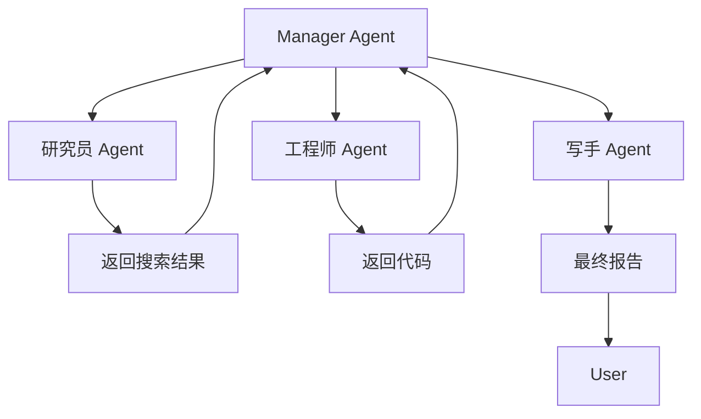

# 多Agent协作架构

> **在知识图谱中的位置**：模块三 · 03_高级模式 · 第 4 节
> **难度**：⭐⭐⭐ | **前置知识**：单Agent基础

---

## 1. 概述

**多Agent协作（Multi-Agent Collaboration）**是将复杂任务拆给多个专业化 Agent 协同完成。每个 Agent 有独立角色、工具和能力，通过某种编排机制协作。

核心理念：**分工 > 全能** — 让多个专门 Agent 比一个全能 Agent 更可靠。

---

## 2. 核心概念

### 2.1 多Agent 的三种架构模式

| 模式 | 描述 | 适用场景 |
|------|------|--|-|
| **Sequential（序列）** | Agent A → Agent B → Agent C | 流水线任务 |
| **Hierarchical（层级）** | Manager Agent → Worker Agents | 项目管理 |
| **Swarm（蜂群）** | 多 Agent 并行 + 自主决策 | 分布式任务 |

### 2.2 多Agent vs 单Agent

```
单Agent:  一个 Agent 做所有事 → 复杂度高、容易出错
多Agent:  多个 Agent 分工协作 → 每个专注一个领域
```

| 维度 | 单Agent | 多Agent |
|------|------|--|-|
| 复杂度 | 低 | 高 |
| 可靠性 | 随任务增长下降 | 每个 Agent 独立可靠 |
| 扩展性 | 差 | 好（加 Agent） |
| 调试难度 | 简单 | 困难（追踪交互） |
| 成本 | 低 | 高（多轮调用） |

---

## 3. 技术原理

### 3.1 多Agent 协作协议



### 3.2 CrewAI 多Agent 示例

```python
from crewai import Agent, Task, Crew

# 定义角色
researcher = Agent(
    role="AI研究员",
    goal="搜索最新技术趋势",
    backstory="你有 10 年 AI 研究经验",
    tools=[arxiv_tool, web_search_tool]
)

coder = Agent(
    role="工程师",
    goal="编写实现代码",
    backstory="你有 10 年 Python 开发经验",
    tools=[code_execution_tool]
)

writer = Agent(
    role="写手",
    goal="生成技术报告",
    backstory="你有 10 年技术写作经验"
)

# 定义任务
research_task = Task(
    description="搜索 AI Agent 最新论文",
    agent=researcher
)

coding_task = Task(
    description="根据搜索结果写代码示例",
    agent=coder
)

writing_task = Task(
    description="整理研究报告",
    agent=writer
)

# 组织团队
crew = Crew(
    agents=[researcher, coder, writer],
    tasks=[research_task, coding_task, writing_task],
    verbose=True
)

# 运行
result = crew.kickoff()
```

### 3.3 Agent 编排方式

| 编排方式 | 描述 | 示例框架 |
|------|------|------|
| **LLM 决策** | LLM 决定执行哪个 Agent | OpenAI Agents SDK |
| **代码编排** | 代码控制流程 | LangGraph |
| **混合编排** | 代码+LLM 混合 | OpenAI Agents SDK |

---

## 4. 实践指南

### 4.1 多Agent 最佳实践

1. **角色边界清晰** — 每个 Agent 只做一件事
2. **交接格式统一** — Agent 间通信用结构化数据
3. **错误隔离** — 一个 Agent 失败不影响其他
4. **监控每个 Agent** — 追踪每个 Agent 的行为

### 4.2 常见陷阱

| 陷阱 | 解法 |
|------|------|
| Agent 间通信混乱 | 定义统一消息格式 |
| 协调成本过高 | 用 Manager Agent |
| 上下文膨胀 | 定期摘要传递 |
| 调试困难 | 用 LangSmith 追踪 |

---

## 5. 工具链

| 工具 | 用途 |
|------|------|
| CrewAI | 多Agent团队 |
| AutoGen | Agent对话 |
| MetaGPT | 软件工程多Agent |
| LangGraph | 有向图编排 |

---

## 6. 参考资料

- [CrewAI 文档](https://docs.crewai.com/)
- [AutoGen 文档](https://microsoft.github.io/autogen/)
- [MetaGPT 论文](https://arxiv.org/abs/2308.00352)

---

## 7. 学习路径

1. **Level 1** — 用 CrewAI 创建多Agent
2. **Level 2** — 理解编排模式
3. **Level 3** — 实现 Agent 间通信协议
4. **Level 4** — 多 Agent 监控和调试
5. **Level 5** — 多 Agent 安全和对齐
