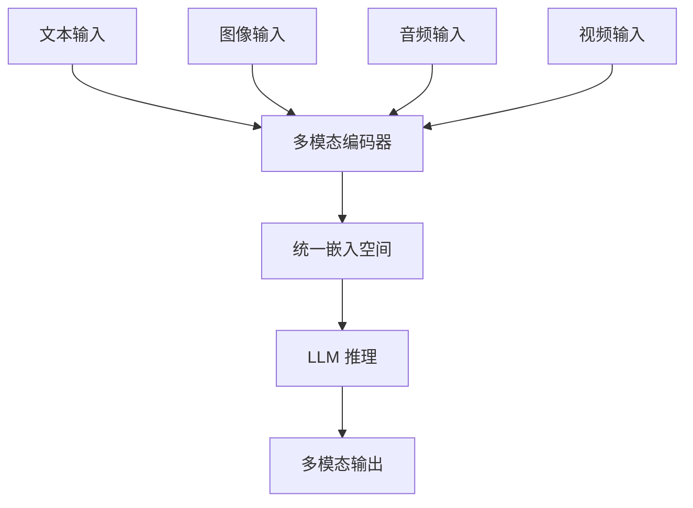

# 多模态 Agent

> **在知识图谱的位���置**：模块五 · 05_前沿趋势 · 第 5 节
> **难度**：⭐⭐ | **前置知识**：Agent 基础

---

## 1. 概述

**多模态 Agent**是能理解和处理**文本、图像、音频、视频**的 Agent。

2025 年关键突破：模型不再是纯文本，而是原生多模态。

---

## 2. 多模态 Agent 能力

| 模态 | 能力 | 代表模型 |
|------|------|------|
| **文本** | 理解/生成文本 | 所有模型 |
| **图像** | 看图、识图、生成图 | GPT-4o, Claude |
| **音频** | 听、说、分析音频 | GPT-4o, Gemini |
| **视频** | 理解视频内容 | GPT-4o, Sora |
| **3D** | 理解 3D 场景 | Sora 3D, NVIDIA |

---

## 3. 技术原理

### 3.1 多模态融合

---

## 4. 应用场景

| 场景 | 多模态能力 |
|------|------|
| 视觉 Agent | 看图理解、截图分析 |
| 语音 Agent | 语音交互、会议记录 |
| 视频 Agent | 视频分析、剪辑 |
| 医疗 Agent | 医学影像分析 |
| 工业 Agent | 缺陷检测 |

---

## 5. 参考资料

- [OpenAI GPT-4o](https://openai.com/index/hello-gpt-4o/)
- [Google Gemini 2.0](https://blog.google/technology/ai/google-gemini-next-generation/)
