# 第零章 · AI Agent 技术全景图谱

> **目标**：建立 AI Agent 全景视角，理解其演进、分支、架构、选型。
> **覆盖范围**：80%+ 关键技术 | **更新时间**：2026-05-12

---

## 0.1 AI Agent 技术演进时间线

```
2016       2020               2022                    2023                    2024                    2025-2026
  |          |                  |                       |                       |                       |
对话系统    任务型 Agent    ChatGPT 催化           Agent 框架爆发期         多Agent/MCP 时代      AI Agent 元年
（ELIZA）   简单规则引擎    大模型能力觉醒          LangChain/CrewAI        端到端 Agent           Agent 自主进化
           ↕              ↕                        ↕                       ↕                       ↕
Rasa/Dialogflow → Watson → GPT-3.5 触发 → 200+ 框架 → OpenAI Agents SDK → LLM-as-Agent
              搜索增强  → ChatGPT plugin       AutoGPT/BabyAGI       MCP 协议标准化       模型即 Agent
                           LangChain v0.1       CrewAI/Multi-Agent     GPT-4o Function Call   自进化 Agent
```

### 各阶段详解

| 阶段 | 时间 | 核心特征 | 代表技术/项目 |
|------|------|----------|--|----|
| 对话系统期 | 2016-2019 | 规则驱动 + 有限状态机 | Rasa, Dialogflow, Watson |
| 搜索增强期 | 2020-2021 | RAG 雏形 + 检索增强 | RetrievalQA, LangChain v0.1 |
| Agent 萌芽期 | 2022-2023 | ChatGPT + GPT-4 触发 | GPT-3.5 触发, ChatGPT Plugins |
| 框架爆发期 | 2023-2024 | LangChain/CrewAI/AutoGPT | 200+ 框架, AutoGPT, BabyAGI |
| 多Agent协作 | 2024-2025 | MCP 协议, 多代理编排 | MCP, OpenAI Agents SDK, CrewAI |
| 自主 Agent | 2025+ | LLM-as-Agent, 端到端 | GPT-4o FC, Claude Opus, 自进化 |

---

## 0.2 AI Agent 技术分支知识图谱

```mermaid
graph TD
    Root["AI Agent"]
    
    Root --> Brain["大脑：LLM 与决策"]
    Root --> Memory["记忆：存储与检索"]
    Root --> Tools["工具：调用与编排"]
    Root --> Plan["规划：拆解与执行"]
    Root --> Multi["多Agent协作"]
    Root --> Framework["Agent框架"]
    Root --> Evaluate["评估与安全"]
    
    Brain --> GPT["GPT-4o/3.5"]
    Brain --> Claude["Claude Opus/Sonnet"]
    Brain --> OpenRouter["OpenRouter/模型路由"]
    Brain --> FineTune["微调/LoRA"]
    
    Memory --> Short["短期对话记忆"]
    Memory --> Long["长期记忆 VectorDB"]
    Memory --> MAGMA["MAGMA 多图架构"]
    Memory --> Forget["类人遗忘机制"]
    
    Tools --> FC["Function Calling"]
    Tools --> MCP["MCP 协议"]
    Tools --> API["REST/GraphQL API"]
    Tools --> Browser["Browser Automation"]
    
    Plan --> ReAct["ReAct 模式"]
    Plan --> Reflexion["Reflexion 反思"]
    Plan --> Tree["ToT/GoT 树思考"]
    Plan --> AgentX["Agent-X 按需规划"]
    
    Multi --> Swarm["Swarm 蜂群"]
    Multi --> Crew["CrewAI 团队"]
    Multi --> Auto["AutoGen"]
    Multi --> MetaGPT["MetaGPT"]
    
    Framework --> LC["LangChain/LangGraph"]
    Framework --> CDK["LlamaIndex"]
    Framework --> OASDK["OpenAI Agents SDK"]
    Framework --> Phidata["Phidata"]
    Framework --> DSPy["DSPy"]
    
    Evaluate --> Bench["AgentBench/BabyAGI Eval"]
    Evaluate --> Safety["安全对齐/RLHF"]
    Evaluate --> Human["HITL 人在回路"]
```



---

## 0.3 技术选型指南

### 按场景选择

| 场景 | 推荐方案 | 备选 | 理由 |
|------|------|------|--|-|
| 快速原型 | OpenAI Agents SDK | LangChain | 最小代码, 官方支持 |
| 复杂工作流 | LangGraph | CrewAI | 有向图编排, 状态管理 |
| 多Agent协作 | CrewAI / AutoGen | MetaGPT | 角色分工, 团队协作 |
| 企业级生产 | 自研 + MCP | DSPy | 可控性强, 安全对齐 |
| 检索增强 | LlamaIndex | LangChain | 检索优先架构 |
| Agent 编排 | OpenAI Agents SDK | LangGraph | Agent 编排标准化 |

### 按 LLM 模型选择

| 模型 | Agent 优势 | 推荐场景 |
|------|------|------|
| GPT-4o | Function Calling 最成熟 | 通用Agent, 多模态 |
| Claude Opus | 超长上下文, 推理强 | 复杂推理, 长文档处理 |
| Claude Sonnet | 成本效益比好 | 生产环境主力 |
| Gemini 2.0 | 多模态原生 | 图文混合任务 |
| DeepSeek/R1 | 开源, 推理能力 | 自部署, 成本敏感 |

---

## 0.4 核心术语表

| 术语 | 英文 | 定义 |
|------|------|------|
| Agent | Agent | 能感知环境、自主决策并执行行动的 AI 系统 |
| Function Calling | 函数调用 | LLM 返回结构化参数以调用外部函数 |
| ReAct | ReAct | Reasoning + Acting 交替推理与执行模式 |
| Tool Use | 工具使用 | Agent 通过 API/代码/脚本执行任务 |
| Memory | 记忆 | Agent 的状态管理（短期/长期/工作记忆） |
| Planning | 规划 | 将复杂任务拆解为可执行步骤 |
| Multi-Agent | 多智能体 | 多个 Agent 协作完成任务 |
| MCP | Model Context Protocol | Anthropic 提出的 Agent 与工具连接协议 |
| Reflection | 反思 | Agent 对自己的输出进行自我评估和改进 |
| Agent-as-a-Service | Agent 即服务 | Agent 以 API 形式提供服务 |
| HITL | Human-in-the-Loop | 人在回路：人工干预 Agent 决策 |
| AGI | Artificial General Intelligence | 通用人工智能 |

---

## 0.5 行业生态

### 主流厂商/组织

| 组织 | 定位 | 代表产品 |
|------|------|------|
| OpenAI | Agent SDK + GPT | Agents SDK, GPT-4o |
| Anthropic | MCP + Claude | MCP 协议, Claude |
| LangChain | Agent 框架 | LangChain, LangGraph |
| LlamaIndex | 检索优先 | LlamaIndex |
| Google | Agent 生态 | Gemini + Vertex AI |
| Meta | 开源 | Llama + Pydantic AI |
| Microsoft | 企业Agent | AutoGen, Copilot Studio |
| Databricks | Agent 数据 | Agent Builder |

### 社区资源

- [LangChain 官方文档](https://python.langchain.com/)
- [OpenAI Agents SDK](https://github.com/openai/openai-agents-python)
- [MCP 官方规范](https://modelcontextprotocol.io/)
- [awesome-ai-agents (GitHub)](https://github.com/awesome-ai-agents)
- [HuggingFace Agent Harness Survey](https://huggingface.co/datasets/GloriaaaM/LLM-Agent-Harness-Survey)
- [2025 AI Agent 行业研究报告 - 甲子光年](https://pdf.dfcfw.com/pdf/H3_AP202503131644339445_1.pdf)

---

## 0.6 四大核心设计模式

2025-2026 年生产级 Agent 系统的四大核心技术：

| 模式 | 核心能力 | 关键技术 |
|------|------|------|
| **反思 (Reflection)** | 自我评估 + 迭代改进 | Reflexion, Self-RAG, 自我批评 |
| **工具 (Tool Use)** | 感知 + 执行外部动作 | Function Calling, MCP, API 集成 |
| **规划 (Planning)** | 任务拆解 + 动态调整 | ReAct, ToT, Agent-X 按需规划 |
| **多代理 (Multi-Agent)** | 角色分工 + 协同决策 | Swarm, CrewAI, AutoGen, MCP |

---

**📅 最后更新**：2026-05-12
