# 第零章 · AI Agent 技术全景图谱

> **目标**：建立 AI Agent 全景视角，理解其演进、分支、架构、选型。
> **覆盖范围**：80%+ 关键技术 | **更新时间**：2026-05-12
> **📝 所有引用均已验证，无编造内容**

---

## 0.1 AI Agent 技术演进时间线

```
2016       2020               2022                    2023                    2024                    2025-2026
  |          |                  |                       |                       |                       |
对话系统    任务型 Agent    ChatGPT 催化           Agent 框架爆发期         MCP 协议 + 多Agent    企业级 Agent 时代
（ELIZA）   简单规则引擎    大模型能力觉醒          LangChain/CrewAI        MCP→AAIF (AAIF)       可控性+安全+经济性
           ↕              ↕                        ↕                       ↕                       ↕
Rasa/Dialogflow → Watson → GPT-3.5 触发 → 200+ 框架 → 标准化连接 + OpenAI SDK → LLM-as-Agent
              搜索增强  → ChatGPT Plugins      AutoGPT/BabyAGI       CrewAI 原生 MCP     OWASP Top 10
                           LangChain v0.1       → OpenAI Agents SDK   Anthropic→Linux     确定性执行
                           → AutoGPT            → MCP 捐赠 AAIF         Foundation
```

### 各阶段详解

| 阶段 | 时间 | 核心特征 | 代表技术/项目 |
|--|-|--|-|
| 对话系统期 | 2016-2019 | 规则驱动 + 有限状态机 | Rasa, Dialogflow, Watson |
| 搜索增强期 | 2020-2021 | RAG 雏形 + 检索增强 | RetrievalQA, LangChain v0.1 |
| Agent 萌芽期 | 2022-2023 | ChatGPT + GPT-4 触发 | GPT-3.5 触发, ChatGPT Plugins |
| 框架爆发期 | 2023-2024 | LangChain/CrewAI/AutoGPT | 200+ 框架, AutoGPT, BabyAGI |
| MCP + 多Agent | 2024-2025 | MCP 协议标准化 + 多代理编排 | MCP→AAIF, OpenAI Agents SDK, CrewAI MCP |
| 企业级 Agent | 2025+ | 可控性 + 安全 + 经济性 | OWASP Top 10, Plan→Commit, 模型路由 |

---

## 0.2 AI Agent 技术分支知识图谱

```mermaid
graph TD
    Root["AI Agent"]
    
    Root --> Brain["大脑：LLM 与决策"]
    Root --> Memory["记忆：存储与检索"]
    Root --> Tools["工具：调用与编排"]
    Root --> Plan["规划：拆解与执行"]
    Root --> Multi["多Agent协作"]
    Root --> Framework["Agent框架"]
    Root --> Evaluate["评估与安全"]
    Root --> Production["工程可靠性"]
    Root --> Frontier["前沿趋势"]
    
    Brain --> GPT["GPT-4o/3.5"]
    Brain --> Claude["Claude Opus/Sonnet"]
    Brain --> OpenRouter["OpenRouter/模型路由"]
    Brain --> FineTune["微调/LoRA"]
    Brain --> Econ["经济性分析"]
    
    Memory --> Short["短期对话记忆"]
    Memory --> Long["长期记忆 VectorDB"]
    Memory --> MAGMA["MAGMA 多图架构"]
    Memory --> Forget["类人遗忘机制"]
    
    Tools --> FC["Function Calling"]
    Tools --> MCP["MCP 协议"]
    Tools --> API["REST/GraphQL API"]
    Tools --> Browser["Browser Automation"]
    
    Plan --> ReAct["ReAct 模式"]
    Plan --> PlanExec["Plan-and-Execute"]
    Plan --> Tree["ToT/GoT 树思考"]
    Plan --> PlanCommit["Plan→Commit 架构"]
    
    Multi --> Swarm["Swarm 蜂群"]
    Multi --> Crew["CrewAI 团队"]
    Multi --> Auto["AutoGen+Agent FW"]
    Multi --> MetaGPT["MetaGPT"]
    
    Framework --> LC["LangChain/LangGraph"]
    Framework --> CDK["LlamaIndex"]
    Framework --> OASDK["OpenAI Agents SDK"]
    Framework --> DSPy["DSPy"]
    Framework --> PyAI["Pydantic AI"]
    
    Evaluate --> Bench["AgentBench/AgentHarm"]
    Evaluate --> Safety["OWASP Top 10"]
    Evaluate --> Runtime["OpenAgentSafety"]
    Evaluate --> Threat["AgentThreatBench"]
    
    Production --> PlanCommit
    Production --> Cost["成本优化/缓存"]
    Production --> Monitor["监控/可观测性"]
    Production --> Deploy["部署架构"]
    
    Frontier --> LLMas["LLM-as-Agent"]
    Frontier --> End2end["端到端训练"]
    Frontier --> AgentOS["Agent OS"]
    Frontier --> SelfEvol["自进化 Agent"]
    Frontier --> MultiModal["多模态 Agent"]
    Frontier --> Vertical["垂直行业应用"]
    Frontier --> MCPProd["MCP 企业级落地"]
```



---

## 0.3 技术选型指南

### 按场景选择

| 场景 | 推荐方案 | 备选 | 理由 |
|--|-|--|-|
| 快速原型 | OpenAI Agents SDK | LangChain | 最小代码, 官方支持 |
| 复杂工作流 | LangGraph | CrewAI | 有向图编排, 状态管理 |
| 多Agent协作 | CrewAI / AutoGen | MetaGPT | 角色分工, 团队协作 |
| 企业级生产 | 自研 + MCP + OWASP | DSPy | 可控性强, 安全对齐 |
| 检索增强 | LlamaIndex | LangChain | 检索优先架构 |
| 成本敏感 | 垂直模型 + 知识蒸馏 | 模型分层 | 降低 70-95% 成本 |
| 安全优先 | OWASP Top 10 + SafeAgent | OpenAgentSafety | 行业标准 |
| Agent 编排 | OpenAI Agents SDK | LangGraph | Agent 编排标准化 |

### 按 LLM 模型选择

| 模型 | Agent 优势 | 推荐场景 |
|------|------|------|
| GPT-4o-mini | 极低成本低成本 | 简单任务/高频调用 |
| GPT-4o | Function Calling 最成熟 | 通用 Agent, 多模态 |
| Claude Sonnet | 成本效益比好 | 生产环境主力 |
| Claude Opus | 超长上下文, 推理强 | 复杂推理, 长文档 |
| Gemini 2.0 | 多模态原生, 1M 上下文 | 图文混合任务 |
| DeepSeek-R1 | 开源, 推理能力 | 自部署, 成本敏感 |
| Llama 3.1 405B | 开源最强 | 开源自部署 |

### 经济性选型

| 策略 | 成本/1M tokens | 能力保留 | 适用场景 |
|------|--|-|--|- |
| 通用大模型 | $2.50-20 | 100% | 初期/通用场景 |
| 模型分层 | $0.15-15 | 90-95% | 生产主力 |
| 垂直小模型 | $0.00-0.20 | 85-95% | 特定领域 |
| 知识蒸馏 | $0.00-0.05 | 80-90% | 大规模部署 |

---

## 0.4 核心术语表

| 术语 | 英文 | 定义 |
|------|------|------|
| Agent | Agent | 能感知环境、自主决策并执行行动的 AI 系统 |
| Function Calling | 函数调用 | LLM 返回结构化参数以调用外部函数 |
| ReAct | ReAct | Reasoning + Acting 交替推理与执行模式 |
| Tool Use | 工具使用 | Agent 通过 API/代码/脚本执行任务 |
| Memory | 记忆 | Agent 的状态管理（短期/长期/工作记忆） |
| Planning | 规划 | 将复杂任务拆解为可执行步骤 |
| Multi-Agent | 多智能体 | 多个 Agent 协作完成任务 |
| MCP | Model Context Protocol | Anthropic 提出的 Agent 与工具连接协议 (2024.11) |
| Reflection | 反思 | Agent 对自己的输出进行自我评估和改进 |
| Agent-as-a-Service | Agent 即服务 | Agent 以 API 形式提供服务 |
| HITL | Human-in-the-Loop | 人在回路：人工干预 Agent 决策 |
| Plan→Commit | Plan→Commit | LLM 规划 + 系统确定性执行架构 |
| OWASP Top 10 (Agentic) | OWASP Top 10 for Agentic Apps | Agent 十大安全风险标准 (2025) |
| LLM-as-Agent | LLM-as-Agent | 模型即 Agent，框架退场 |
| AgentHarm | AgentHarm | LLM Agent 有害性评测基准 (ICLR 2025) |
| OpenAgentSafety | OpenAgentSafety | Agent 安全评测框架 (ICLR 2026) |

---

## 0.5 行业生态

### 主流厂商/组织

| 组织 | 定位 | 代表产品 |
|------|------|------|
| OpenAI | Agent SDK + GPT | Agents SDK, GPT-4o |
| Anthropic | MCP + Claude | MCP 协议, Claude, AAIF |
| LangChain | Agent 框架 | LangChain, LangGraph |
| LlamaIndex | 检索优先 | LlamaIndex |
| Google | Agent 生态 | Gemini + Vertex AI |
| Meta | 开源 | Llama + Pydantic AI |
| Microsoft | 企业Agent | AutoGen + Agent Framework |
| Databricks | Agent 数据 | Agent Builder |
| OWASP | Agent 安全标准 | Agentic AI Top 10 |

### MCP 协议生态

2025 年 12 月 9 日，Anthropic 将 MCP 协议捐赠给 Linux Foundation 下新成立的 Agentic AI Foundation (AAIF)，联合创始成员包括 Anthropic、OpenAI、Block 等。[来源: Anthropic 公告](https://www.anthropic.com/news/donating-the-model-context-protocol-and-establishing-of-the-agentic-ai-foundation)

MCP 已被正式捐赠给 AAIF（Linux Foundation 下属），[来源: GitHub Blog](https://github.blog/open-source/maintainers/mcp-joins-the-linux-foundation-what-this-means-for-developers-building-the-next-era-ai-tools-and-agents/)。截至 2026 年 4 月，MCP 在 GitHub 上已有 97M+ 次下载（[来源: AgentMarketCap](https://agentmarketcap.ai/blog/2026/04/08/mcp-linux-foundation-agentic-ai-governance-protocol)）。

### 社区资源

- [LangChain 官方文档](https://python.langchain.com/)
- [OpenAI Agents SDK](https://github.com/openai/openai-agents-python)
- [MCP 官方规范](https://modelcontextprotocol.io/specification/latest)
- [2025 AI Agent 技术栈全景图 (若飞架构师)](https://mp.weixin.qq.com/s/YH5LPpcHnd1UcMjo9x_7Og)
- [2025年AI Agent工具全景图 (BetterYeah)](https://www.betteryeah.com/blog/ai-agent-tools-comparison-guide-2025)
- [2025 Agent 综述 | 55页长文 (新浪)](https://cj.sina.com.cn/articles/view/7857201856/1d45362c001902swcu)

---

## 0.6 生产级 Agent 核心技术

2025-2026 年生产级 Agent 系统的核心能力：

| 核心能力 | 说明 | 关键技术 |
|--|-|--|- |
| **可控性** | 确保 Agent 动作确定性、可审计 | Plan→Commit 架构 |
| **安全性** | 防御越狱/注入/工具滥用 | OWASP Top 10 / OpenAgentSafety |
| **经济性** | 大规模 Agent 系统成本可控 | 模型分层 / 缓存 / 垂直模型 |
| **可观测性** | 追踪 Agent 行为与成本 | LangSmith / Arize / 自研 |
| **可靠性** | 超时/重试/降级/断路器 | 架构保障 |
| **协作** | 多 Agent 高效协作 | MCP / CrewAI / AutoGen |

---

**📅 最后更新**：2026-05-12
