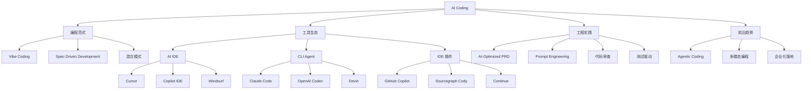

# 第零章 · AI Coding 技术全景图谱

> **目标**：建立 AI Coding 全景视角，理解 Vibe Coding 与 Spec-Driven Development 两种范式。
> **更新时间**：2026-05-12

---

## 0.1 AI Coding 技术演进

```
2015       2017               2019                    2022                    2025                    2026
  |          |                  |                       |                       |                       |
自动补全    TabNine          GitHub Copilot          LLM 编程助手爆发        Vibe Coding + Spec 时代  Agentic Coding
（Kite等）   AI 代码补全      （预览版）              ChatGPT-4/Claude        两种范式并存            Agent 自主编码
           ↕              ↕                        ↕                       ↕                       ↕
基础代码补全 → GitHub Copilot → 上下文感知编程 → Cursor/Claude Code → Vibe vs Spec 大讨论 → 企业落地
                    （GitHub+OpenAI） → Copilot X    → Karpathy 命名 Vibe  → PRD 驱动的 Spec 模式
```

### 各阶段详解

| 阶段 | 时间 | 核心特征 | 代表技术/项目 |
|--|-|--|-|
| 自动补全期 | 2015-2018 | 基于历史代码的补全 | Kite, TabNine, CodeCompletions |
| Copilot 时代 | 2019-2021 | GitHub Copilot 发布（预览版 2021） | GitHub + OpenAI |
| LLM 编程助手 | 2022-2024 | ChatGPT-4 / Claude 驱动的编程助手 | ChatGPT, Claude, GitHub Copilot X |
| Agent 编程时代 | 2025 | Vibe Coding (Karpathy) + Spec Coding 并存 | Cursor, Claude Code, Windsurf |
| Agentic Coding | 2026+ | Agent 自主执行开发任务 | OpenAI Codex, Cursor Composer, Claude Code |

---

## 0.2 AI Coding 知识分支知识图谱



---

## 0.3 Vibe Coding vs Spec-Driven Development 选型指南

### 按场景选择

| 场景 | 推荐范式 | 理由 |
|--|-|--|
| 快速原型/POC | Vibe Coding | 速度极快，对话式交互 |
| MVP 开发 | Vibe Coding | 从 0 到 1 快速验证 |
| 生产代码 | Spec-Driven | 可预测性、可测试性 |
| 团队协作 | Spec-Driven | PRD 作为对齐工具 |
| 复杂功能模块 | Spec-Driven | 需要明确规格 |
| 创意/设计探索 | Vibe Coding | 需要灵活性 |
| 长期维护项目 | Spec-Driven | 可追溯性 |
| 小团队 (<5人) | Vibe + Spec 混合 | 灵活性与规范平衡 |

### 按项目阶段选择

| 阶段 | 推荐范式 |
|--|-|
| 创意探索 | Vibe Coding |
| 需求定义 | Spec-Driven (PRD) |
| 原型开发 | Vibe Coding |
| 功能开发 | Spec-Driven |
| 重构/优化 | Vibe Coding + Spec 审查 |
| 生产发布 | Spec-Driven (完整 Spec) |

---

## 0.4 核心术语表

| 术语 | 定义 |
|--|-|
| **Vibe Coding** | 通过自然语言对话与 AI 交互，描述需求后让 AI 生成代码的开发方式（Karpathy, 2025） |
| **Spec-Driven Development (SDD)** | 先编写详细规格文档（PRD），再由 AI 按规格生成代码的开发方式 |
| **AI Pair Programming** | AI 作为结对编程伙伴，实时提供代码建议与对话 |
| **AI-Optimized PRD** | 专为 AI Agent 阅读优化的需求文档格式 |
| **Behavior-Driven Prompting** | 将 PRD 转化为 BDD 格式的 prompt，驱动 AI 行为 |
| **Agentic Coding** | AI Agent 自主规划、执行、审查代码的开发范式 |
| **Cursor** | AI-native IDE，集成 Claude/GPT-4 等模型 |
| **Claude Code** | Anthropic 的 CLI AI 编程 Agent |
| **GitHub Copilot** | GitHub + OpenAI 的 AI 编程助手 |
| **Windsurf** | 前 Codeium，被 OpenAI 收购的 AI IDE |
| **Sourcegraph Cody** | 基于代码库理解的 AI 编码助手 |

---

## 0.5 行业生态

### 主流 AI 编程工具

| 工具 | 类型 | 提供商 | 定价 |
|--|-|--|-|
| **Cursor** | AI IDE | Cursor (Svix) | $20/月 (Pro) |
| **GitHub Copilot** | IDE 插件 | GitHub + OpenAI | $10/月 (个人) |
| **Claude Code** | CLI Agent | Anthropic | Anthropic API 费用 |
| **Windsurf** | AI IDE | OpenAI (收购前 Codeium) | 免费+付费 |
| **Sourcegraph Cody** | IDE 插件 | Sourcegraph | 免费+企业版 |
| **OpenAI Codex** | CLI Agent | OpenAI | API 费用 |
| **Continue** | IDE 插件 | 开源 | 免费 |
| **Devin** | AI Agent | Cognition Labs | 企业定价 |

### 社区资源

- [Vibe Coding Wikipedia](https://en.wikipedia.org/wiki/Vibe_coding)
- [GitHub AI 术语解析](https://shenxianpeng.github.io/posts/2025/github-ai/)
- [AI Coding 工具对比 (Scrimba)](https://scrimba.com/articles/best-ai-coding-assistants-2026/)
- [2026 AI Coding 工具评测 (weavai.app)](https://weavai.app/blog/zh-cn/2026/04/25/2026%e5%b9%b410%e6%ac%be%e6%9c%80%e4%bdb%b3github-copilot%e6%9b%bf%e4%bb%a3%e6%96%b9%e6%a1%88%e8%af%84%e6%b5%8b/)

---

**📅 最后更新**：2026-05-12
