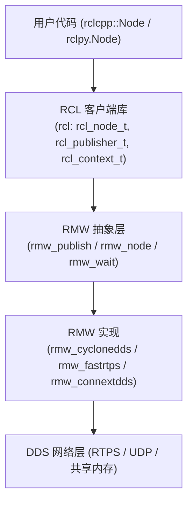

# 01 什么是 ROS 2

> **在知识图谱中的位置**：模块一 · 基础概念 · 01
> **难度**：⭐⭐⭐ | **前置知识**：Linux 命令行基础、C++ 或 Python 任一语言基础，对"进程/线程/网络通信"有直觉即可

## 1. 概述

**ROS 2（Robot Operating System 2）不是传统意义上的操作系统，而是一套面向机器人应用的开源中间件框架 + 工具链 + 包生态**：它为分布式进程提供节点发现、话题（Topic）发布/订阅、服务（Service）、动作（Action）、参数、生命周期、时间等通信与编排原语，并附带构建系统（colcon）、包管理（rosdep）、可视化（rviz2）、调试（ros2 CLI）等完整工具集。

在机器人软件体系里，ROS 2 位于"操作系统/驱动"之上、"具体算法与业务逻辑"之下，是连接硬件抽象层与应用层之间的**软件框架层（middleware framework）**。它自身依赖一个真正的操作系统（Linux/Windows/macOS/RTOS）来运行进程、线程与网络栈。

## 2. 核心概念

### 2.1 它不是操作系统，而是"中间件 + 工具集"

名称里的 "Operating System" 是历史包袱：ROS 1 借用了"操作系统"隐喻，因为它像 OS 一样给应用提供硬件抽象、进程间通信、包管理。但 ROS 2 本体不调度 CPU、不管理内存分页、不实现文件系统——这些由它**脚下的真实 OS** 完成。把它理解成"机器人领域的分布式中间件 + SDK"最准确。

### 2.2 节点图（Node Graph）心智模型

ROS 2 用**图（Graph）**而不是进程树来组织系统：

- **Node**：一个参与通信的最小单元（通常一个进程一个或多个 Node），有唯一全名（namespace + name）。
- **Topic**：带类型的消息总线，发布者（Publisher）→ 订阅者（Subscriber）多对多。
- **Service**：请求/响应（Request/Reply），一次一问一答。
- **Action**：长耗时任务的"目标-反馈-结果"三通道（基于 Topic + Service 组合）。
- **Parameter**：节点运行时可读写的键值配置。

关键心智：**谁和谁通信，由"话题名 + 类型 + QoS"匹配决定，而不是由"谁启动了谁"决定**。节点可以动态加入/离开，图随之变化。

### 2.3 DDS 作为通信底座

ROS 2 不自己发明新的网络协议，而是把通信层抽象成 **RMW（ROS Middleware Interface）**，默认在 RMW 之上选择 **DDS（Data Distribution Service）** 实现。DDS 是 OMG 制定的工业级分布式实时通信标准，自带发布/订阅、去中心化发现、可配置 QoS、多播等能力，正好覆盖 ROS 1 缺失的实时性与生产级可靠性需求。参见 [QoS 详解](../02_核心模块/05_QoS与通信机制.md)。

### 2.4 发行版（Distro）与工作区

ROS 2 按**时间冻结发行版**（如 Humble 2022、Jazzy 2024、Kilted 2025），每个发行版锁定全部包的版本以保证可复现；另有持续滚动更新的 **rolling** 分支。一次开发围绕一个 `colcon` **工作区**（workspace）展开，见 [工作空间与 Colcon 构建](./04_工作空间与Colcon构建.md)。

### 2.5 治理与生态

ROS 2 由开源社区治理：**TSC（Technical Steering Committee）** 决策技术方向，各 **Working Group**（如 Middleware WG、Real-Time WG、Security WG、Client Libraries WG 等）分领域推进，包由 **maintainer** 负责 review 与发布。详见 [生态与角色地图](./06_ROS2生态与角色地图.md)。

## 3. 技术原理

### 3.1 分层架构与数据流



- **上层（用户代码）**：`rclcpp::Node`、`rclpy.Node` 是不同语言的**客户端库**（client library），语言间互不耦合。
- **中层（rcl）**：C 语言编写的语言无关核心库，定义 `rcl_node_t`、`rcl_publisher_t`、`rcl_context_t` 等**不透明句柄**结构，所有上层语言最终都调用它。
- **rmw 层（关键抽象）**：`rmw/rmw.h` 声明 `rmw_publish()`、`rmw_take()`、`rmw_create_node()`、`rmw_wait()` 等接口。**换通信后端 = 换 `RMW_IMPLEMENTATION` 环境变量 + 换一个 `rmw_*` 动态库**，上层代码一行不改。这是 ROS 2 与 ROS 1 最大的架构差异之一。

### 3.2 源码级证据：一次 publish 的控制流

以 C++ 发布一条消息为例（对应 ros2/rclcpp、ros2/rcl、ros2/rmw、ros2/rmw_cyclonedds 四个仓库）：

1. `publisher_->publish(msg)` → `rclcpp::Publisher::do_inter_process_publish()`。
2. 进入 `rcl_publish()`（rcl 库），内部先做 `rcl_ret_t` 错误码检查与参数校验。
3. 取出该 publisher 注册的 `rmw_publisher_t *` 并调用 `rmw_publish()`。
4. `rmw_cyclonedds` 实现把消息序列化后交给 Cyclone DDS 的 `dds_write()`，再经 RTPS 协议发出。

**资源开销（量级）**：

- **序列化/反序列化**：每字节有 copy 开销，大消息（>1 MB，如图像点云）建议走共享内存或 zero-copy（`rmw_cyclonedds` 支持 `iceoryx`/loan 机制），否则吞吐瓶颈常在这里。
- **线程模型**：`rclcpp::executors::SingleThreadedExecutor` 单线程轮询所有订阅/定时器/服务（`rmw_wait` 阻塞等待），高并发下容易"饿死"回调；`MultiThreadedExecutor` 开多线程但需用户自己保证回调线程安全（锁）。
- **发现开销**：DDS 靠 UDP 多播 + SEDP/SPDP 协议动态发现节点，节点规模大时（几百上千节点）发现流量不可忽略，可用 `ROS_AUTOMATIC_DISCOVERY_RANGE` / partition 收敛。

### 3.3 平台差异（Linux / Windows / macOS）

| 维度 | Linux (Ubuntu) | Windows | macOS |
|---|---|---|---|
| 官方二进制 | ✅ apt 预编译 | ✅ 预编译 zip/Chocolatey | ❌ 需源码编译或 RoboStack |
| 实时性路径 | ✅ 支持 PREEMPT_RT 内核 + `rmw_cyclonedds` | ⚠️ 无硬实时，仅软实时 | ⚠️ 无硬实时 |
| DDS 共享内存 | ✅ iceoryx/共享内存成熟 | ⚠️ 部分 RMW 支持受限 | ⚠️ 部分 RMW 支持受限 |
| 主要用途 | 机器人主流平台 | 开发/仿真/教学 | 开发/教学 |

## 4. 实践指南

### 4.1 入门代码示例（最小发布/订阅）

```python
# talker.py —— Python 最小发布者
import rclpy
from rclpy.node import Node
from std_msgs.msg import String

class Talker(Node):
    def __init__(self):
        super().__init__('talker')
        self.pub = self.create_publisher(String, 'chatter', 10)
        self.timer = self.create_timer(0.5, self.tick)
    def tick(self):
        msg = String()
        msg.data = 'hello world'
        self.pub.publish(msg)

def main():
    rclpy.init()
    rclpy.spin(Talker())
    rclpy.shutdown()
```

```cpp
// talker.cpp —— C++ 最小发布者
#include <chrono>
#include <memory>
#include "rclcpp/rclcpp.hpp"
#include "std_msgs/msg/string.hpp"

class Talker : public rclcpp::Node {
public:
  Talker() : Node("talker") {
    pub_ = this->create_publisher<std_msgs::msg::String>("chatter", 10);
    timer_ = this->create_wall_timer(
      std::chrono::milliseconds(500),
      [this]() {
        auto msg = std_msgs::msg::String();
        msg.data = "hello world";
        pub_->publish(msg);
      });
  }
private:
  rclcpp::Publisher<std_msgs::msg::String>::SharedPtr pub_;
  rclcpp::TimerBase::SharedPtr timer_;
};

int main(int argc, char **argv) {
  rclcpp::init(argc, argv);
  rclcpp::spin(std::make_shared<Talker>());
  rclcpp::shutdown();
  return 0;
}
```

> 注意：`std_msgs/msg/String` 是 C++ 类型；Python 里同名但由 `rosidl` 生成，两者通过 **DDS 二进制序列化 + 消息类型元数据** 达成跨语言一致（见 [消息服务与类型系统](./05_消息服务与类型系统.md)）。

### 4.2 最佳实践

- 一个进程一个 `rclcpp::init()`；Node 生命周期用 `rclcpp_lifecycle::LifecycleNode` 显式管理（未配置→未激活→激活→清理）。
- 话题名用命名空间隔离，例如 `robot_1/lidar/scan`，避免多机器人撞名。
- 默认 RMW 是 `rmw_fastrtps_cpp`（eProsima Fast DDS）；`rmw_cyclonedds`（Eclipse Cyclone DDS）等是官方可切换的替代实现，选型对比见 [06_RMW实现对比](../03_高级话题/06_RMW实现对比(FastDDS_vs_CycloneDDS).md)。
- 生产环境显式指定 `ROS_DOMAIN_ID`，避免不同机器人互相"串台"。

### 4.3 常见陷阱

| 坑 | 现象 | 解法 |
|---|---|---|
| 不 source setup.bash | `command not found: ros2` | `source /opt/ros/<distro>/setup.bash`，或写入 `~/.bashrc` |
| 两台机器默认 DOMAIN_ID 相同且网络互通 | 话题被"别人"订阅/污染 | 设不同的 `ROS_DOMAIN_ID` |
| 回调里做阻塞/耗时操作 | 单线程执行器卡死其他回调 | 用 `MultiThreadedExecutor` 或拆 callback group |
| 误以为 ROS 2 是 OS 而"重装系统" | 无谓折腾 | 认清它是中间件，问题大多在通信/QoS/网络 |

### 4.4 性能调优/注意事项

- **吞吐敏感**：大消息关闭可靠传输或改 `BEST_EFFORT` + `KEEP_LAST` 深队列；或走 zero-copy。
- **延迟敏感**：`rmw_wait` 阻塞式执行器比忙等省 CPU；`rclcpp::executors::SingleThreadedExecutor` 本身单线程无锁开销低。
- **节点规模大**：用 partition / `ROS_AUTOMATIC_DISCOVERY_RANGE=LOCALHOST|SUBNET` 收敛发现范围。
- **实时场景**：RMW 选择（rmw_fastrtps_cpp / rmw_cyclonedds）均可作为底座，关键是 Linux PREEMPT_RT + 无堆分配回调 + 共享内存/零拷贝路径（详见 [03_实时性](../03_高级话题/03_实时性与任务调度.md)）。

## 5. 方案对比

| 方案 | 优势 | 劣势 | 适用场景 |
|---|---|---|---|
| ROS 2 | 生态庞大、跨语言、工具链全、QoS/DDS 生产级 | 学习曲线、内存/发现开销 | 机器人研发与量产 |
| ROS 1（遗留） | 资料海量、简单 | 无安全、单点 master、无 QoS、不再活跃维护 | 维护老项目 |
| 裸 DDS（Cyclone/Fast DDS） | 极致性能、可控 | 无机器人语义、无 rviz/rosbag 工具 | 极致性能子系统 |
| MQTT/ZMQ 等通用消息 | 简单、生态广 | 无类型系统、无发现、无 QoS 完整实现 | 物联网/简单遥测 |

> **在什么场景下绝对不能使用**：硬实时安全关键（safety-critical）场景，如果未做全链路实时化改造（PREEMPT_RT 内核 + 实时 RMW + 无堆分配回调），**绝不能直接把通用 ROS 2 默认配置**当作硬实时系统交付；同样，资源极度受限的单片机（< 1 MB RAM）上也不能直接跑完整 ROS 2，应用 `rclc`/`micro-ROS` 裁剪版本。

## 6. 工具链

| 工具 | 用途 | 链接 |
|---|---|---|
| ros2 CLI | 节点/话题/服务/参数/生命周期调试 | https://docs.ros.org/en/jazzy/Tutorials/Beginner-CLI-Tools.html |
| rviz2 | 3D 可视化 | https://github.com/ros2/rviz |
| colcon | 构建工作区 | https://docs.ros.org/en/jazzy/Tutorials/Beginner-Client-Libraries/Colcon-Tutorial.html |
| rosdep | 依赖安装 | https://docs.ros.org/en/jazzy/Tutorials/Intermediate/Rosdep.html |
| rosbag2 | 录制/回放消息 | https://github.com/ros2/rosbag2 |
| Cyclone DDS | 默认 RMW 实现 | https://github.com/eclipse-cyclonedds/cyclonedds |

## 7. 参考资料

- ROS 2 官方文档（Jazzy）：https://docs.ros.org/en/jazzy/ ✅已验证
- 发布/发行版总览：https://docs.ros.org/en/rolling/Get-Started/Releases.html ✅已验证
- Jazzy Jalisco 发布博客：https://www.openrobotics.org/blog/2024/5/ros-jazzy-jalisco-released ✅已验证
- ROS 2 路线图：https://docs.ros.org/en/humble/The-ROS2-Project/Roadmap.html ✅已验证
- Open Robotics（历史/组织）：https://en.wikipedia.org/wiki/Open_Robotics ✅已验证
- Intrinsic 收购 OSRC（2022）：https://www.openrobotics.org/blog/2022/12/15/intrinsic-acquires-osrc-and-osrc-sg ✅已验证
- Working Groups 治理页：https://docs.ros.org/en/jazzy/The-ROS2-Project/Governance/Working-Groups.html ✅已验证
- TSC 章程：https://docs.ros.org/en/galactic/The-ROS2-Project/Governance/ROS2-TSC-Charter.html ✅已验证
- RMW 接口仓库：https://github.com/ros2/rmw ✅已验证
- 设计文档：https://design.ros2.org ✅已验证

## 8. 学习路径

- **Level 1**：跑通官方 talker/listener，用 `ros2 topic echo/list` 观察话题图。
- **Level 2**：理解 Node/Topic/Service/Action 四原语，手写发布订阅。
- **Level 3**：读懂 rclcpp/rcl/rmw 三层调用链，能解释 `RMW_IMPLEMENTATION` 换后端原理。
- **Level 4**：掌握 QoS 与执行器模型，做吞吐/延迟基准实验。
- **Level 5**：参与 ros2 仓库贡献，理解 TSC/WG 治理与发行版发布流程。

## 9. 核心面试三问

**Q1：ROS 2 为什么能在没有"master"的情况下发现彼此？节点失联/网络分区时会发生什么？**

参考要点：依赖 DDS 的 SPDP（简单参与者发现）+ SEDP（端点发现）协议，通过 UDP 多播 + 单播回退实现去中心化发现，无单点。极端/失败模式：网络分区（partition）后两半各自继续运行形成"脑裂"，恢复后靠 DDS 存活性（liveliness）机制剔除过期节点；多播被交换机禁用时会退化到单播发现列表，可能发现不到，需配 `Peers` 或 `ROS_AUTOMATIC_DISCOVERY_RANGE`。

**Q2：为什么说 ROS 2"不是操作系统"，但又能当"操作系统"用？边界在哪？**

参考要点：它不管理 CPU/内存/文件系统，只在真实 OS 之上提供硬件抽象、进程间通信、包管理、调度编排的**软件框架**。边界：一旦涉及进程调度优先级、内存锁定（`mlockall`）、中断响应延迟，就必须回到 Linux（如 PREEMPT_RT）层面；ROS 2 只保证"通信与编排"层面的确定性，不保证执行层面的硬实时。

**Q3：把 `RMW_IMPLEMENTATION` 从 Fast DDS 换成 Cyclone DDS，上层代码要不要改？哪些东西会悄悄变化？**

参考要点：上层 `rclcpp`/`rclpy` 代码一行不用改（这正是 rmw 抽象层的意义）。但底层行为会变：默认 QoS 的兜底实现、wire 协议细节、发现流量、共享内存/zero-copy 支持、性能特征都不同；还可能因两个 RMW 的 QoS 语义细微差异在边界场景（如 deadline/liveliness 的严格程度）表现不一致——换 RMW 必须重新做全链路联调。
