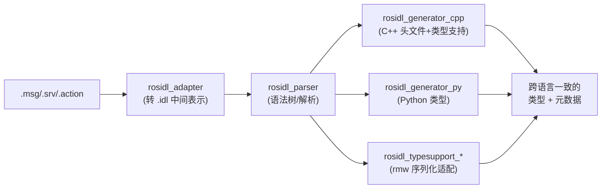

# 05 消息、服务与类型系统

> **在知识图谱中的位置**：模块一 · 基础概念 · 05
> **难度**：⭐⭐⭐ | **前置知识**：[什么是 ROS 2](./01_什么是ROS2.md)、[工作空间与 Colcon 构建](./04_工作空间与Colcon构建.md)

## 1. 概述

**ROS 2 的通信是"强类型"的：节点间交换的每条数据都由接口定义语言（IDL）描述的消息（`.msg`）、服务（`.srv`）、动作（`.action`）定义，经 `rosidl` 工具链从语言无关的中间表示生成 C++/Python 等各语言绑定。** 类型系统既是跨语言互通的契约，也是运行时消息路由与序列化的基石。

## 2. 核心概念

### 2.1 三类接口定义

```bash
# 文件后缀与作用
.msg     # 消息：纯数据结构（Topic 用）
.srv     # 服务：请求 + 响应（Service 用），用 --- 分隔
.action  # 动作：目标 + 结果 + 反馈（Action 用），用 --- 分隔三段
```

### 2.2 三段结构语法

```bash
# std_msgs/msg/Header.msg（真实定义）
uint32 seq
builtin_interfaces/Time stamp    # 内建时间类型
string frame_id
```

```bash
# 自定义 AddTwoInts.srv
int64 a
int64 b
---
int64 sum
```

```bash
# 自定义 Fibonacci.action
int32 order          # 目标（Goal）
---
sequence<int32> sequence   # 结果（Result）
---
sequence<int32> partial_sequence   # 反馈（Feedback）
```

### 2.3 内建与基础类型

`bool, byte, char, float32, float64, int8/16/32/64, uint8/16/32/64, string, wstring`；复合类型：定长数组 `T[N]`、变长数组 `T[]` 与 `sequence<T>`、以及嵌套其他消息。**字段默认值可写 `= 值`**（如 `int32 x = 5`）。

## 3. 技术原理

### 3.1 rosidl 生成流水线



**关键机制**：`rosidl_adapter` 把 `.msg/.srv/.action` 统一转成 OMG IDL 风格的 `.idl` 中间表示；`rosidl_parser` 解析成抽象语法树；各 `rosidl_generator_*` 包从**同一棵语法树**生成不同语言产物，从而保证"同一消息在 C++/Python/C 里的字段与内存布局语义一致"。

### 3.2 源码级证据：生成产物与运行时类型查找

构建时 `rosidl_generate_interfaces()`（见 [工作空间与 Colcon 构建](./04_工作空间与Colcon构建.md)）触发上述流水线，生成：

- C++：`my_msgs/msg/foo.hpp` 中的 `my_msgs::msg::Foo` 结构体 + `get_type_support()`。
- Python：`my_msgs.msg.Foo` 类（`rosidl_generator_py` 产出，继承 `object`，带 `__slots__` 与序列化支持）。
- 元数据：类型支持库（`libmy_msgs__rosidl_typesupport_cpp.so` 等），供 rmw 层在运行时按类型名路由。

**运行时按字符串查类型**（Python 侧）：

```python
from rosidl_runtime_py.utilities import get_message, get_service
Msg = get_message("std_msgs/msg/String")   # 返回 Python 消息类
Srv = get_service("example_interfaces/srv/AddTwoInts")
```

其底层是 `rosidl_runtime_py` 的**类型注册表**：`rosidl_generator_py` 在导入消息模块时，把 `"std_msgs/msg/String" → 类` 的映射注册进全局表；`get_message`/`get_service` 即按字符串查表（内部走 `get_message_type()`/类型支持机制）。这支撑了 `ros2 topic pub`、rosbag2 回放、动态类型工具等"用名字就能拿到类型"的能力。

### 3.3 跨语言一致性

一致性的根在于**单一 IDL 源 + 统一的序列化规范（CDR，Common Data Representation）**：

- C++ 的 `uint64` 与 Python 的 `int`（生成时校验范围）在 wire 上都是 8 字节小端整数。
- `float32` 在 wire 上是 IEEE-754 单精度，C++ 里 `float`、Python 里 `float`（生成类不透明持有），**精度语义一致**。
- 嵌套消息按"长度前缀 + 数据"序列化，两端解析顺序一致。

## 4. 实践指南

### 4.1 自定义消息包的标准做法

```bash
# 建独立消息包（消息与逻辑分离，便于跨语言复用）
ros2 pkg create my_msgs --build-type ament_cmake
cd my_msgs
mkdir msg srv action
```

```bash
# msg/Point2D.msg
float64 x
float64 y
```

```cmake
# CMakeLists.txt 关键片段
find_package(rosidl_default_generators REQUIRED)
rosidl_generate_interfaces(${PROJECT_NAME}
  "msg/Point2D.msg"
)
```

```xml
<!-- package.xml 关键依赖 -->
<buildtool_depend>rosidl_default_generators</buildtool_depend>
<exec_depend>rosidl_default_runtime</exec_depend>
<member_of_group>rosidl_interface_packages</member_of_group>
```

```python
# 使用方（Python）
from my_msgs.msg import Point2D
p = Point2D(x=1.0, y=2.0)
```

> `rosidl_default_generators` / `rosidl_default_runtime` 是"元包"，把当前发行版默认的 rosidl 生成器/运行时一次性聚合，避免逐个列举。

### 4.2 最佳实践

- **消息包与业务包分离**：接口单独成包（如 `my_msgs`），业务包依赖它，避免交叉依赖与重复生成。
- 字段语义写清楚（单位、坐标系、时间语义），字段类型**宁小勿大**（能用 `float32` 别用 `float64`）。
- 变长字段（`string`/`sequence`）会带来堆分配与序列化开销，实时/高频路径尽量用定长字段。
- 用 `ros2 interface show my_msgs/msg/Point2D` 验证生成的接口；用 `ros2 interface package my_msgs` 列出包内接口。

### 4.3 常见陷阱

| 坑 | 现象 | 解法 |
|---|---|---|
| 字段类型不兼容（如 `float32` 改 `float64`） | 旧订阅者收到新消息解析错位 | 接口变更要走版本化/迁移，或重编译所有相关方 |
| `uint64` 存大数在 Python 里类型混乱 | 精度/比较异常 | 明确整数范围，别用 `uint64` 存可能超 2^63 且需 Python 精确运算的值 |
| 浮点语义（`float32` vs `float64`） | 精度损失、相等比较抖动 | 明确精度需求，避免直接 `==` 比较浮点字段 |
| 消息包没加 `member_of_group` | 工具/索引识别不到接口包 | 补 `<member_of_group>rosidl_interface_packages</member_of_group>` |
| 改了 `.msg` 不重编就运行 | 消费方拿到旧类型 | 重跑 `colcon build` 并重新 source |

### 4.4 性能与注意事项

- **大消息**（图像/点云）：用 `sensor_msgs/msg/Image`/`PointCloud2` 这类含连续缓冲的布局，配合共享内存/zero-copy（Cyclone DDS 支持 loan），避免默认序列化的多次拷贝。
- **高频小消息**：把多个标量打包成一个定长消息，减少 topic 数量与头部开销。
- **跨语言数值**：注意 Python `int` 无上界，而 C++ 侧是定长整型；越界赋值在部分生成器会抛异常或静默截断，务必显式校验。

## 5. 方案对比

| 方案 | 优势 | 劣势 | 适用场景 |
|---|---|---|---|
| `.msg`（自定义） | 类型安全、强契约 | 变更需重编 | 结构化数据 |
| `std_msgs`/内建 | 开箱即用 | 语义弱（仅 data 字段） | 原型/字符串透传 |
| 泛型 `rclpy` 动态类型（rosbag/CLI） | 无需编译即可操作任意类型 | 性能低、无编译期检查 | 工具/调试 |
| ROS 1 genmsg 旧消息 | 兼容老系统 | 需桥接/迁移 | 迁移过渡 |

> **在什么场景下绝对不能使用**：**绝不能靠"裸字符串 + 自己 split"替代消息定义来跨语言传结构化数据**——一旦两端解析规则不一致（编码、字段顺序、浮点格式），会在无任何类型检查的情况下产生静默数据错位；同理，**绝不能在生产里用 `ros2 topic pub` 的 YAML 文本发布高频关键指令**，它经过文本解析且无类型编译期保护，只适合调试。

## 6. 工具链

| 工具 | 用途 | 链接 |
|---|---|---|
| ros2 interface | 查看/列举接口 | https://docs.ros.org/en/jazzy/Tutorials/Beginner-CLI-Tools/Understanding-Services/Understanding-Services.html |
| rosidl | 接口生成框架 | https://github.com/ros2/rosidl |
| rosidl_runtime_py | Python 运行时类型 | https://docs.ros.org/en/iron/p/rosidl_runtime_py/index.html |
| rosbag2 | 类型化录制回放 | https://github.com/ros2/rosbag2 |

## 7. 参考资料

- 自定义 msg/srv 教程：https://docs.ros.org/en/jazzy/Tutorials/Beginner-Client-Libraries/Custom-ROS2-Interfaces.html ✅已验证
- About ROS 2 Interfaces：https://docs.ros.org/en/jazzy/Concepts/Basic/About-Interfaces.html ✅已验证
- rosidl 仓库：https://github.com/ros2/rosidl ✅已验证
- rosidl_runtime_py 文档：https://docs.ros.org/en/iron/p/rosidl_runtime_py/index.html ✅已验证
- interface 命令行工具：https://docs.ros.org/en/jazzy/Tutorials/Beginner-CLI-Tools/Understanding-Services/Understanding-Services.html ✅已验证

## 8. 学习路径

- **Level 1**：用 `ros2 interface show` 查看 std_msgs 的 Header，理解字段类型。
- **Level 2**：建一个自定义消息包，在 C++ 与 Python 两端各写发布/订阅。
- **Level 3**：读懂 rosidl_adapter→parser→generator 流水线，会看生成的 `.hpp`/Python 类。
- **Level 4**：用 `get_message` 做运行时动态类型，理解类型支持库与 rosbag2 的机制。
- **Level 5**：设计跨语言、跨版本演进的接口规范，评估大消息 zero-copy 与序列化开销。

## 9. 核心面试三问

**Q1：`.msg` 是怎么变成 C++ 和 Python 两套类型的？为什么能保证跨语言一致？**

参考要点：`.msg/.srv/.action` 先经 `rosidl_adapter` 转成 `.idl` 中间表示，`rosidl_parser` 解析成同一棵语法树，`rosidl_generator_cpp`/`rosidl_generator_py` 等从**同一源**生成各自语言产物，并用统一 CDR 序列化规范，因此字段类型、顺序、内存布局语义一致。

**Q2：`ros2 topic pub` 或 rosbag2 是怎么"只知道一个字符串名字"就能反序列化任意消息的？**

参考要点：生成器在导入消息模块时向 `rosidl_runtime_py` 的**类型注册表**登记 `"包/类型"→类` 映射（内部靠 `get_message_type()`/类型支持库）；运行时用 `get_message("std_msgs/msg/String")` 按字符串查表拿类，再调用其序列化/反序列化方法，故无需编译期类型。

**Q3：把消息里一个字段从 `float32` 改成 `float64`，哪些地方会悄悄出错？**

参考要点：wire 布局改变（4→8 字节），**旧版本消费者**按旧偏移解析会错位/崩溃；Python 侧精度语义变化；序列化长度变化影响带宽；若两端版本不一致且无版本协商，会静默数据损坏。必须版本化接口、同步重编所有相关方，或保留旧字段新增字段。
