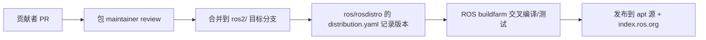

# 06 ROS 2 生态与角色地图

> **在知识图谱中的位置**：模块一 · 基础概念 · 06
> **难度**：⭐ | **前置知识**：[什么是 ROS 2](./01_什么是ROS2.md)

## 1. 概述

**ROS 2 是一个由多家组织、公司、社区共同治理的开源生态：开源基金会与公司承担基础设施，`github.com/ros2` 组织承载核心代码仓库，`index.ros.org` 提供包索引，Discourse 是主论坛，ROSCon 是年度大会，贡献流程由 TSC 与 maintainer 制度保障。** 了解这张"角色地图"，才知道该去哪里找包、提问题、提 PR、跟进版本。

## 2. 核心概念

### 2.1 组织脉络：从 Willow Garage 到 Open Robotics

- **2007**：机器人公司 Willow Garage 启动 ROS 1（ROS 1.0 于 2010 发布）。
- **2012**：成立非营利 **OSRF（Open Source Robotics Foundation）**，接管 ROS 的持续开发。
- **2017**：OSRF 更名/重组为 **Open Robotics**（旗下含非营利 OSRF 与营利性 OSRC 两部分）。
- **2022-12**：Alphabet 旗下 **Intrinsic 收购 OSRC**（Open Robotics 的营利部门），非营利 **OSRF 继续存在**并主导 ROS 开源治理。

> 这段历史细节以 Open Robotics 官方博客与维基为准；公司层面更名/股权演变的精确表述建议再核对官方公告，本文标注到"2017 重组、2022 Intrinsic 收购"这一公认时间线。

### 2.2 代码组织：`github.com/ros2`

核心仓库按"分层"组织，上层依赖下层：

| 层 | 代表仓库 | 作用 |
|---|---|---|
| 客户端库 | `rclcpp`、`rclpy`、`rclc` | C++/Python/微控制器客户端库 |
| 语言无关核心 | `rcl` | C 语言核心库（`rcl_node_t` 等句柄） |
| 中间件抽象 | `rmw`、`rmw_cyclonedds`、`rmw_fastrtps` | RMW 接口 + 各 DDS 实现适配 |
| 接口生成 | `rosidl`、`rosidl_typesupport` | `.msg/.srv/.action` → 各语言 |
| 命令行 | `ros2cli`、`ros2launch` 等 | `ros2` 命令族 |
| 高层工具 | `rosbag2`、`rclcpp_lifecycle`、`rviz` | 录制/生命周期/可视化 |

### 2.3 包分发：`index.ros.org`

`index.ros.org` 是 ROS 的**官方包索引**：能按发行版（jazzy/rolling/...）搜索包，查看其版本、依赖、README、源码/二进制来源。它是"这个包在哪个 distro 里、版本是多少"的权威入口。

### 2.4 社区阵地

- **Discourse**：主论坛 `discourse.ros.org`（现已迁移到 `discourse.openrobotics.org`），发公告、提问、WG 会议纪要、发布通知都在这。
- **ROSCon**：年度 ROS 开发者大会（官网 `roscon.ros.org`），含技术演讲、Lightning talk、厂商展区。⚠️ `roscon.global` 这一域名**来源待验证**，官方站点以 `roscon.ros.org` 为准。

## 3. 技术原理

### 3.1 一条 `ros2 topic list` 命令的调用链（源码级）

以 `ros2cli` 仓库为例，理解生态的"可扩展 CLI 架构"：

1. 入口 `ros2` 是 `ros2cli` 提供的**命令分派器**，按第一个词（verb）加载对应子命令插件。
2. `ros2 topic list` 进入 `ros2topic` 包的 `ros2topic/command/topic.py` 与 `verb/list.py`。
3. `list.py` 通过 `rclpy` 的 **graph API**（`rclpy` 内部调用 `rcl` 的 `rcl_get_topic_names_and_types()`，再经 `rmw` 查询 DDS 发现缓存）拿到话题名与类型。
4. 结果格式化打印到终端。

**关键点**：这条链展示了 ROS 2 生态的**插件化设计**——第三方完全可以新增自己的 `ros2 xxx` 子命令（放在包的 `entry_points` 里注册 verb），无需修改 `ros2cli` 本体。`rcl_get_topic_names_and_types()` 是 `rcl/graph.h` 中的真实函数，是"图自省（introspection）"能力的源码锚点。

### 3.2 治理与发布数据流



- **TSC（Technical Steering Committee）**：裁决技术方向与争议，章程见 docs.ros.org 的 Governance 页。
- **Working Groups**：如 Middleware WG、Real-Time WG、Security WG、Client Libraries WG、Tooling WG 等，分领域推进设计评审（完整列表见官方 Working Groups 页，名单随项目演进）。
- **maintainer**：每个包的代码/发布负责人，PR 需其 review 通过。

## 4. 实践指南

### 4.1 找包、装包、贡献的最小闭环

```bash
# 1) 找包：在 index.ros.org 搜 "demo_nodes_cpp"，确认它在 jazzy 有二进制
# 2) 装包（Ubuntu）
sudo apt install ros-jazzy-demo-nodes-cpp
# 3) 本地跑
source /opt/ros/jazzy/setup.bash
ros2 run demo_nodes_cpp talker
```

### 4.2 贡献 PR 的流程

1. 找到目标仓库（`github.com/ros2/<repo>`），读 `CONTRIBUTING.md`。
2. Fork → 建分支 → 修改 → 提交（遵循 DCO sign-off：`git commit -s`）。
3. 跑测试与 linter（`colcon test`、`ament_lint`），确保 CI 绿。
4. 提 PR，@ 相关 maintainer，在 Discourse 相关 WG 帖子里说明动机。
5. 等 review，按意见迭代；合并后走 release 流程进入某个 distro。

### 4.3 常见陷阱

| 坑 | 现象 | 解法 |
|---|---|---|
| 在 GitHub 上"乱找"核心包 | 分不清 rcl/rclcpp/rmw 层级 | 按上文分层表定位仓库 |
| 把 Discourse 当 GitHub issue 用 | 问题无人跟进 | 代码 bug 提 issue/PR，讨论去 Discourse |
| 用错发行版搜包 | index 上找不到包 | 切换 index 的 distro 过滤为 jazzy 等 |
| 直接抄第三方博客里的旧命令 | 命令/URL 已失效 | 以 docs.ros.org 当前发行版为准 |

### 4.4 注意事项

- ROS 2 核心仓库众多，入门不必全读：先认准 `rclcpp`/`rclpy`/`rcl`/`rmw`/`rosidl`/`ros2cli` 六个"骨架"。
- 官方二进制包的权威来源是 `packages.ros.org` 与 `index.ros.org`；**不要从不明第三方源安装 ROS 包**。
- 关注发行版发布公告（Discourse 的 "ROS Announcements"），跟进 EOL 与迁移窗口。

## 5. 方案对比

| 方案 | 优势 | 劣势 | 适用场景 |
|---|---|---|---|
| 官方核心（github.com/ros2） | 权威、受 TSC 治理 | 迭代节奏按社区 | 核心能力 |
| 第三方生态包（导航/控制等） | 功能丰富 | 质量/维护参差 | 具体功能 |
| 商业发行版（各厂商维护的 ROS 2） | 认证、技术支持 | 锁定、成本 | 量产/安全认证 |
| 自研 fork | 完全可控 | 维护成本极高、脱离生态 | 极特殊定制 |

> **在什么场景下绝对不能使用**：**绝不能从 GitHub 的 `master`/`rolling` 分支直接拉取未发布代码并部署到生产机器人**——这些分支处于持续集成中、可能不通过 release 测试；生产必须使用经 ROS buildfarm 测试、冻结的发行版二进制（如 jazzy），或经完整 CI 验证的固定 commit。

## 6. 工具链

| 工具 | 用途 | 链接 |
|---|---|---|
| index.ros.org | 官方包索引 | https://index.ros.org |
| Discourse | 社区论坛 | https://discourse.openrobotics.org |
| ROSCon | 年度大会 | https://roscon.ros.org |
| ros/rosdistro | 发行版元数据（distribution.yaml） | https://github.com/ros/rosdistro |
| build.ros.org | ROS buildfarm | https://build.ros.org |

## 7. 参考资料

- ROS 2 官方文档（Jazzy）：https://docs.ros.org/en/jazzy/ ✅已验证
- Open Robotics（历史）：https://en.wikipedia.org/wiki/Open_Robotics ✅已验证
- Intrinsic 收购 OSRC：https://www.openrobotics.org/blog/2022/12/15/intrinsic-acquires-osrc-and-osrc-sg ✅已验证
- github.com/ros2 组织：https://github.com/ros2 ✅已验证
- Middleware Working Group：https://github.com/ros2/middleware_working_group ✅已验证
- Working Groups 治理页：https://docs.ros.org/en/jazzy/The-ROS2-Project/Governance/Working-Groups.html ✅已验证
- TSC 章程：https://docs.ros.org/en/galactic/The-ROS2-Project/Governance/ROS2-TSC-Charter.html ✅已验证
- ROS 包索引：https://index.ros.org ✅已验证
- ROS Discourse：https://discourse.openrobotics.org ✅已验证（原 `discourse.ros.org` 已迁移至此）
- ROSCon：https://roscon.ros.org ✅已验证（`roscon.global` ⚠️来源待验证）
- rosdistro 仓库：https://github.com/ros/rosdistro ✅已验证

## 8. 学习路径

- **Level 1**：浏览 index.ros.org，搜出 `demo_nodes_cpp` 在 jazzy 的版本。
- **Level 2**：逛 Discourse 的 Announcements/General 板块，读一篇发行版发布帖。
- **Level 3**：在 github.com/ros2 里认全 rcl/rclcpp/rmw/rosidl/ros2cli 五层仓库。
- **Level 4**：给某包提一个文档/小 bug 的 PR，走完 DCO + review 流程。
- **Level 5**：参与某个 Working Group 的设计讨论，理解 TSC 决策与 release 流程。

## 9. 核心面试三问

**Q1：Open Robotics、OSRF、Intrinsic 三者现在是什么关系？**

参考要点：OSRF 是 2012 年成立的**非营利基金会**，2017 年重组为 Open Robotics（含非营利 OSRF 与营利 OSRC）；2022 年 Intrinsic 收购了营利性 OSRC，非营利 OSRF 继续存在并主导 ROS 开源治理。三者不是同一实体，谈"谁拥有 ROS"时要区分营利/非营利两部分。

**Q2：一个第三方包是怎么"进入" jazzy 发行版、变成 `apt install ros-jazzy-xxx` 的？**

参考要点：包在 GitHub 上由 maintainer 维护 → 其版本被登记进 `ros/rosdistro` 的 `jazzy/distribution.yaml` → ROS buildfarm 按该元数据拉源码交叉编译/跑测试 → 产物发布到 `packages.ros.org` 源，`index.ros.org` 同步展示。**直接有 GitHub 仓库 ≠ 进了发行版**。

**Q3：`rcl`、`rclcpp`、`rmw` 三个仓库的分工与依赖方向是什么？为什么这样分层？**

参考要点：`rmw` 定义语言无关的中间件抽象（对接 DDS）；`rcl` 在 rmw 之上实现语言无关的节点/话题/图 API（`rcl_node_t`、`rcl_get_topic_names_and_types`）；`rclcpp` 在 rcl 之上提供 C++ 面向对象封装（`rclcpp::Node`）。依赖方向 rclcpp→rcl→rmw，好处是换 DDS 后端只动 rmw 实现，上层（rclcpp/rclpy）零改动，实现"客户端库与通信后端解耦"。
