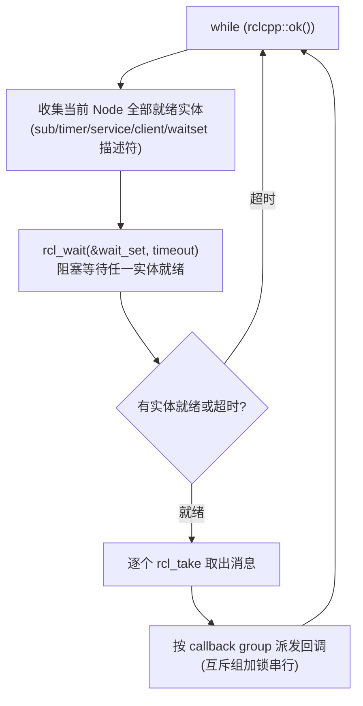

> **在知识图谱中的位置**：模块二 · 核心模块 · 01
> **难度**：⭐⭐⭐ 进阶（本模块核心） | **前置知识**：[ROS 2 概述](../01_基础概念/01_什么是ROS2.md)、[架构与 DDS 中间件](../03_高级话题/01_ROS2架构分层详解.md)

## 1. 概述

发布/订阅（Publish/Subscribe，Pub/Sub）是 ROS 2 一切通信的基石：传感器数据、控制指令、状态上报、日志、TF 等几乎全部基于"话题（Topic）+ 消息（Message）"流动。本文件把 **Node / Publisher / Subscription / Topic** 四件套与 **executor + spin** 机制讲透，并逐层拆解一条消息从 `publish()` 到对端回调函数的完整数据通路。

四件套关系一句话：**Node 是进程内通信的载体与命名空间，Publisher 是"出口"，Subscription 是"入口"，Topic 是连接二者的逻辑地址**。多个订阅方订阅同一话题即可完成一对多广播；发布方与订阅方在编译期只依赖消息类型（`std_msgs::msg::String` 等），运行时通过 DDS 的发现机制动态匹配，彼此无需知道对方进程与主机位置。

## 2. 核心概念

| 概念 | 定义 | 关键点 |
|------|------|--------|
| **Node（节点）** | 一个参与 ROS 2 图（Graph）的进程内对象，拥有名字、命名空间、参数、日志器、时钟、回调组等资源 | 一个进程可承载多个 Node；`rclcpp::Node` / `rclpy.node.Node` |
| **Topic（话题）** | 消息的逻辑通道，由名字唯一标识（如 `/scan`、`/cmd_vel`），类型化（一个话题只有一种消息类型） | 一对多；发布方与订阅方解耦 |
| **Publisher（发布方）** | 向话题写入消息的句柄，`create_publisher<T>("topic", qos)` 创建 | 线程安全，可在任意线程 `publish()` |
| **Subscription（订阅方）** | 从话题读取消息的句柄，创建时绑定回调函数 | 回调由 executor 驱动，而非用户线程直接调用 |
| **Executor（执行器）** | 驱动回调的调度器，`add_node` 注册节点、`spin` 主循环等待并派发就绪回调 | 见 §3；callback group 详解见[执行器与回调组](../03_高级话题/02_线程模型与Executor深度解析.md) |

> **Callback Group（回调组）**：把多个实体（订阅/定时器/服务/动作）的回调归组并施加并发约束（`MutuallyExclusive` 互斥 / `Reentrant` 可重入）。它是解决"一个慢回调拖垮整节点"的关键工具，本文件只引入概念，完整机制见[执行器与回调组详解](../03_高级话题/02_线程模型与Executor深度解析.md)。

## 3. 技术原理

### 3.1 发布/订阅数据通路全解析

一条消息的完整旅程（以 C++ 为例，Python 走同一条 rcl/rmw 底层）：


逐层说明（源码级证据）：

1. **rclcpp 层**：`rclcpp::Publisher<T>::publish(const T & msg)` 内部先做 **序列化**——调用由 `rosidl_typesupport_cpp` 为每个消息类型生成的 `serialize()` 把结构体打包成字节流；随后调用 `rcl_publish()`（rcl 库，`rcl/publisher.h`）。
2. **rcl 层**：`rcl_publish()` 是对 `rmw_publish()` 的薄封装，负责校验句柄有效性并转发给具体中间件。
3. **rmw 层**：`rmw_publish()`（`rmw/rmw.h`）是"ROS 中间件接口"，由具体 RMW 实现（如 Fast DDS / CycloneDDS 的 rmw 适配器）把序列化字节写入 DDS **DataWriter**。
4. **DDS 传输**：DataWriter `write()` 后，DDS 依据 QoS 做可靠重传/历史缓存/分片，经共享内存、loopback 或真实网络送达对端 **DataReader**。
5. **订阅侧逆过程**：DataReader 的监听线程把新样本交给 rmw，`rmw_take()` → `rcl_take()`，rclcpp 用类型支持的 `deserialize()` 还原对象，压入 `Subscription` 内部的就绪队列，等待 executor 取出后按 callback group 派发回调。

> **线程/锁/内存开销与延迟量级**（量级仅供参考，具体值取决于 RMW 实现、消息大小与硬件，标注"待验证"）：进程内 **intra-process 零拷贝**（`NodeOptions().use_intra_process_comms(true)` + `publish(std::move(unique_ptr))`）可到**微秒级**；本机 loopback 的跨进程 Pub/Sub 通常在**几十微秒到毫秒级**（序列化 + DDS 发现与传输占大头）；跨网络延迟由链路决定。每新增一个实体（pub/sub）都要持有 rmw/DDS 结构体并计入 waitset，实体数与 waitset 重建有 O(N) 开销。`MutuallyExclusive` 回调组用互斥锁串行化回调，`Reentrant` 组不加锁但要求用户自行保证线程安全。

### 3.2 executor 与 spin 机制

`rclcpp::spin(node)` 等价于"建一个 `SingleThreadedExecutor` → `add_node(node)` → `spin()`"。主循环逻辑：



关键点：

- **waitset（`rcl_wait_set_t`）**：rcl 提供的"多实体就绪事件的批处理等待"原语。它把订阅、服务、客户端、定时器、可等待事件等抽象成统一的**等待描述符**，一次 `rcl_wait()` 阻塞直到集合中任意实体就绪，**避免忙轮询（busy-polling）**。waitset 结构大小与实体数量成正比，复杂度 O(实体数)。
- **单线程语义**：`SingleThreadedExecutor` 只有一个执行线程，所有回调（定时器、订阅、服务、动作）**串行执行**——因此一个回调里 `sleep(10)` 会阻塞整节点的所有回调（见 §4.3 陷阱 1）。
- **rclpy 差异**：`rclpy.spin()` 在调用 `rcl_wait()` 阻塞期间会**释放 GIL**，让其他 Python 线程得以运行；但回调执行时仍持有 GIL，因此 **CPython 下即使 `MultiThreadedExecutor`，纯 Python 回调也会被 GIL 串行化**，CPU 密集型计算无法靠多线程提速，需改用多进程或 C 扩展。Windows 上 rcl 的 waitset 底层依赖各 RMW 的 Windows 同步原语（条件变量 / 等待句柄），与 Linux 的 poll/epoll 路径不同，线程调度粒度亦有差异（具体取决于所装 RMW）。
- 进阶执行器（`events_executor`、`StaticSingleThreadedExecutor`）与 callback group 完整机制见[执行器与回调组详解](../03_高级话题/02_线程模型与Executor深度解析.md)。

## 4. 实践指南

### 4.1 入门代码示例（talker / listener）

**C++ 发布方**（`minimal_publisher.cpp`）：

```cpp
#include <chrono>
#include <functional>
#include <memory>
#include <string>

#include "rclcpp/rclcpp.hpp"
#include "std_msgs/msg/string.hpp"

using namespace std::chrono_literals;

class MinimalPublisher : public rclcpp::Node
{
public:
  MinimalPublisher()
  : Node("minimal_publisher"), count_(0)
  {
    publisher_ = this->create_publisher<std_msgs::msg::String>("topic", 10);
    timer_ = this->create_wall_timer(
      500ms, std::bind(&MinimalPublisher::timer_callback, this));
  }

private:
  void timer_callback()
  {
    auto message = std_msgs::msg::String();
    message.data = "Hello, world! " + std::to_string(count_++);
    RCLCPP_INFO(this->get_logger(), "Publishing: '%s'", message.data.c_str());
    publisher_->publish(message);
  }
  rclcpp::TimerBase::SharedPtr timer_;
  rclcpp::Publisher<std_msgs::msg::String>::SharedPtr publisher_;
  size_t count_;
};

int main(int argc, char * argv[])
{
  rclcpp::init(argc, argv);
  rclcpp::spin(std::make_shared<MinimalPublisher>());
  rclcpp::shutdown();
  return 0;
}
```

**C++ 订阅方**（`minimal_subscriber.cpp`）：

```cpp
#include <memory>
#include "rclcpp/rclcpp.hpp"
#include "std_msgs/msg/string.hpp"
using std::placeholders::_1;

class MinimalSubscriber : public rclcpp::Node
{
public:
  MinimalSubscriber()
  : Node("minimal_subscriber")
  {
    subscription_ = this->create_subscription<std_msgs::msg::String>(
      "topic", 10, std::bind(&MinimalSubscriber::topic_callback, this, _1));
  }

private:
  void topic_callback(const std_msgs::msg::String & msg) const
  {
    RCLCPP_INFO(this->get_logger(), "I heard: '%s'", msg.data.c_str());
  }
  rclcpp::Subscription<std_msgs::msg::String>::SharedPtr subscription_;
};

int main(int argc, char * argv[])
{
  rclcpp::init(argc, argv);
  rclcpp::spin(std::make_shared<MinimalSubscriber>());
  rclcpp::shutdown();
  return 0;
}
```

**Python 发布方**（`minimal_publisher.py`）：

```python
import rclpy
from rclpy.node import Node
from std_msgs.msg import String

class MinimalPublisher(Node):
    def __init__(self):
        super().__init__('minimal_publisher')
        self.publisher_ = self.create_publisher(String, 'topic', 10)
        timer_period = 0.5  # seconds
        self.timer = self.create_timer(timer_period, self.timer_callback)
        self.i = 0

    def timer_callback(self):
        msg = String()
        msg.data = 'Hello World: %d' % self.i
        self.publisher_.publish(msg)
        self.get_logger().info('Publishing: "%s"' % msg.data)
        self.i += 1

def main(args=None):
    rclpy.init(args=args)
    minimal_publisher = MinimalPublisher()
    rclpy.spin(minimal_publisher)
    minimal_publisher.destroy_node()
    rclpy.shutdown()

if __name__ == '__main__':
    main()
```

**Python 订阅方**（`minimal_subscriber.py`）：

```python
import rclpy
from rclpy.node import Node
from std_msgs.msg import String

class MinimalSubscriber(Node):
    def __init__(self):
        super().__init__('minimal_subscriber')
        self.subscription = self.create_subscription(
            String, 'topic', self.listener_callback, 10)

    def listener_callback(self, msg):
        self.get_logger().info('I heard: "%s"' % msg.data)

def main(args=None):
    rclpy.init(args=args)
    minimal_subscriber = MinimalSubscriber()
    rclpy.spin(minimal_subscriber)
    minimal_subscriber.destroy_node()
    rclpy.shutdown()

if __name__ == '__main__':
    main()
```

> 以上为官方入门示例的标准形态；`create_publisher` / `create_subscription` 的第 3 个参数是 **QoS**（整型 10 等价于 `rclcpp::QoS(10)`，即 reliable + keep_last(depth=10)）。

### 4.2 最佳实践

- **构造期一次性创建实体**：`create_publisher/subscription` 在构造函数中完成，避免运行时反复创建/销毁（DDS 发现与内存分配开销大）。
- **回调要短**：把耗时 I/O、重计算移出回调；单线程 executor 下回调即瓶颈。
- **命名与命名空间**：用 `/robot/sensors/lidar` 这类层级化命名 + `namespace`，配合 remap 提高可复用性。
- **显式 QoS**：不要依赖默认值，为传感器流用 best_effort、控制指令用 reliable（详见 [05 QoS](./05_QoS与通信机制.md)）。
- **用定时器替代忙循环**：`create_wall_timer` 优于 `while + sleep` 手动发消息。
- **启用 intra-process 通信**：同一进程内多个 Node 的高频大数据（点云、图像）用零拷贝路径省去序列化。

### 4.3 常见陷阱（坑 → 解法）

| 坑 | 现象 | 解法 |
|----|------|------|
| **回调里阻塞** | `sleep`/同步 RPC/阻塞读写在订阅回调里，单线程 executor 整节点卡死：定时器停摆、其他话题不响应 | 把阻塞工作移入独立线程/独立 callback group；或 `MultiThreadedExecutor` + `Reentrant` 组；优先改异步 I/O |
| **QoS 默认不匹配传感器** | 默认 reliable + volatile，高帧率图像/点云因重传排队造成延迟与丢帧 | 传感器用 `best_effort + keep_last(1)`（`rclcpp::SensorDataQoS()`），详见 [05 QoS](./05_QoS与通信机制.md) |
| **late joiner 丢首帧** | volatile 语义下，后启动的订阅方收不到历史消息（如地图、参数快照） | 发布方改用 `transient_local` durability |
| **回调里误用 shared_ptr 生命周期** | 回调参数是 `SharedPtr`，把指针存到容器导致消息被反复覆盖/悬垂 | 需要保存就 `msg->data` 深拷贝；不要长期持有回调传入的 `SharedPtr` |
| **未 `rclcpp::init` 就建节点** | 运行时异常 / 段错误 | 任何 ROS 程序先 `rclcpp::init(argc, argv)` |

### 4.4 性能调优

- **减少序列化**：大消息用 intra-process 零拷贝；或自定义类型支持（`rosidl_typesupport`）裁剪字段。
- **waitset 实体数**：每个订阅/定时器都计入 waitset，节点实体过多会增加每轮 `rcl_wait` 与重建开销；合并话题、精简定时器。
- **回调组隔离**：高频低延迟话题放独立 `Reentrant` 组 + 独立线程，与慢速回调解耦。
- **QoS 调优**：`depth` 只保留最新帧（传感器）；`best_effort` 省去 ACK/重传（详见 [05 QoS](./05_QoS与通信机制.md) 4.4）。
- **测量而非猜测**：用 `ros2 topic hz/bw`、`rqt_plot`、Tracy/`ros2 trace` 定位瓶颈，勿凭直觉改参数。

## 5. 方案对比

| 通信范式 | 语义 | 适用场景 | 本模块文档 |
|----------|------|----------|-----------|
| **发布/订阅** | 一对多、单向、异步、无应答 | 传感器流、状态广播、TF、连续指令 | 本文 |
| **服务** | 一问一答、请求-响应、幂等 | 触发式、低频率、需要返回值 | [02 服务与动作](02_服务与动作.md) |
| **动作** | 长时任务、带反馈、可取消 | 导航、抓取、轨迹执行 | [02 服务与动作](02_服务与动作.md) |

**绝对不适用场景**：需要"一问一答且必须拿到返回值/成功失败确认"的同步语义（如查询相机标定参数、请求一次抓取），用发布/订阅会因单向无应答而无法确认对方是否收到或处理成功——此时应改用服务或动作。

## 6. 工具链

| 工具 | 用途 | 链接 |
|------|------|------|
| `ros2 topic list/info/echo/pub/hz/bw` | 话题的列举、类型/QoS 查询、回显、注入、频率/带宽测量 | https://docs.ros.org/en/jazzy/ |
| `ros2 node list/info` | 节点与订阅/发布关系查询 | https://docs.ros.org/en/jazzy/ |
| `rqt_graph` | 可视化节点-话题计算图 | https://github.com/ros-visualization/rqt_graph |
| `ros2 interface show` | 查看消息类型定义 | https://docs.ros.org/en/jazzy/ |
| `rqt_plot` / `plotjuggler` | 数据时序可视化与调参 | https://github.com/ros-visualization/rqt_plot |

## 7. 参考资料

- 官方概念：Executors —— https://docs.ros.org/en/jazzy/Concepts/Intermediate/About-Executors.html ✅
- 官方教程（C++ 发布/订阅）：https://docs.ros.org/en/jazzy/Tutorials/Beginner-Client-Libraries/Writing-A-Simple-Cpp-Publisher-And-Subscriber.html ✅
- 官方教程（Python 发布/订阅）：https://docs.ros.org/en/jazzy/Tutorials/Beginner-Client-Libraries/Writing-A-Simple-Py-Publisher-And-Subscriber.html ✅
- rclcpp 源码：https://github.com/ros2/rclcpp ✅
- rcl 源码：https://github.com/ros2/rcl ✅
- rmw 接口源码：https://github.com/ros2/rmw ✅

## 8. 学习路径

- **Level 1**：跑通官方 talker/listener（C++ 与 Python 各一遍），用 `ros2 topic echo /topic` 看到消息。
- **Level 2**：改话题名/消息类型，用 `ros2 topic info --verbose` 看 QoS 与类型。
- **Level 3**：读懂 §3 数据通路，能画出 publish→DataWriter→DataReader→callback 全链路。
- **Level 4**：写一个带自定义 callback group 的多话题节点，隔离慢回调。
- **Level 5**：用 intra-process 零拷贝优化同进程点云/图像传输，并用 `ros2 trace` 实测延迟。

## 9. 核心面试三问

**Q1：为什么一个订阅回调里 `sleep(10s)` 会导致整个节点的定时器、其他订阅全部卡死？如何解决？**
答题要点：默认 `rclcpp::spin` = `SingleThreadedExecutor`，单线程串行执行所有回调，阻塞回调占用唯一执行线程 → 其他回调排队。解决：① 回调内不阻塞、改异步；② 慢任务放独立 `MutuallyExclusive` callback group + 独立 executor/线程；③ `MultiThreadedExecutor`；④ `Reentrant` 组配合显式加锁。源码证据：executor 主循环里 `rcl_wait` 后就绪实体被顺序 `take` + 派发，无抢占。

**Q2：发布方 best_effort、订阅方 reliable（或反之）会发生什么？**
答题要点：QoS 请求/提供（requested/offered）需满足兼容矩阵，规则是"请求可靠性 ≤ 提供可靠性"（BEST_EFFORT < RELIABLE）。**best_effort 发布 + reliable 订阅 = 不兼容**，DDS 无法建立匹配 → 订阅方静默收不到任何数据（不报错，最易被忽略）；**reliable 发布 + best_effort 订阅 = 兼容**（订阅方自降为尽力投递）。诊断用 `ros2 topic info /t --verbose` 看实际 QoS。详见 [05 QoS 兼容矩阵](./05_QoS与通信机制.md)。

**Q3：发布方先启动、订阅方后启动，订阅方为什么收不到"最新状态"（如地图、参数快照）？**
答题要点：默认 durability=volatile，历史消息不缓存，late joiner 只收到之后的新消息。若需要"后到者也能拿到最新一帧"，发布方用 `transient_local`（rmw 层 `RMW_QOS_POLICY_DURABILITY_TRANSIENT_LOCAL`），DDS 在本地缓存最新样本供新订阅者拉取。注意 transient_local 有内存代价与匹配开销。
