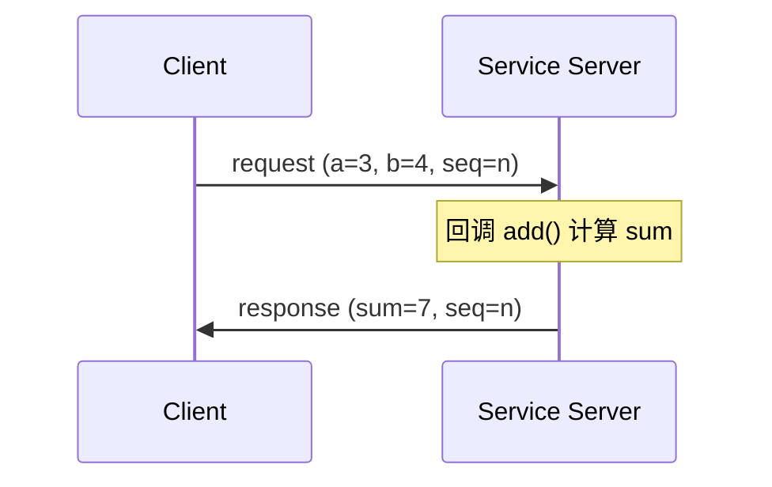
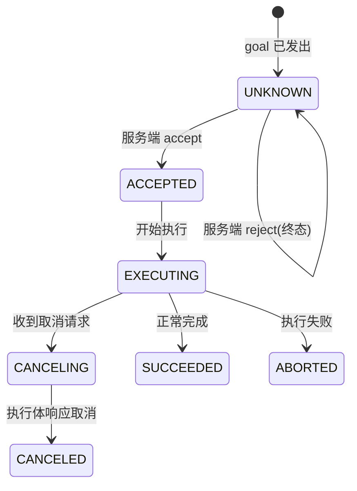

> **在知识图谱中的位置**：模块二 · 核心模块 · 02
> **难度**：⭐⭐ 进阶 | **前置知识**：[节点与发布订阅](01_节点与发布订阅.md)、[服务/动作接口定义](../01_基础概念/05_消息服务与类型系统.md)

## 1. 概述

发布/订阅是"单向广播"，无法表达"我需要你回答"或"这个任务完成了吗"。ROS 2 提供两种请求-响应式通信补齐这一短板：

- **服务（Service）**：**一问一答**。客户端发一个 `request`，服务端返回一个 `response`。语义上适合**幂等、快速、低频率**的操作（如"读取参数""保存地图""触发标定"）。
- **动作（Action）**：**长时任务 + 中间反馈 + 可取消**。客户端发 `goal`，服务端持续回 `feedback`，最终回 `result`，期间任一方可发起取消。适合导航、抓取、轨迹执行等**秒级到分钟级**任务。

一句话区分：**Service 是一次性的、无中间状态的"函数调用"；Action 是有生命周期、可观测、可中断的"任务句柄"**。

## 2. 核心概念

| 概念 | 定义 | 关键点 |
|------|------|--------|
| **Service Server** | 提供服务端，注册 `request → response` 回调 | `create_service<T>("name", cb)` |
| **Service Client** | 发起请求并异步等待响应的句柄 | `create_client<T>("name")`；`async_send_request()` 返回 future |
| **Action Server** | 执行 goal 的服务端，管理 goal 生命周期 | `rclcpp_action::Server<T>` / `rclpy.action.ActionServer` |
| **Action Client** | 发送 goal、接收 feedback/result、发起取消 | `rclcpp_action::Client<T>` / `rclpy.action.ActionClient` |
| **Goal Handle** | 一个被接受 goal 的运行时句柄，承载状态流转与 feedback/result 回传 | `ServerGoalHandle` / `ClientGoalHandle` |

> **幂等性**：Service 语义假定同一次请求重复发出结果一致（如加法、查参数）；对"有副作用、不可重复"的操作（如"把货架再推一格"），要么用 Action 的 goal ID 去重，要么在应用层做幂等保护。

## 3. 技术原理

### 3.1 服务的底层机制

ROS 2 的 Service 并非独立传输，而是**复用 DDS 的请求-应答（request-reply）模式**：rmw 层为每个服务建立一对"请求通道 + 应答通道"，并在消息头带 **sequence number** 关联请求与响应。服务默认使用 **reliable** QoS（`rmw_qos_profile_services_default`：reliable + volatile + keep_last），保证请求不丢失。



**`wait_for_service()` 行为**：客户端 `wait_for_service(timeout)` 阻塞（带超时）直到通过 DDS 发现机制找到同名服务，返回 `bool`。它是"服务是否可达"的探活，**不发起业务请求**；发现失败时通常重试循环等待。

**超时语义**：`async_send_request()` 本身不内置超时——它立即返回 `future`，由用户决定等待方式（C++ 用 `future.wait_for(duration)` 或 `spin_until_future_complete`；Python 用 `rclpy.spin_until_future_complete` 并检查 future）。若服务端崩溃或响应丢失，future 将一直不就绪，需自行加超时保护。

### 3.2 动作的内部结构与取消传播

一个 Action 在 ROS 2 图中**实际拆成 5 个底层通信实体**（命名空间 `<action_name>/_action/` 下）：

| 底层实体 | 类型 | 作用 |
|----------|------|------|
| `send_goal` | 服务（`action_msgs::srv::SendGoal`） | 提交 goal，返回是否 accepted |
| `cancel_goal` | 服务（`action_msgs::srv::CancelGoal`） | 请求取消 |
| `get_result` | 服务（`action_msgs::srv::GetResult`） | 异步拉取最终 result |
| `feedback` | 话题（`Fibonacci::Impl::FeedbackMessage`） | 周期性中间反馈 |
| `status` | 话题（`action_msgs::msg::GoalStatusArray`） | 各 goal 状态广播 |

goal 状态机（`action_msgs::msg::GoalStatus`，枚举值：UNKNOWN=0 / ACCEPTED=1 / EXECUTING=2 / CANCELING=3 / SUCCEEDED=4 / CANCELED=5 / ABORTED=6）：



**取消传播**：客户端 `async_cancel_goal()` 调用 `cancel_goal` 服务 → 服务端 `handle_cancel` 回调决定返回 `CancelResponse::ACCEPT` 还是 `REJECT`。**取消不是强制的**——执行线程必须在循环里主动检查 `goal_handle->is_canceling()`（C++）/ `goal_handle.is_cancel_requested`（Python），然后调用 `goal_handle->canceled(result)` 终态化；若执行体不检查，取消请求会被"接受但永不生效"。

## 4. 实践指南

### 4.1 入门代码示例

**C++ 服务端 + 客户端**（`example_interfaces::srv::AddTwoInts`）：

```cpp
// 服务端
#include "rclcpp/rclcpp.hpp"
#include "example_interfaces/srv/add_two_ints.hpp"

void add(const std::shared_ptr<example_interfaces::srv::AddTwoInts::Request> request,
         std::shared_ptr<example_interfaces::srv::AddTwoInts::Response> response)
{
  response->sum = request->a + request->b;
  RCLCPP_INFO(rclcpp::get_logger("rclcpp"),
    "Incoming request\na: %ld b: %ld", request->a, request->b);
}

int main(int argc, char ** argv)
{
  rclcpp::init(argc, argv);
  auto node = rclcpp::Node::make_shared("add_two_ints_server");
  node->create_service<example_interfaces::srv::AddTwoInts>("add_two_ints", &add);
  RCLCPP_INFO(rclcpp::get_logger("rclcpp"), "Ready to add two ints.");
  rclcpp::spin(node);
  rclcpp::shutdown();
  return 0;
}
```

```cpp
// 客户端
#include "rclcpp/rclcpp.hpp"
#include "example_interfaces/srv/add_two_ints.hpp"
using namespace std::chrono_literals;

int main(int argc, char ** argv)
{
  rclcpp::init(argc, argv);
  auto node = rclcpp::Node::make_shared("add_two_ints_client");
  auto client = node->create_client<example_interfaces::srv::AddTwoInts>("add_two_ints");

  while (!client->wait_for_service(1s)) {
    if (!rclcpp::ok()) {
      RCLCPP_ERROR(rclcpp::get_logger("rclcpp"), "Interrupted while waiting.");
      return 0;
    }
    RCLCPP_INFO(rclcpp::get_logger("rclcpp"), "service not available, waiting...");
  }

  auto request = std::make_shared<example_interfaces::srv::AddTwoInts::Request>();
  request->a = 3;
  request->b = 4;
  auto result = client->async_send_request(request);
  if (rclcpp::spin_until_future_complete(node, result) == rclcpp::FutureReturnCode::SUCCESS) {
    RCLCPP_INFO(rclcpp::get_logger("rclcpp"), "Sum: %ld", result.get()->sum);
  } else {
    RCLCPP_ERROR(rclcpp::get_logger("rclcpp"), "Failed to call service");
  }
  rclcpp::shutdown();
  return 0;
}
```

**Python 服务端 + 客户端**：

```python
# 服务端
from example_interfaces.srv import AddTwoInts
import rclpy
from rclpy.node import Node

class MinimalService(Node):
    def __init__(self):
        super().__init__('minimal_service')
        self.srv = self.create_service(AddTwoInts, 'add_two_ints', self.add_two_ints_callback)

    def add_two_ints_callback(self, request, response):
        response.sum = request.a + request.b
        self.get_logger().info('Incoming request\na: %d b: %d' % (request.a, request.b))
        return response

def main():
    rclpy.init()
    minimal_service = MinimalService()
    rclpy.spin(minimal_service)
    rclpy.shutdown()
```

```python
# 客户端
import sys
from example_interfaces.srv import AddTwoInts
import rclpy
from rclpy.node import Node

class MinimalClientAsync(Node):
    def __init__(self):
        super().__init__('minimal_client_async')
        self.cli = self.create_client(AddTwoInts, 'add_two_ints')
        while not self.cli.wait_for_service(timeout_sec=1.0):
            self.get_logger().info('service not available, waiting again...')
        self.req = AddTwoInts.Request()

    def send_request(self, a, b):
        self.req.a = a
        self.req.b = b
        return self.cli.call_async(self.req)

def main():
    rclpy.init()
    minimal_client = MinimalClientAsync()
    future = minimal_client.send_request(int(sys.argv[1]), int(sys.argv[2]))
    rclpy.spin_until_future_complete(minimal_client, future)
    response = future.result()
    minimal_client.get_logger().info('Result: %d + %d = %d' %
        (int(sys.argv[1]), int(sys.argv[2]), response.sum))
    minimal_client.destroy_node()
    rclpy.shutdown()
```

**动作（Action）示例**（斐波那契任务，改编自官方教程，**示例代码，需根据实际框架调整**；需自定义接口 `action_tutorials_interfaces/action/Fibonacci`，字段 `goal: order(int32)`、`feedback: partial_sequence(int32[])`、`result: sequence(int32[])`）：

```cpp
// 服务端核心：handle_goal / handle_cancel / execute 三回调
auto action_server = rclcpp_action::create_server<Fibonacci>(
  node, "fibonacci",
  [](const GoalUUID &, std::shared_ptr<const Fibonacci::Goal>) {
    return rclcpp_action::GoalResponse::ACCEPT_AND_EXECUTE;   // 也可 REJECT
  },
  [](const std::shared_ptr<GoalHandleFibonacci>) {
    return rclcpp_action::CancelResponse::ACCEPT;              // 也可 REJECT
  },
  [](const std::shared_ptr<GoalHandleFibonacci> gh) {          // 接受后另起线程 execute
    std::thread{execute, gh}.detach();
  });

// execute 循环内：
if (goal_handle->is_canceling()) {          // 主动检查取消
  result->sequence = sequence;
  goal_handle->canceled(result);            // 终态：已取消
  return;
}
goal_handle->publish_feedback(feedback);    // 中间反馈
// ... 完成后 goal_handle->succeed(result) 或 goal_handle->abort(result)
```

```python
# Python 动作服务端（rclpy.action）
import time
import rclpy
from rclpy.action import ActionServer
from rclpy.node import Node
from action_tutorials_interfaces.action import Fibonacci

class FibonacciActionServer(Node):
    def __init__(self):
        super().__init__('fibonacci_action_server')
        self._action_server = ActionServer(
            self, Fibonacci, 'fibonacci', self.execute_callback)

    def execute_callback(self, goal_handle):
        feedback_msg = Fibonacci.Feedback()
        feedback_msg.partial_sequence = [0, 1]
        for i in range(1, goal_handle.request.order):
            if goal_handle.is_cancel_requested:      # 检查取消
                goal_handle.canceled()
                return Fibonacci.Result()
            feedback_msg.partial_sequence.append(
                feedback_msg.partial_sequence[i] + feedback_msg.partial_sequence[i-1])
            goal_handle.publish_feedback(feedback_msg)
            time.sleep(1)
        goal_handle.succeed()
        result = Fibonacci.Result()
        result.sequence = feedback_msg.partial_sequence
        return result
```

### 4.2 最佳实践

- **Service 回调要快且可重入**：默认 service 回调在 executor 线程执行，长计算会阻塞节点（同 §01 陷阱）。
- **Action 执行体放独立线程**：`execute` 里是长循环，务必在独立线程/回调组运行，否则阻塞 executor（官方示例用 `std::thread` detach）。
- **取消必须被轮询**：在长循环关键点检查 `is_canceling()`/`is_cancel_requested`，否则取消形同虚设。
- **结果只回传一次**：`succeed`/`abort`/`canceled` 是终态，只能调用一次，二次调用属错误。
- **客户端务必处理 goal 被 reject**：`goal_handle.accepted == false` 时终止流程，勿盲等 result。

### 4.3 常见陷阱（坑 → 解法）

| 坑 | 现象 | 解法 |
|----|------|------|
| **服务端回调阻塞** | 调用服务方超时/卡住，节点其他回调也停摆 | service 回调内只做轻量工作；重活转异步或独立线程 |
| **feedback 丢失/看不到** | 客户端收不到中间反馈 | feedback 走独立话题，检查 QoS 匹配与订阅建立时序；feedback 与 result 都要注册回调 |
| **goal 被 reject 却继续等** | 客户端永久等待 result | `goal_response_callback` 中判断 `accepted`，reject 时清理状态 |
| **重复请求无去重** | 同一次"动作"被发出两次 | 服务语义下用 goal UUID 去重；或应用层幂等键 |
| **取消不生效** | 调了 cancel 但任务继续跑 | 执行循环未轮询 `is_canceling()`；补轮询并终态化 |

### 4.4 性能调优

- Service 适合低频（< 几十 Hz）触发式调用；高频往返（> 100 Hz 请求-应答）应考虑 topic 或自定义批处理，否则 reliable 握手开销累积。
- Action 的 `feedback` 频率要克制（如 10~20 Hz），feedback 也是 topic 消息，过高频率会与业务数据争抢带宽。
- 大量并发 goal 时，服务端用线程池而非每个 goal `detach` 一个 `std::thread`，控制并发上限。

## 5. 方案对比

| 维度 | Service | Action | Topic（参考） |
|------|---------|--------|---------------|
| 方向 | 请求-响应 | goal→feedback→result | 单向广播 |
| 是否有应答 | 有（单次） | 有（终态 result） | 无 |
| 中间反馈 | 无 | 有 | N/A |
| 可取消 | 否（请求后无法撤回） | 是 | N/A |
| 持续时间 | 短（毫秒级） | 长（秒~分钟级） | 连续 |
| 典型场景 | 查参、触发、一次计算 | 导航、抓取、巡检 | 传感器流、指令流 |

**绝对不适用场景**：需要**中途取消或持续汇报进度**的任务（如"让机械臂画一个圆，期间每秒回报位置"）绝不能用 Service——它没有 feedback 通道也没有取消语义，只能用 Action。

## 6. 工具链

| 工具 | 用途 | 链接 |
|------|------|------|
| `ros2 service list/find/type/call` | 服务列举、定位、类型查询、手动调用 | https://docs.ros.org/en/jazzy/ |
| `ros2 action list/info/send_goal` | 动作列举、查看内部 5 实体、发送 goal | https://docs.ros.org/en/jazzy/ |
| `ros2 interface show example_interfaces/srv/AddTwoInts` | 查看 srv/action 定义 | https://docs.ros.org/en/jazzy/ |
| `rqt` 的 Service Caller / Action 插件 | 图形化调试 | https://github.com/ros-visualization/rqt |

## 7. 参考资料

- 官方教程（C++ 服务/客户端）：https://docs.ros.org/en/jazzy/Tutorials/Beginner-Client-Libraries/Writing-A-Simple-Cpp-Service-And-Client.html ✅
- 官方教程（Python 服务/客户端）：https://docs.ros.org/en/jazzy/Tutorials/Beginner-Client-Libraries/Writing-A-Simple-Py-Service-And-Client.html ✅
- 官方教程（C++ 动作）：https://docs.ros.org/en/jazzy/Tutorials/Intermediate/Writing-an-Action-Server-Client/Cpp.html ✅
- 官方教程（Python 动作）：https://docs.ros.org/en/jazzy/Tutorials/Intermediate/Writing-an-Action-Server-Client/Py.html ✅
- rclcpp_action 源码：https://github.com/ros2/rclcpp_action ✅
- action_msgs 接口定义：https://github.com/ros2/rcl_interfaces ✅

## 8. 学习路径

- **Level 1**：跑通 AddTwoInts 服务（C++/Python），用 `ros2 service call /add_two_ints example_interfaces/srv/AddTwoInts "{a: 3, b: 4}"`。
- **Level 2**：跑通 Fibonacci 动作，用 `ros2 action send_goal /fibonacci ... --feedback` 观察 feedback。
- **Level 3**：读懂 action 的 5 个底层实体与 goal 状态机，能解释"取消如何传播"。
- **Level 4**：写一个支持取消与进度反馈的机器人任务（如移动巡检），处理 reject/cancel/abort 全路径。
- **Level 5**：对比 service vs action 在你的业务中的延迟与吞吐，设计并发 goal 的线程池与幂等去重。

## 9. 核心面试三问

**Q1：为什么 Service 适合"幂等快速"操作而 Action 适合"长任务"？底层通信结构上差在哪？**
答题要点：Service 是单次 request→response，无中间状态，靠 DDS request-reply + sequence number 关联，超时/取消都需自己兜底。Action 底层拆成 5 个实体（send_goal/cancel_goal/get_result 服务 + feedback/status 话题），有 goal 状态机（ACCEPTED→EXECUTING→SUCCEEDED/CANCELED/ABORTED），支持中间反馈与取消，天然适配长任务与"可观测可中断"需求。

**Q2：客户端调用了 `async_cancel_goal()`，但任务还在继续跑，可能是什么原因？**
答题要点：取消是**协作式**而非抢占式——服务端 `handle_cancel` 返回 ACCEPT 只是"同意取消请求"，真正停止取决于执行线程是否在循环里轮询 `is_canceling()`/`is_cancel_requested` 并调用 `canceled(result)` 终态化。执行体不检查 → 取消被接受但永不生效。此外若 goal 已进入终态（succeeded），再取消会被拒绝。

**Q3：goal 被服务端 reject 后，客户端常见的 bug 是什么？**
答题要点：不检查 `goal_handle.accepted` 就盲目 `get_result_async()` 等待 result，导致永久挂起/无响应。正确做法：在 goal_response 回调中判断 `accepted == false` 时记录失败并清理，不进入等 result 流程；同时服务端 `handle_goal` 返回 `GoalResponse::REJECT` 是合法的（如资源不足、参数非法），客户端必须能处理该路径。
