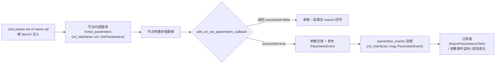

> **在知识图谱中的位置**：模块二 · 核心模块 · 03
> **难度**：⭐⭐ 进阶 | **前置知识**：[节点与发布订阅](01_节点与发布订阅.md)、[服务与动作](02_服务与动作.md)、[launch 系统](06_ROS2_CLI与Launch系统.md)

## 1. 概述

机器人系统充满"可调旋钮"：速度上限、PID 增益、相机曝光、命名空间……ROS 2 用**参数（Parameter）**统一管理这些运行时可变的键值对。参数由节点**声明（declare）→ 读取（get）→ 修改（set）**，修改可来自代码、`ros2 param` 命令、launch 文件或 YAML，并可通过**参数回调**做校验与热更新。

参数系统解决了 ROS 1 时代 `rosparam` + `dynamic_reconfigure` 割裂的问题，把它收敛成一套：**声明式参数 + 变更回调 + 参数事件流**。它是"配置管理"与"运行时动态重配置"的统一入口。

## 2. 核心概念

| 概念 | 定义 | 关键点 |
|------|------|--------|
| **Parameter** | 一个具名 + 强类型的键值对，从属于某个节点 | `rclcpp::Parameter` / `rclpy.parameter.Parameter` |
| **declare_parameter** | 声明参数名与默认值（及描述符），声明后才能 get/set | 未声明就 get/set 会抛异常 |
| **ParameterDescriptor** | 参数元数据：描述、范围、是否只读、步长等 | 供工具链展示与校验 |
| **set_parameters 回调** | 参数被修改时触发的用户回调，可校验并拒绝 | `add_on_set_parameters_callback` |
| **ParameterEvent** | 参数变更事件，发布到 `/parameter_events` 话题 | 供其他节点订阅感知配置变化 |

## 3. 技术原理

### 3.1 参数类型矩阵

参数是**强类型**的，`rcl_interfaces::msg::ParameterType` 枚举定义全部合法类型（取值见下表）。get/set 时类型必须匹配，否则抛异常。

| 类型 | 枚举值 | C++ 类型 | Python 类型 |
|------|--------|----------|-------------|
| 未设置 | `PARAMETER_NOT_SET` = 0 | — | — |
| 布尔 | `PARAMETER_BOOL` = 1 | `bool` | `bool` |
| 整数 | `PARAMETER_INTEGER` = 2 | `int64_t` | `int` |
| 浮点 | `PARAMETER_DOUBLE` = 3 | `double` | `float` |
| 字符串 | `PARAMETER_STRING` = 4 | `std::string` | `str` |
| 字节数组 | `PARAMETER_BYTE_ARRAY` = 5 | `std::vector<uint8_t>` | `list[bytes]` |
| 布尔数组 | `PARAMETER_BOOL_ARRAY` = 6 | `std::vector<bool>` | `list[bool]` |
| 整型数组 | `PARAMETER_INTEGER_ARRAY` = 7 | `std::vector<int64_t>` | `list[int]` |
| 浮点数组 | `PARAMETER_DOUBLE_ARRAY` = 8 | `std::vector<double>` | `list[float]` |
| 字符串数组 | `PARAMETER_STRING_ARRAY` = 9 | `std::vector<std::string>` | `list[str]` |

> 注意：ROS 2 参数**不支持任意嵌套结构**（无 dict/struct 顶层类型）。层级化配置通过**参数名前缀 + YAML 嵌套**表达（如 `gains.p`、`gains.i`），它们在节点内部是扁平参数名，靠 YAML 的缩进提供可读性。

### 3.2 declare / get / set 与覆盖机制

- **声明是前提**：rclcpp 中必须先 `declare_parameter("name", default)`；对未声明参数调用 `get_parameter`/`set_parameter` 抛 `rclcpp::exceptions::ParameterNotDeclaredException`。
- **覆盖值（overrides）优先**：通过 launch / CLI 传入的参数在**节点构造前**作为 overrides 存入 node options；节点 `declare_parameter` 同名参数时，override 值覆盖代码默认值。可用 `NodeOptions().automatically_declare_parameters_from_overrides(true)` 让未在代码里声明的 override 自动声明（默认关闭）。
- **构造期 vs 回调期**：`declare_parameter` 通常在**构造函数**里一次性完成；而 `add_on_set_parameters_callback` 注册的回调在**运行期每次 set 时**触发，用于校验与副作用。

### 3.3 参数事件与动态重配置流程



- **动态重配置**：ROS 2 用"参数回调"取代 ROS 1 的 `dynamic_reconfigure`。服务端在回调里即时应用新值（如改速度上限、重设控制器增益），无需重启。
- **仍需重启的场景**：部分硬件/中间件级配置（如改通信 QoS、改设备节点名、改某些底层驱动参数）无法热生效，回调里只能"记录待重启生效"或拒绝——没有通用热重载，取决于实现。
- **参数事件广播**：每次参数变更，节点向 `/parameter_events` 发布 `ParameterEvent`，其他节点可用 `rclcpp::AsyncParametersClient` 订阅并 `on_parameter_event` 响应，实现跨节点配置联动。

## 4. 实践指南

### 4.1 入门代码示例

**C++**（声明、读取、带校验的 set 回调）：

```cpp
#include "rclcpp/rclcpp.hpp"

class ParamNode : public rclcpp::Node
{
public:
  ParamNode() : Node("param_node")
  {
    this->declare_parameter<int>("max_speed", 100);
    this->declare_parameter<std::string>("robot_name", "turtle");

    param_cb_ = this->add_on_set_parameters_callback(
      [this](const std::vector<rclcpp::Parameter> & params) {
        rcl_interfaces::msg::SetParametersResult result;
        result.successful = true;
        for (const auto & p : params) {
          if (p.get_name() == "max_speed" && p.as_int() < 0) {
            result.successful = false;
            result.reason = "max_speed must be >= 0";
          }
        }
        return result;
      });

    int ms = this->get_parameter("max_speed").as_int();
    RCLCPP_INFO(this->get_logger(), "max_speed = %d", ms);
  }

private:
  rclcpp::node_interfaces::OnSetParametersCallbackHandle::SharedPtr param_cb_;
};

int main(int argc, char ** argv)
{
  rclcpp::init(argc, argv);
  rclcpp::spin(std::make_shared<ParamNode>());
  rclcpp::shutdown();
  return 0;
}
```

**Python**（声明、读取、带校验的 set 回调）：

```python
import rclpy
from rclpy.node import Node
from rclpy.parameter import Parameter
from rcl_interfaces.msg import SetParametersResult

class ParamNode(Node):
    def __init__(self):
        super().__init__('param_node')
        self.declare_parameter('max_speed', 100)
        self.declare_parameter('robot_name', 'turtle')
        self.add_on_set_parameters_callback(self.param_callback)

    def param_callback(self, params):
        result = SetParametersResult()
        result.successful = True
        for p in params:
            if p.name == 'max_speed' and p.type_ == Parameter.Type.INTEGER and p.value < 0:
                result.successful = False
                result.reason = 'max_speed must be >= 0'
                return result
        return result

def main(args=None):
    rclpy.init(args=args)
    node = ParamNode()
    rclpy.spin(node)
    node.destroy_node()
    rclpy.shutdown()
```

### 4.2 最佳实践

- **集中声明 + 默认值**：在构造函数顶部用 `declare_parameter` 声明全部参数，让默认值可见、可被 override。
- **YAML 分层组织**：用嵌套 YAML 管理成组参数（`gains.p/i/d`），launch 里一个文件覆盖整套配置。
- **回调做校验**：`add_on_set_parameters_callback` 里验证范围与合法性，返回 `reason` 说明拒绝原因——这是防止非法配置进入系统的第一道闸。
- **命名规范**：用 `snake_case` + 命名空间前缀（如 `safety.max_speed`），避免同节点重名与跨节点混淆。
- **只读参数用 `read_only` 描述符**：`ParameterDescriptor().set__read_only(true)` 阻止运行期修改。

### 4.3 常见陷阱（坑 → 解法）

| 坑 | 现象 | 解法 |
|----|------|------|
| **未 declare 就 get/set** | 抛 `ParameterNotDeclaredException` | 所有参数先 `declare_parameter`；或开 `automatically_declare_parameters_from_overrides` |
| **类型不匹配** | `get_parameter("x").as_int()` 但 `x` 实际是 double → 异常 | 用 `as_double()` 或先 `get_parameter_type` 判断；YAML 里整数写 `50` 会当 int，浮点要写 `50.0` |
| **构造期 vs 回调期混淆** | 在回调里 `declare_parameter` 或运行期才声明 | declare 放构造函数；回调只做校验/应用 |
| **同节点重名参数** | 二次 declare 同名 → 冲突/覆盖异常 | 集中管理参数名，避免重复声明 |
| **YAML 缩进/顶层键错误** | launch 加载 YAML 报错或参数不生效 | YAML 顶层必须是节点名，第二层是 `ros__parameters`，参数名不能带 `/` |

### 4.4 性能调优

- 参数 set 是低频操作（Hz 级），回调务必轻量；若回调里做重计算（如重新规划），移入独立线程异步执行。
- `get_parameter` 每次调用有锁与查找开销，高频循环里读参数应**缓存到成员变量**，靠 set 回调刷新缓存。
- 参数事件广播到 `/parameter_events` 有额外话题开销，极端高频 set（> kHz）时注意；常规场景可忽略。

## 5. 方案对比

| 配置方式 | 时机 | 热生效 | 适用 |
|----------|------|--------|------|
| 代码默认值 | 编译期 | — | 兜底默认 |
| launch 内联 dict / YAML | 启动时注入 | 否（需重启） | 部署级静态配置 |
| `ros2 param set` / CLI | 运行期 | 是 | 调试、临时调整 |
| set_parameters 回调 | 运行期 | 是（可校验拒绝） | 动态重配置、安全校验 |

**绝对不适用场景**：需要"改一个参数就换一套二进制/硬件拓扑"的场景（如切换中间件 RMW、更换设备驱动），参数机制无法完成进程级重构，必须重启或换 launch 编排——此时参数只适合存"意图标志"，真正的切换由上层进程管理实现。

## 6. 工具链

| 工具 | 用途 | 链接 |
|------|------|------|
| `ros2 param list/get/set/describe/dump/load` | 参数列举、读写、描述、导出/导入 | https://docs.ros.org/en/jazzy/ |
| launch 的 `parameters=[...]` | 启动时注入参数 | [launch 系统](06_ROS2_CLI与Launch系统.md) |
| `rqt_reconfigure` | 图形化动态调参 | https://github.com/ros-visualization/rqt_reconfigure |
| `ros2 launch --show-args` | 查看可配置的 launch 参数 | https://docs.ros.org/en/jazzy/ |

## 7. 参考资料

- 官方概念（Parameters）：https://docs.ros.org/en/jazzy/Concepts/Basic/About-Parameters.html ✅
- 官方教程（C++ 参数）：https://docs.ros.org/en/jazzy/Tutorials/Beginner-Client-Libraries/Using-Parameters-In-A-Class-CPP.html ✅
- 官方教程（Python 参数）：https://docs.ros.org/en/jazzy/Tutorials/Beginner-Client-Libraries/Using-Parameters-In-A-Class-Python.html ✅
- rcl_interfaces 参数类型定义：https://github.com/ros2/rcl_interfaces ✅
- rclcpp 源码（parameter）：https://github.com/ros2/rclcpp ✅

## 8. 学习路径

- **Level 1**：在 talker 里 declare/get 一个 `max_speed` 参数，用 `ros2 param get/set` 观察变化。
- **Level 2**：写 YAML + launch 注入整套参数，理解 override 与默认值优先级。
- **Level 3**：加 `add_on_set_parameters_callback` 做范围校验与热更新。
- **Level 4**：用 `AsyncParametersClient` 订阅 `/parameter_events`，实现跨节点配置联动。
- **Level 5**：设计参数命名规范 + 描述符（范围/只读），做配置审计与回滚。

## 9. 核心面试三问

**Q1：`declare_parameter` 在构造函数里调用和在运行期回调里调用有什么区别？为什么未声明就 set 会报错？**
答题要点：declare 是"注册参数名 + 默认值 + 描述符"，必须在 get/set 之前；rclcpp 用声明表区分"合法参数"与"未定义参数"，未声明 set/get 抛 `ParameterNotDeclaredException` 防止参数名拼写错误静默生效。构造期 declare 使 launch/CLI 的 override 能在节点启动时正确覆盖默认值；运行期才 declare 会导致启动注入的 override 丢失或时序错乱。

**Q2：launch 里注入 `max_speed: 50`（YAML 写整数）后，代码里 `declare_parameter("max_speed", 1.5)` 会发生什么？**
答题要点：参数强类型，YAML 的 `50` 解析为 int，而代码声明的是 double，类型不一致会导致**启动报错或 override 不生效**（取决于实现与自动转换策略）。正确写法：YAML 里显式写 `50.0` 匹配 double。这暴露了 ROS 2 参数无隐式类型转换的坑，解决靠严格对齐类型或用 `describe_parameter` 核对。

**Q3：参数被 set 后，其他节点如何感知这个变化？这套机制能完全替代动态重配置吗？**
答题要点：节点参数变更后向 `/parameter_events` 话题发布 `rcl_interfaces::msg::ParameterEvent`，其他节点用 `AsyncParametersClient` 订阅并注册 `on_parameter_event` 回调即可感知。它替代了 ROS 1 的 `dynamic_reconfigure`，但"生效"仍取决于节点在 set 回调里是否真正应用新值；部分底层配置（RMW、设备、QoS）无法热生效，仍需重启——参数机制只负责"通知 + 存储"，热重载语义由各节点自己实现。
