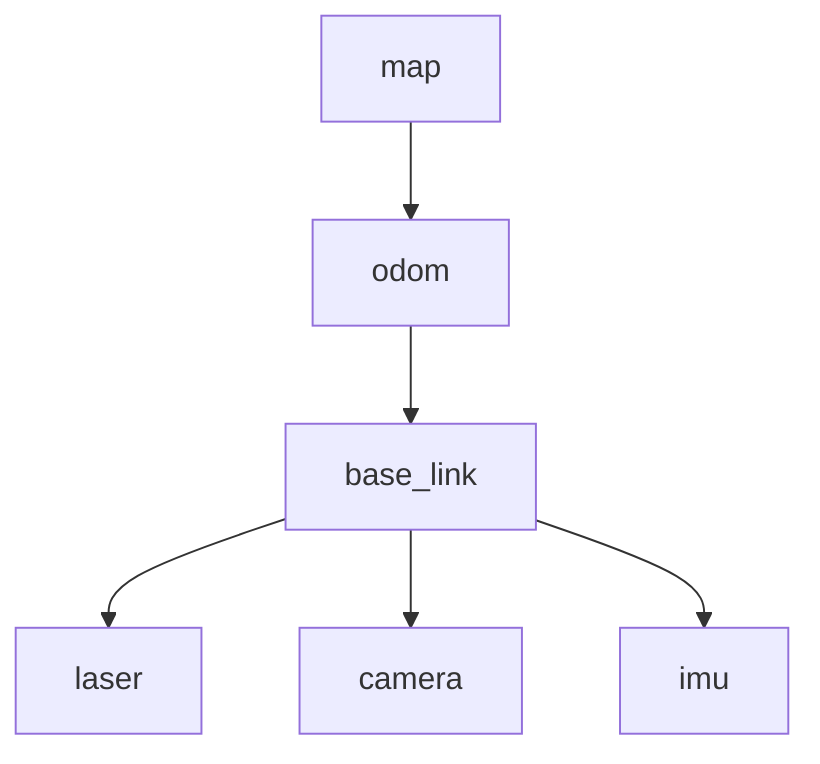

> **在知识图谱中的位置**：模块二 · 核心模块 · 04
> **难度**：⭐⭐ 进阶 | **前置知识**：[节点与发布订阅](01_节点与发布订阅.md)、[坐标与刚体变换基础](../01_基础概念/01_什么是ROS2.md)

## 1. 概述

机器人身上有几十个坐标系：地图（map）、里程计（odom）、底盘（base_link）、激光雷达（laser）、相机（camera）、机械臂各关节……**TF2** 是 ROS 2 的坐标变换库，负责**维护这些坐标系之间的关系并支持任意两点间的时空变换查询**。

TF2 的核心价值：传感器数据、导航、可视化都依赖"把数据从某个 frame 变换到另一个 frame"。它把"谁相对谁、在什么时刻、如何旋转平移"抽象成一张**随时间演化的变换树**，让下游（如 rviz2、导航栈）无需关心数据来自哪个传感器，统一用 `lookup_transform` 取变换。

## 2. 核心概念

| 概念 | 定义 | 关键点 |
|------|------|--------|
| **Frame（坐标系）** | 一个有名字的坐标系，如 `map`、`base_link` | 名字是字符串，大小写敏感 |
| **Transform（变换）** | 一个 frame 相对另一个 frame 的平移+旋转（四元数） | 数据载体 `geometry_msgs::msg::TransformStamped` |
| **TF 树** | 由 transform 边连接 frame 节点的**有向图**，**单根约束** | 任意两 frame 间只能有一条变换链 |
| **Broadcaster（广播器）** | 发布 transform 的组件 | `TransformBroadcaster`（动态）/ `StaticTransformBroadcaster`（静态） |
| **Buffer + Listener** | 缓存 transform 并提供查询 | `tf2_ros::Buffer` + `tf2_ros::TransformListener` |

## 3. 技术原理

### 3.1 TF 树模型与单根约束

把 frame 当作**节点**，transform 当作**有向边**（父 frame → 子 frame）。经典机器人 TF 树：



**单根约束**：整棵树只有一个根（上例 `map`），任意两个 frame 之间**只存在唯一一条变换链**。若出现两条路径（如同时有 `odom→base_link` 和 `map→base_link` 直连），TF 树就"有多条解"而报错。这条链的变换通过**逐边相乘**得到：`T_map→laser = T_map→odom × T_odom→base_link × T_base_link→laser`。

### 3.2 `lookup_transform` 语义：时间戳与插值

```cpp
geometry_msgs::msg::TransformStamped t =
  tf_buffer.lookupTransform("odom", "base_link", tf2::TimePointZero, timeout);
// 语义：查询 "base_link 相对 odom" 的变换，在"最新可用时间点"上取值
```

- **时间戳是查询的关键维度**：TF2 里每个 transform 都带 `header.stamp`。`Buffer` 内部按时间缓存样本；`lookup_transform` 的第三个参数指定"要哪个时刻的变换"。
- **插值**：请求时刻落在两个缓存样本之间时，TF2 做**线性插值**（平移线性、旋转用 slerp）。`tf2::TimePointZero`（Python 用 `rclpy.time.Time()` 或 0 时间戳）表示"取最新可用值"。
- **缓存窗口**：`Buffer` 默认缓存约 **10 秒**的历史 transform（`tf2_ros::Buffer` 可配 cache time）。请求过旧（超出窗口）或未来的时间戳，会抛 `tf2::ExtrapolationException`/`tf2::LookupException`，`canTransform` 返回 false。
- **lookahead / backward lookup**：查过去时间戳（backward）在窗口内可插值；查未来时间戳（lookahead）无法插值，默认失败。

### 3.3 静态 vs 动态变换

| 维度 | `StaticTransformBroadcaster` | `TransformBroadcaster` |
|------|------------------------------|------------------------|
| 发布频率 | 一次性（latch，transient_local 语义） | 周期发布（如 10~100 Hz） |
| 适用 | 固定不变的机械装配关系（laser 相对 base_link） | 随时间变化的关系（odom、车轮里程计、SLAM 位姿） |
| 带宽 | 极小 | 与频率成正比 |

### 3.4 坐标惯例（REP-103）

REP-103（Standard Units of Measure and Coordinate Conventions）约定**右手系**：单位用**米**（平移）与**弧度**（旋转）；标准框架 `map`/`odom`/`base_link` 中 **X 向前、Y 向左、Z 向上**（对地面机器人），旋转用四元数 `(x, y, z, w)`，正旋转遵循右手定则（绕 +Z 逆时针）。

> 遵守 REP-103 是跨机器人、跨传感器数据对齐的前提，违反它会导致可视化、导航、SLAM 全部"歪斜/镜像"。

### 3.5 Buffer 内部存储与锁

`tf2_ros::Buffer` 内部维护**按 (父 frame, 子 frame) 索引的时间序列缓存**，并**加锁保证跨线程访问安全**（`lookupTransform`/`canTransform` 会获取内部锁，多线程并发查询是安全的）。查询耗时取决于树的深度（链式相乘）与缓存命中情况——**具体延迟由缓存数据量与查询频率决定**（此处不虚构具体数值），高频查询应尽量复用结果而非反复 `lookup`。

## 4. 实践指南

### 4.1 入门代码示例

**C++ 动态广播 + 查询**：

```cpp
#include <memory>
#include "rclcpp/rclcpp.hpp"
#include "tf2_ros/transform_broadcaster.h"
#include "tf2_ros/transform_listener.h"
#include "tf2_ros/buffer.h"
#include "geometry_msgs/msg/transform_stamped.hpp"

class FramePublisher : public rclcpp::Node
{
public:
  FramePublisher() : Node("frame_publisher")
  {
    tf_broadcaster_ = std::make_unique<tf2_ros::TransformBroadcaster>(*this);
    timer_ = this->create_wall_timer(
      std::chrono::milliseconds(100), [this]() { this->publish_tf(); });
  }

private:
  void publish_tf()
  {
    geometry_msgs::msg::TransformStamped t;
    t.header.stamp = this->get_clock()->now();
    t.header.frame_id = "world";
    t.child_frame_id = "base_link";
    t.transform.translation.x = 1.0;
    t.transform.translation.y = 0.0;
    t.transform.translation.z = 0.0;
    t.transform.rotation.x = 0.0;
    t.transform.rotation.y = 0.0;
    t.transform.rotation.z = 0.0;
    t.transform.rotation.w = 1.0;
    tf_broadcaster_->sendTransform(t);
  }
  std::unique_ptr<tf2_ros::TransformBroadcaster> tf_broadcaster_;
  rclcpp::TimerBase::SharedPtr timer_;
};

// 查询方（另一个节点）
tf2_ros::Buffer tf_buffer{this->get_clock()};
tf2_ros::TransformListener tf_listener(tf_buffer);  // 常驻，持续填充 Buffer

try {
  auto t = tf_buffer.lookupTransform("world", "base_link", tf2::TimePointZero);
  RCLCPP_INFO(this->get_logger(), "base_link x = %f", t.transform.translation.x);
} catch (const tf2::TransformException & ex) {
  RCLCPP_WARN(this->get_logger(), "lookup failed: %s", ex.what());
}
```

**Python 广播 + 查询**：

```python
import rclpy
from rclpy.node import Node
from tf2_ros import TransformBroadcaster, TransformListener, Buffer
from geometry_msgs.msg import TransformStamped

class FramePublisher(Node):
    def __init__(self):
        super().__init__('frame_publisher')
        self.tf_broadcaster = TransformBroadcaster(self)
        self.timer = self.create_timer(0.1, self.broadcast_cb)

    def broadcast_cb(self):
        t = TransformStamped()
        t.header.stamp = self.get_clock().now().to_msg()
        t.header.frame_id = 'world'
        t.child_frame_id = 'base_link'
        t.transform.translation.x = 1.0
        t.transform.rotation.w = 1.0
        self.tf_broadcaster.sendTransform(t)

class TFListener(Node):
    def __init__(self):
        super().__init__('tf_listener')
        self.tf_buffer = Buffer()
        self.tf_listener = TransformListener(self.tf_buffer, self)
        self.timer = self.create_timer(1.0, self.lookup_cb)

    def lookup_cb(self):
        try:
            t = self.tf_buffer.lookup_transform('world', 'base_link', rclpy.time.Time())
            self.get_logger().info('base_link x = %f' % t.transform.translation.x)
        except Exception as ex:
            self.get_logger().warn('tf lookup failed: %s' % str(ex))
```

### 4.2 最佳实践

- **静态关系用 StaticTransformBroadcaster**：机械装配关系（传感器相对底盘）只发一次，省带宽、杜绝抖动。
- **TransformListener 要常驻**：它持续订阅 `/tf` 与 `/tf_static` 填充 Buffer，绝不能临时建临时销毁。
- **命名严格一致**：frame 名全项目统一（大小写敏感），用常量定义避免拼写漂移。
- **查询前先 `canTransform`** 或用 try/catch 包住 `lookupTransform`，失败时优雅降级而非崩溃。
- **时间戳用 `now()`**：动态变换必须打当前时间戳，否则 Buffer 里时间错乱导致插值/超时异常。

### 4.3 常见陷阱（坑 → 解法）

| 坑 | 现象 | 解法 |
|----|------|------|
| **frame 名字拼写错误** | `lookup` 报 "frame 'baselink' does not exist" | 用 `tf2_echo`/`view_frames` 核对真实 frame 名 |
| **transform 缺失** | `lookup` 超时，`canTransform` false | 检查 broadcaster 是否在运行、父子 frame 是否写反 |
| **transform 过期** | "transform is too old" 或数据跳变 | 广播频率下降/停发 → 检查发布者生命周期与时间戳 |
| **时间戳查不到** | 请求过旧/未来时刻报 ExtrapolationException | 用 `TimePointZero` 取最新；或扩大 cache time；确认请求时刻在窗口内 |
| **父子顺序颠倒** | 查询结果反了/异常 | `lookup_transform(target, source)` 语义：source 相对 target；记口诀"target 在前、source 在后" |

### 4.4 性能调优

- **降低动态广播频率**：仅变化的关系才高频广播；固定关系一律静态。
- **复用变换结果**：同一时刻的 `lookup` 结果缓存复用，避免循环内反复加锁查询（Buffer 加锁有开销）。
- **控制树深度**：过深链式相乘累积误差与计算量，设计时尽量扁平。
- **数据量决定延迟**：Buffer 缓存窗口越大、实体越多，查询越慢，按需设 cache time（默认 10s 通常足够）。

## 5. 方案对比

| 方案 | 机制 | 适用 | 局限 |
|------|------|------|------|
| **TF2 变换** | 广播 transform + 缓存查询 | 全局坐标系关系、导航、可视化、多传感器对齐 | 非数据、是"关系"，需配合时间戳 |
| **直接发布位姿话题** | 自定义 `PoseStamped` 话题 | 单点定位结果流转 | 无插值/无树管理/无缓存查询，需自己实现时序 |

**绝对不适用场景**：需要"查询过去某精确时刻、并自动插值的多传感器时空对齐"时，绝不能用裸 `PoseStamped` 话题——它没有时间缓存与插值语义，只能用 TF2（其 Buffer 正是为此设计）。

## 6. 工具链

| 工具 | 用途 | 链接 |
|------|------|------|
| `ros2 run tf2_ros tf2_echo <src> <dst>` | 实时打印两 frame 间变换 | https://docs.ros.org/en/jazzy/ |
| `ros2 run tf2_ros tf2_monitor` | 监控 TF 树与广播频率 | https://docs.ros.org/en/jazzy/ |
| `ros2 run tf2_tools view_frames` | 生成 TF 树 PDF 图 | https://docs.ros.org/en/jazzy/ |
| `rviz2`（TF 显示） | 可视化各 frame 与变换 | https://github.com/ros2/rviz |
| `tf2_ros` 源码 | Buffer/Broadcaster/Listener 实现 | https://github.com/ros2/geometry2 |

## 7. 参考资料

- 官方概念（About-Tf2）：https://docs.ros.org/en/jazzy/Concepts/Intermediate/About-Tf2.html ✅
- 官方教程（Introducing tf2）：https://docs.ros.org/en/jazzy/Tutorials/Intermediate/Tf2/Introduction-To-Tf2.html ✅
- REP-103（坐标与单位约定）源码：https://github.com/ros-infrastructure/rep/blob/master/rep-0103.rst ✅；REP 官方索引页 https://ros.org/reps/rep-0103.html ⚠️ 待验证
- tf2/geometry2 源码：https://github.com/ros2/geometry2 ✅

## 8. 学习路径

- **Level 1**：跑 `tf2_echo world base_link` 看到变换，理解 header 里 frame_id/child_frame_id。
- **Level 2**：写动态 + 静态 broadcaster，用 `view_frames` 画出自己的 TF 树。
- **Level 3**：用 `lookup_transform` 把激光点云从 `laser` 变换到 `odom`，理解时间戳插值。
- **Level 4**：处理缓存窗口、过期、拼写错误的各类异常，实现优雅降级。
- **Level 5**：结合 SLAM/导航，理解 `map→odom→base_link` 三层结构的更新机制与漂移补偿。

## 9. 核心面试三问

**Q1：`lookup_transform(target, source, time)` 中 time 参数的作用是什么？传入未来时间戳会怎样？**
答题要点：time 指定"查询哪个时刻的变换"。TF2 的 Buffer 按时间缓存样本，请求时刻落在样本间则插值；`TimePointZero` 表示最新。传未来时间戳（lookahead）无法插值 → 抛 `tf2::ExtrapolationException`；传过旧时间戳超出缓存窗口（默认约 10s）同样失败。这体现了 TF2 的"时空一致"设计，用于多传感器时间对齐。

**Q2：TF 树为什么要求"单根"？出现两条路径会发生什么？**
答题要点：任意两 frame 之间必须只有唯一变换链，否则"base_link 相对 map"有多条解，TF 树不一致。工程上违反单根（如既 `map→base_link` 又 `odom→base_link` 且两者都连根）会导致查询冲突、可视化错乱。正确做法是把变化关系与固定关系分层（map→odom→base_link 一条链）。

**Q3：订阅方 `lookup_transform` 一直超时/报 "transform not found"，排查顺序是什么？**
答题要点：① 先用 `tf2_echo`/`view_frames` 确认变换**确实被广播**（broadcaster 是否运行、frame 名是否拼写正确、父子是否写反）；② 确认 TransformListener 已常驻并订阅到 `/tf`、`/tf_static`；③ 检查时间戳（是否打 `now()`、请求时刻是否在缓存窗口）；④ 最后才怀疑 QoS/网络。多数超时是 ①② 类配置错误而非 TF2 本身问题。
