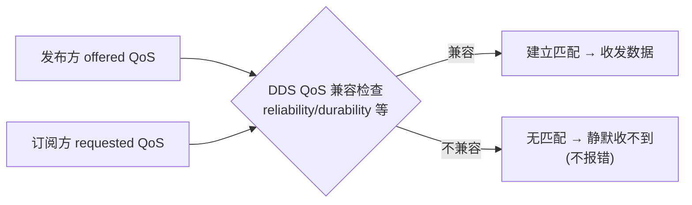

> **在知识图谱中的位置**：模块二 · 核心模块 · 05
> **难度**：⭐⭐ 进阶 | **前置知识**：[节点与发布订阅](01_节点与发布订阅.md)、[架构与 DDS 中间件](../03_高级话题/01_ROS2架构分层详解.md)

## 1. 概述

QoS（Quality of Service，服务质量）是 ROS 2 相对 ROS 1 最重要的底层升级之一——它把 DDS 的**可靠性、历史、持久性、活性**等策略直接暴露给用户，让"传输语义"从"一刀切"变成"按需配置"。

QoS 决定了：消息**丢不丢**（reliability）、后到者**能不能拿到历史**（durability）、**缓存多少条**（history）、对方**是否还活着**（liveliness）。配错 QoS 的后果往往**静默**（收不到数据却不报错），因此它是 ROS 2 调试与面试的高频雷区。本文件讲透四维语义 + 兼容矩阵 + 常用预设。

## 2. 核心概念

| 维度 | 取值 | 一句话语义 |
|------|------|-----------|
| **Reliability（可靠性）** | `RELIABLE` / `BEST_EFFORT` | 消息"保证送达（重传）"还是"尽力而为（可丢）" |
| **Durability（持久性）** | `VOLATILE` / `TRANSIENT_LOCAL` | late joiner 能否拿到"历史最后样本" |
| **History（历史）** | `KEEP_LAST` + depth / `KEEP_ALL` | 缓存多少条历史消息 |
| **Liveliness（活性）** | `AUTOMATIC` / `MANUAL_BY_TOPIC` 等 | 如何判定发布方"仍存活" |

> 另有两个进阶维度 **Deadline**（承诺最大发布间隔，超时触发事件）与 **Lifespan**（消息有效期，过期即弃），用于实时性/看门狗场景，详见[高级话题 QoS 进阶](../03_高级话题/02_线程模型与Executor深度解析.md)（注：深度调优见 03 模块）。

## 3. 技术原理

### 3.1 四维语义详解

**Reliability**（`rmw_qos_reliability_policy_t`，枚举值 `SYSTEM_DEFAULT=0 / RELIABLE=1 / BEST_EFFORT=2 / UNKNOWN=3`）：
- `RELIABLE`：DDS 层做 **ACK + 重传**，保证不丢（前提是历史窗口内）。代价：延迟抖动、带宽占用。
- `BEST_EFFORT`：不重传，丢了就丢。适合高频、可容忍丢帧的传感器流。

**Durability**（`rmw_qos_durability_policy_t`，`SYSTEM_DEFAULT=0 / TRANSIENT_LOCAL=1 / VOLATILE=2 / UNKNOWN=3`）：
- `VOLATILE`：只在匹配期间投递，late joiner 拿不到历史。
- `TRANSIENT_LOCAL`：发布方在本地保留"最新样本"，新订阅者加入即收到最后一条。适合地图、参数快照、静态配置。

**History**（`rmw_qos_history_policy_t`，`SYSTEM_DEFAULT=0 / KEEP_LAST=1 / KEEP_ALL=2 / UNKNOWN=3`）：
- `KEEP_LAST` + `depth`：只保留最近 N 条（如传感器 `depth=1` 只留最新帧）。
- `KEEP_ALL`：全量保留，可能无界增长，慎用。

**Liveliness**（`rmw_qos_liveliness_policy_t`，`SYSTEM_DEFAULT=0 / AUTOMATIC=1 / MANUAL_BY_NODE=2 / MANUAL_BY_TOPIC=3 / UNKNOWN=4`）：
- `AUTOMATIC`：DDS 自动维持活性（默认）。
- `MANUAL_BY_TOPIC`：发布方需**手动断言活性**（配 lease duration），用于心跳/看门狗。

### 3.2 兼容矩阵与匹配规则

DDS 在发布/订阅建立匹配时做 **offered（发布方提供）vs requested（订阅方请求）** 的 QoS 兼容检查。核心规则：**请求的可靠性等级 ≤ 提供的可靠性等级**（`BEST_EFFORT < RELIABLE`）。

| 发布方 offered | 订阅方 requested | 结果 |
|----------------|------------------|------|
| RELIABLE | RELIABLE | ✅ 兼容 |
| RELIABLE | BEST_EFFORT | ✅ 兼容（订阅方自降为尽力投递） |
| BEST_EFFORT | BEST_EFFORT | ✅ 兼容 |
| **BEST_EFFORT** | **RELIABLE** | ❌ **不兼容**（订阅方要求可靠，发布方给不了） |



> 不兼容的典型场景：**best_effort 发布方 + reliable 订阅方 = 收不到任何数据**，且无任何日志告警——这是 ROS 2 最隐蔽的坑之一（见 §4.3）。Durability 维度同理：`TRANSIENT_LOCAL` 请求方必须匹配 `TRANSIENT_LOCAL` 提供方，否则按 volatile 处理。

### 3.3 `rmw_qos_profile_t` 常用预设

rclcpp/rclpy 在 `rmw/qos_profiles.h` 提供预设（C++ 侧 `rclcpp::QoS` 也封装了等价构造）：

| 预设名 | reliability | durability | history/depth | 典型用途 |
|--------|-------------|------------|---------------|----------|
| `rmw_qos_profile_default` / `system_default` | reliable | volatile | keep_last(10) | 一般消息 |
| `rmw_qos_profile_sensor_data` | best_effort | volatile | keep_last(5) | 图像/点云/IMU |
| `rmw_qos_profile_parameters` | reliable | volatile | keep_last(1000) | 参数服务 |
| `rmw_qos_profile_parameter_events` | reliable | volatile | keep_last(1000) | `/parameter_events` |
| `rmw_qos_profile_services_default` | reliable | volatile | keep_last(10) | 服务/动作内部 |

> **纠正一个常见误记**：参数预设 `parameters` 的 durability 是 **volatile**，**不是** transient_local。若希望"后启动节点也能拿到最新参数快照"，需**显式**构造 `transient_local` QoS（自定义），不能靠默认预设。

## 4. 实践指南

### 4.1 入门代码示例

**C++**（传感器流 vs 控制指令的典型 QoS）：

```cpp
#include "rclcpp/qos.hpp"

// 传感器流：best_effort + keep_last(1)（只保留最新帧）
auto sensor_qos = rclcpp::QoS(1);
sensor_qos.best_effort().keep_last(1);
image_pub_ = this->create_publisher<sensor_msgs::msg::Image>("image", sensor_qos);

// 等价快捷方式：rclcpp::SensorDataQoS()  // best_effort + keep_last(5)
// 控制指令：reliable + transient_local（late joiner 可拿到最新指令）
auto cmd_qos = rclcpp::QoS(10);
cmd_qos.reliable().transient_local();
cmd_pub_ = this->create_publisher<geometry_msgs::msg::Twist>("cmd_vel", cmd_qos);
```

**Python**：

```python
from rclpy.qos import QoSProfile, ReliabilityPolicy, DurabilityPolicy, HistoryPolicy

sensor_qos = QoSProfile(
    reliability=ReliabilityPolicy.BEST_EFFORT,
    durability=DurabilityPolicy.VOLATILE,
    history=HistoryPolicy.KEEP_LAST,
    depth=1,
)
self.image_pub = self.create_publisher(Image, 'image', sensor_qos)

# 等价快捷方式：
# from rclpy.qos import qos_profile_sensor_data
```

### 4.2 最佳实践

- **传感器用 best_effort + keep_last(1~5)**：图像、点云、IMU 高帧率流，丢帧优于延迟，depth 只留最新。
- **控制/命令/关键状态用 reliable**：`cmd_vel`、报警、安全状态必须可靠投递。
- **静态数据用 transient_local**：地图、TF 静态变换、参数快照，让 late joiner 秒取。
- **订阅方与发布方 QoS 成对对齐**：尤其 reliability 与 durability，写代码时就在注释里标明双方约定。
- **服务/动作别乱改 QoS**：默认 `services_default` 即可，改动会影响 request-reply 匹配。

### 4.3 常见陷阱（坑 → 解法）

| 坑 | 现象 | 解法 |
|----|------|------|
| **best_effort 发布 + reliable 订阅** | 订阅方**静默收不到任何数据**，无报错 | 订阅方改 best_effort；或用 `ros2 topic info --verbose` 比对双方 QoS |
| **默认 reliable 跑高帧率传感器** | 重传排队 → 延迟升高、丢帧、CPU 飙高 | 传感器改 `best_effort + keep_last(1)` |
| **late joiner 拿不到地图** | 后启动订阅方收不到 volatile 的地图消息 | 发布方改 `transient_local` |
| **`ros2 topic echo` 也收不到** | echo 默认 reliable，与 best_effort 发布方不匹配 | `ros2 topic echo /topic --qos-reliability best_effort` |
| **keep_all 无界增长** | 内存持续上涨 | 换 `keep_last(depth)` 并设合理 depth |

### 4.4 性能调优

- **best_effort 省 ACK/重传**：高频大流量下可显著降低 CPU 与网络开销，代价是可能丢帧。
- **depth 调小降内存**：传感器 `keep_last(1)` 只留最新，避免历史帧堆积。
- **transient_local 有代价**：会额外缓存最新样本并参与 late-joiner 匹配，非必要不用。
- **liveliness 慎开手动**：manual 断言失败会误判离线，增加复杂度，默认 automatic 即可。
- 更深入的 QoS 调优（deadline、lifespan、跨 RMW 差异）见 [03 模块高级话题](../03_高级话题/01_ROS2架构分层详解.md)。

## 5. 方案对比

| 场景 | reliability | durability | history/depth | 理由 |
|------|-------------|------------|---------------|------|
| 图像/点云/IMU | best_effort | volatile | keep_last(1) | 最新帧优先，容忍丢帧 |
| 控制指令 `cmd_vel` | reliable | volatile | keep_last(10) | 必须送达 |
| 地图/静态配置 | reliable | transient_local | keep_last(1) | late joiner 需历史 |
| 日志/调试 | best_effort | volatile | keep_last(10) | 低开销，可丢 |
| 服务/动作 | reliable | volatile | keep_last(10) | request-reply 需可靠 |

**绝对不适用场景**：要求"订阅方强制可靠接收、且发布方以尽力而为发送"（best_effort 发布 + reliable 订阅）——这在 QoS 匹配层就**不可能成立**，任何配置都救不了，必须改发布方为 reliable 或订阅方为 best_effort。

## 6. 工具链

| 工具 | 用途 | 链接 |
|------|------|------|
| `ros2 topic info /t --verbose` | 查看话题实际 offered/requested QoS | https://docs.ros.org/en/jazzy/ |
| `ros2 topic echo --qos-reliability/--qos-durability` | 指定 QoS 回显（对齐 best_effort） | https://docs.ros.org/en/jazzy/ |
| `ros2 interface show` + 话题类型 | 核对消息类型 | https://docs.ros.org/en/jazzy/ |
| `ros2 doctor` | 系统级诊断（含通信异常提示） | https://docs.ros.org/en/jazzy/ |

## 7. 参考资料

- 官方概念（Quality of Service settings）：https://docs.ros.org/en/jazzy/Concepts/Intermediate/About-Quality-of-Service-Settings.html ✅
- rmw QoS 定义（qos_profiles.h / types.h）：https://github.com/ros2/rmw ✅
- rclcpp QoS 封装（qos.hpp）：https://github.com/ros2/rclcpp ✅

## 8. 学习路径

- **Level 1**：用 `ros2 topic info /t --verbose` 看懂默认 QoS 各字段。
- **Level 2**：给传感器话题配 `best_effort + keep_last(1)`，对比与默认值的延迟/丢帧差异。
- **Level 3**：故意制造 best_effort/reliable 不匹配，用 `--verbose` 定位，理解兼容矩阵。
- **Level 4**：用 `transient_local` 实现"后启动也能拿到地图"，理解 durability。
- **Level 5**：深入 deadline/lifespan/liveliness，设计实时性看门狗与 QoS 兼容测试矩阵。

## 9. 核心面试三问

**Q1：best_effort 发布方 + reliable 订阅方，为什么收不到数据？如何定位？**
答题要点：DDS QoS 兼容规则要求"请求可靠性 ≤ 提供可靠性"（BEST_EFFORT < RELIABLE），订阅方要求可靠而发布方只提供尽力而为 → 不满足匹配条件，**静默无数据、无报错**。定位：`ros2 topic info /t --verbose` 对比 offered 与 requested 的 reliability；修正任一侧使二者兼容。注意反向（reliable 发布 + best_effort 订阅）是**兼容**的。

**Q2：图像话题为什么推荐 best_effort + keep_last(1)？换成默认 reliable + keep_last(10) 会怎样？**
答题要点：图像是高频、可容忍丢帧的传感器流，最关心"最新帧"与低延迟。reliable 会引入 ACK + 重传，网络抖动时产生排队与延迟，重传旧帧无意义；keep_last(10) 保留 10 帧历史会浪费内存且下游只消费最新帧。best_effort + keep_last(1) 丢帧即时丢弃、只留最新，契合"帧率 > 完整"。

**Q3：地图发布方想让后启动的节点立刻拿到地图，该改哪个维度？它有什么代价？**
答题要点：改 **durability = TRANSIENT_LOCAL**（rmw 层 `RMW_QOS_POLICY_DURABILITY_TRANSIENT_LOCAL`），发布方本地保留最新样本，新订阅者匹配后立即收到。代价：发布方多缓存一份样本 + late-joiner 匹配开销；且订阅方也需匹配 transient_local（否则按 volatile 处理）。若只是"参数快照"，注意默认 `parameters` 预设是 volatile，需显式构造 transient_local。
