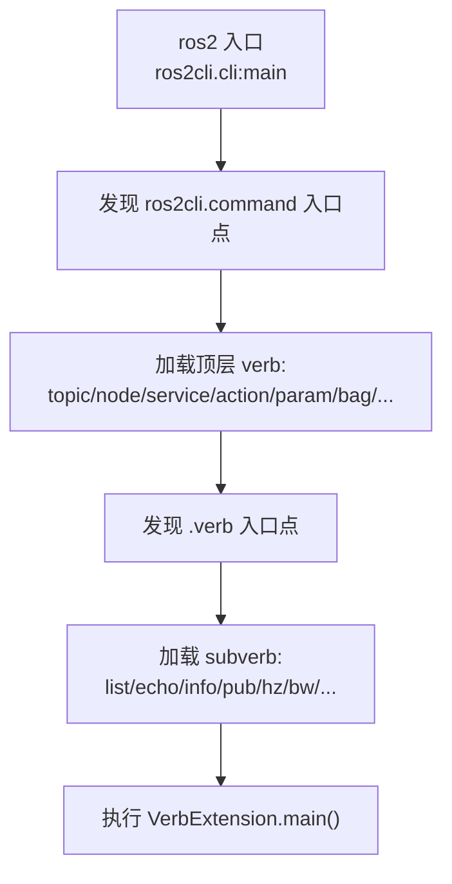

> **在知识图谱中的位置**：模块二 · 核心模块 · 06
> **难度**：⭐⭐⭐ 进阶（工程高频） | **前置知识**：[节点与发布订阅](01_节点与发布订阅.md)、[参数系统](03_参数系统与配置管理.md)

## 1. 概述

CLI 与 Launch 是 ROS 2 的"操作面板"与"编排引擎"：

- **CLI（`ros2 <verb>`）**：统一的命令行入口，覆盖节点、话题、服务、动作、参数、录制、包管理等所有日常操作。它本身是一个**可扩展插件框架**（ros2cli）。
- **Launch 系统**：把"启动哪些节点、传什么参数、按什么顺序、什么条件"写成**可复用的编排文件**（`.launch.py` / `.launch.xml` / `.launch.yaml`），支持参数注入、命名空间、条件、包含嵌套、生命周期事件。

二者联动：launch 文件最终也通过"启动节点进程 + 注入参数/remap"落地，而 CLI 用于**交互式探查与调试**。

## 2. 核心概念

| 概念 | 定义 | 关键点 |
|------|------|--------|
| **ros2 verb（动词）** | `ros2 <verb> <subverb>` 的命令树，如 `ros2 topic list` | 顶层 verb + 二级 subverb |
| **Entry Point（入口点）** | Python 包通过 setuptools `entry_points` 把命令/动词注册进 ros2cli | 扩展机制的核心 |
| **LaunchDescription** | launch 文件中要执行的动作（Action）的清单 | `generate_launch_description()` 返回 |
| **Substitution（替换）** | launch 里延迟求值的"变量"，运行时替换为字符串 | `LaunchConfiguration`、`PathJoinSubstitution`、`Command` |
| **Condition（条件）** | 决定某个 Action 是否执行的布尔条件 | `IfCondition` / `UnlessCondition` |

## 3. 技术原理

### 3.1 ros2cli 架构与扩展机制

`ros2` 命令本身几乎不含业务逻辑，它只做一件事：**按 entry point 发现并分发**。架构分两层：



- **两层 entry point 组**：`ros2cli.command`（注册顶层动词）与 `<command>.verb`（注册各动词的子命令，如 `ros2topic.verb`）。每个动词是一个独立 Python 包（`ros2topic`、`ros2node`、`ros2service`、`ros2action`、`ros2param`、`ros2bag`、`ros2pkg`、`ros2interface`、`ros2launch` 等），在 `setup.py` 里用 `entry_points={'ros2cli.command': ['topic = ros2topic.command.topic:TopicCommand'], 'ros2topic.verb': ['echo = ros2topic.verb.echo:EchoVerb']}` 注册。
- **扩展机制**：第三方包只要继承 `ros2cli.command.CommandExtension` / `ros2cli.verb.VerbExtension` 并注册对应入口点，即可**无缝加入 `ros2` 命令树**——这是 `ros2` 生态可扩展性的来源。

### 3.2 Launch 系统：Python API 与替换/条件

Launch 是 ROS 2 独立于 rcl 的**通用进程编排框架**（`launch` + `launch_ros` 两层），核心抽象：

- **Action**：`launch_ros.actions.Node`（启动 ROS 节点）、`launch.actions.IncludeLaunchDescription`（包含子 launch）、`ExecuteProcess`（任意进程）、`TimerAction`、`GroupAction`、`DeclareLaunchArgument`。
- **Substitution（延迟求值）**：
  - `LaunchConfiguration('name')` —— 引用 launch 参数（最常用）。
  - `PathJoinSubstitution([...])` —— 路径拼接。
  - `Command('...')` —— 启动时执行一条命令并取其输出（如 `find_pkg_share`）。
  - `EnvironmentVariable`、`TextSubstitution`、`PythonExpression`。
- **Condition**：`IfCondition(expr)` / `UnlessCondition(expr)` 在**启动阶段**决定动作是否执行（不是运行期动态）。
- **OngoingCommand / 事件系统**：launch 用事件（`launch.events`）编排启动顺序、进程退出钩子、`OnProcessExit`/`OnShutdown` 等生命周期联动。

### 3.3 launch 与参数注入联动

launch 的 `Node(..., parameters=[...])` 与 `ros2 run --ros-args -p` 殊途同归：最终都作为**参数 overrides** 注入节点（见 [参数系统](03_参数系统与配置管理.md) §3.2）。`IncludeLaunchDescription` 还能把上层 launch 的 `LaunchConfiguration` 透传给子 launch，实现参数自上而下传递。


## 4. 实践指南

### 4.1 入门代码示例

**Python launch 文件**（`demo.launch.py`）：

```python
from launch import LaunchDescription
from launch.actions import DeclareLaunchArgument
from launch.substitutions import LaunchConfiguration
from launch_ros.actions import Node

def generate_launch_description():
    use_sim_time = LaunchConfiguration('use_sim_time', default='false')

    return LaunchDescription([
        DeclareLaunchArgument(
            'use_sim_time', default_value='false',
            description='Use simulation (clock) time'),

        Node(
            package='demo_nodes_cpp',
            executable='talker',
            name='talker',
            parameters=[{'use_sim_time': use_sim_time}],
        ),
        Node(
            package='demo_nodes_py',
            executable='listener',
            name='listener',
        ),
    ])
```

**XML launch 文件**（`demo.launch.xml`，等价功能）：

```xml
<launch>
  <arg name="use_sim_time" default="false"/>
  <node pkg="demo_nodes_cpp" exec="talker" name="talker">
    <param name="use_sim_time" value="$(var use_sim_time)"/>
  </node>
  <node pkg="demo_nodes_py" exec="listener" name="listener"/>
</launch>
```

> XML 里节点用 `pkg`/`exec` 属性（不是 `executable`）；替换语法是 `$(var x)`、`$(find-pkg-share pkg)`、`$(eval ...)`、`$(exec ...)`。

### 4.2 最佳实践

- **launch 参数必 `DeclareLaunchArgument`**：凡在 `LaunchConfiguration('x')` 引用的名字，都要显式 `DeclareLaunchArgument`，避免"未定义"运行时替换错误。
- **参数与 remap 交给 launch**：把端口名、命名空间、参数值都暴露成 launch 参数，同一个 launch 适配多台机器人。
- **分层 include**：把"机器人本体""传感器驱动""导航"拆成独立 launch，顶层用 `IncludeLaunchDescription` 组合。
- **用 `--show-args` 自检**：`ros2 launch pkg file.launch.py --show-args` 查看可配置项，写文档。
- **命名空间隔离**：`PushRosNamespace` 或 `Node(namespace=...)` 做多机器人实例隔离。

### 4.3 常见陷阱（坑 → 解法）

| 坑 | 现象 | 解法 |
|----|------|------|
| **LaunchConfiguration 未定义** | 替换报错 / 值为空字符串 | 每个引用的配置都要 `DeclareLaunchArgument` 声明 |
| **条件判断"顺序"误解** | `IfCondition` 里用运行时才知道的变量，以为会动态判断 | Condition 只在**启动阶段**求值一次；运行时分支用节点内逻辑 |
| **XML 用 `executable=` 属性** | 解析失败 | XML 节点属性是 `pkg`/`exec` |
| **`Command` 替换路径错误** | find 命令找不到包/文件 | 用 `PathJoinSubstitution([FindPackageShare('pkg'), '...'])` 替代裸 `Command` |
| **忘了 `generate_launch_description` 返回** | launch 报空描述 | Python launch 必须 return `LaunchDescription([...])` |

### 4.4 性能调优

- **合并节点进程**：大量小节点可考虑 **composable node（组件化）** 装入同一进程，减少进程与中间件开销（`LoadComposableNodes`）。
- **避免过度 include**：嵌套 include 过多增加解析与启动时间，扁平化编排。
- **参数文件 YAML 集中管理**：减少 launch 内联 dict 重复解析，便于复用与审计。

## 5. 方案对比

| 形式 | 表达能力 | 可读性 | 适用 |
|------|----------|--------|------|
| **Python（.launch.py）** | 最强（任意逻辑、函数、条件、循环） | 需懂 Python | 复杂编排、团队主力 |
| **XML（.launch.xml）** | 声明式，够用 | 最好 | 简单场景、跨语言团队 |
| **YAML（.launch.yaml）** | 声明式，最简 | 好 | 极简/教学演示 |

**绝对不适用场景**：需要"运行期根据传感器结果动态决定启动/停止节点"的逻辑——launch 的 Condition 只在启动时求值一次，无法在运行期动态增删节点，这类需求要用 **lifecycle 节点 + 状态机** 或组件化动态装载，而不是 launch 条件。

## 6. 工具链（`ros2 <verb>` 全景速查）

| verb | 用途 | 典型命令 |
|------|------|----------|
| `run` | 运行单个可执行 | `ros2 run turtlesim turtlesim_node --ros-args -r __ns:=/a` |
| `launch` | 运行 launch 文件 | `ros2 launch pkg file.launch.py --show-args` |
| `node` | 节点信息 | `ros2 node list` / `ros2 node info /talker` |
| `topic` | 话题 | `ros2 topic list -t` / `echo` / `info --verbose` / `pub` / `hz` / `bw` / `delay` |
| `service` | 服务 | `ros2 service list` / `type` / `find` / `call /add_two_ints example_interfaces/srv/AddTwoInts "{a: 1, b: 2}"` |
| `param` | 参数 | `ros2 param list` / `get` / `set /n name val` / `describe` / `dump` / `load` |
| `action` | 动作 | `ros2 action list` / `info` / `send_goal /fibonacci ... --feedback` |
| `bag` | 录制回放 | `ros2 bag record -a` / `play` / `info`（详见 [07 ROSBag2](07_ROSBag2与Rqt调试工具.md)） |
| `pkg` | 包管理 | `ros2 pkg list` / `prefix` / `create --build-type ament_cmake` / `executables` |
| `interface` | 接口定义 | `ros2 interface show std_msgs/msg/String` / `list` / `package` |
| `event` | DDS 事件 | `ros2 event`（查看节点/话题发现事件） |
| `doctor` | 系统诊断 | `ros2 doctor`（检查环境、RMW、网络） |
| `component` | 组件化装载 | `ros2 component list` / `load` |

> 全套命令文档：https://docs.ros.org/en/jazzy/ ✅

## 7. 参考资料

- 官方文档（CLI 与工具）：https://docs.ros.org/en/jazzy/ ✅
- Launch 不同格式指南：https://docs.ros.org/en/jazzy/How-To-Guides/Launch-file-different-formats.html ✅
- 官方教程（Creating a launch file）：https://docs.ros.org/en/jazzy/Tutorials/Intermediate/Launch/Creating-Launch-Files.html ⚠️ 待验证
- ros2cli 源码：https://github.com/ros2/ros2cli ✅
- launch 源码：https://github.com/ros2/launch ✅
- launch_ros 源码：https://github.com/ros2/launch_ros ✅

## 8. 学习路径

- **Level 1**：用 `ros2 run/node/topic/param` 完成基本探查，背熟命令树。
- **Level 2**：写第一个 Python launch 文件，启动 talker+listener 并注入参数。
- **Level 3**：改用 XML 写等价 launch，理解 `$(var)`/`$(find-pkg-share)` 替换。
- **Level 4**：用 `IncludeLaunchDescription` 组合多机器人 launch，透传参数与命名空间。
- **Level 5**：自定义 ros2cli 动词插件，或用 lifecycle/组件化做运行期动态编排。

## 9. 核心面试三问

**Q1：`ros2 topic echo` 为什么能"凭空"多出 topic、echo、pub 这些子命令？讲清扩展机制。**
答题要点：`ros2` 命令本身是薄分发器，通过 setuptools `entry_points` 的 `ros2cli.command` 组发现顶层 verb（`topic = ros2topic.command.topic:TopicCommand`），再通过 `<command>.verb` 组（如 `ros2topic.verb`）发现子命令，每个子命令继承 `ros2cli.verb.VerbExtension`。因此第三方包注册入口点即可无缝扩展命令树，无需改 `ros2` 本体。

**Q2：launch 里引用 `LaunchConfiguration('foo')` 但没写 `DeclareLaunchArgument('foo')`，会怎样？**
答题要点：替换在启动阶段求值，未声明的配置会取空值或抛替换错误，导致参数注入失败、节点以错误配置启动（常见：参数值变成空字符串）。正确做法是每个引用的 launch 配置都配 `DeclareLaunchArgument`（含 default 与 description），并用 `--show-args` 自检。

**Q3：想在运行期根据话题数据动态启停节点，能用 launch 的 `IfCondition` 吗？为什么？**
答题要点：不能。`IfCondition`/`UnlessCondition` 在 **launch 启动阶段一次性求值**，无法感知运行期状态。运行期动态管理要改用 **lifecycle 节点**（managed node）通过状态迁移启停、或组件化（composable node）动态 load/unload，配合状态机/服务触发——launch 只负责静态编排与初始启动。
