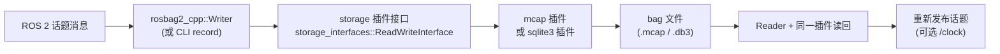

> **在知识图谱中的位置**：模块二 · 核心模块 · 07
> **难度**：⭐⭐ 进阶 | **前置知识**：[节点与发布订阅](01_节点与发布订阅.md)、[TF2 坐标变换](04_TF2坐标变换.md)、[CLI 与 Launch](06_ROS2_CLI与Launch系统.md)

## 1. 概述

**ROSBag2** 是 ROS 2 的"数据黑匣子"：把任意话题消息**录制**成文件（bag），之后**离线回放**，用于调试、回归测试、算法离线评测。**rqt** 是插件化调试工具集（计算图、绘图、日志、图像、参数），**rviz2** 是 3D 可视化渲染器。三者构成 ROS 2 的"观测—记录—回放—可视化"调试闭环。

典型工作流：`ros2 bag record` 录下现场数据 → 用 `rqt_graph`/`rqt_console` 看结构与日志 → `ros2 bag play` 变速/循环回放 → `rviz2` 3D 复现 → 定位并修复。

## 2. 核心概念

| 概念 | 定义 | 关键点 |
|------|------|--------|
| **Bag 文件** | 一组带时间戳的话题消息序列化文件 | 默认格式 `.mcap` |
| **Storage Plugin（存储插件）** | 决定 bag 落盘格式的可插拔后端 | `mcap`（默认）/ `sqlite3`（legacy） |
| **rosbag2_cpp / rosbag2_py** | 录制/回放的 C++/Python 库 | `Writer` / `Reader` 类 |
| **rqt plugin（rqt 插件）** | rqt 框架下的功能模块 | `rqt_graph`、`rqt_plot`、`rqt_console` 等 |
| **rviz2 Display** | rviz2 里的可视化插件（点云、激光、TF、Marker） | 订阅 `/tf` 与传感器话题 |

## 3. 技术原理

### 3.1 rosbag2 架构：storage plugin 与 reader/writer 接口



- **插件化分层**：`rosbag2_cpp` 提供 `Writer`/`Reader` 高层 API，`rosbag2_storage` 定义插件接口（`storage_interfaces::ReadWriteInterface`），具体格式由 `rosbag2_storage_mcap`（默认）与 `rosbag2_storage_sqlite3`（legacy）实现，通过 **pluginlib** 动态加载。
- **默认存储格式 mcap**：自 **Iron（2023）** 起默认从 sqlite3 切换到 **MCAP**（一种高效、可索引、自描述的消息容器格式），Jazzy/Kilted 延续 mcap 默认。legacy `sqlite3` 仍可用（`--storage sqlite3`）。
- **序列化格式**：默认 **CDR**（Common Data Representation，DDS 的规范序列化），`rosbag2` 提供 `ConverterOptions` 支持序列化格式转换。
- **压缩**：`--compression-mode file/message` + `--compression-format zstd` 可对 bag 压缩，降低体积。

> 说明：官方存储插件为 **mcap** 与 **sqlite3** 两种（已核实）；任务提示中提到的 "qed" **未在官方存储插件列表中确认**（⚠️ 待验证），第三方/测试后端可通过 storage 插件接口自行扩展。

### 3.2 rqt 与 rviz2 的定位关系

- **rqt**：基于 Qt 的**插件框架**（`rqt_gui`），各功能是独立插件包，共享一个主窗口。它面向"2D 数据 / 日志 / 结构 / 调参"。
- **rviz2**：独立的 **3D 渲染进程**（Qt + 渲染后端），通过**订阅 `/tf`（TF2）与传感器话题**（点云、激光、图像、Marker、网格）把数据变换到固定坐标系（如 `map`）后显示。它**不参与通信机制**，是纯可视化消费者。
- 关系：`rviz2` 依赖 TF2 做多传感器时空对齐（详见 [TF2](04_TF2坐标变换.md)）；导航/建图的可视化深度交叉引用 [导航与运动控制栈](../04_工程实践/05_导航与运动控制栈(Nav2_MoveIt2_ros2control).md)。

### 3.3 离线回放与时钟

`ros2 bag play` 可选 `--clock` 把录制时间作为 `/clock` 话题发布，配合 `use_sim_time=true` 让下游节点**用历史时间戳**（对 TF2、传感器融合、SLAM 的确定性复现至关重要）。

## 4. 实践指南

### 4.1 入门用法（CLI + 程序化 API）

**CLI 录制 / 回放 / 查看**（核心用法，语法真实）：

```bash
# 录制全部话题
ros2 bag record -a

# 只录指定话题，指定存储插件与输出目录
ros2 bag record -t /scan /odom -s mcap -o my_session

# 压缩录制（zstd）
ros2 bag record -a --compression-mode file --compression-format zstd

# 查看 bag 信息（话题、消息数、时长、大小）
ros2 bag info my_session

# 回放：半速、循环、只回放部分话题、发布 /clock
ros2 bag play my_session --rate 0.5 --loop
ros2 bag play my_session --topics /scan --remap /scan:=/scan_replayed
ros2 bag play my_session --clock
```

**程序化写入（C++，`rosbag2_cpp`）** —— 示例代码，需根据实际框架调整：

```cpp
#include <rclcpp/rclcpp.hpp>
#include <std_msgs/msg/string.hpp>
#include <rosbag2_cpp/writer.hpp>

int main(int argc, char ** argv)
{
  rclcpp::init(argc, argv);

  rosbag2_cpp::StorageOptions storage_options;
  storage_options.uri = "my_bag";
  storage_options.storage_id = "mcap";       // 默认 mcap

  rosbag2_cpp::Writer writer;
  writer.open(storage_options);

  // rosbag2_storage::TopicMetadata{name, type, serialization_format, offered_qos}
  writer.create_topic({"chatter", "std_msgs/msg/String", "cdr", ""});

  std_msgs::msg::String msg;
  msg.data = "Hello";
  writer.write(std::make_shared<std_msgs::msg::String>(msg),
               "chatter", rclcpp::Clock().now());

  rclcpp::shutdown();
  return 0;
}
```

**程序化写入（Python，`rosbag2_py`）** —— 示例代码，需根据实际框架调整：

```python
import rclpy
from rclpy.serialization import serialize_message
from std_msgs.msg import String
import rosbag2_py

rclpy.init()
node = rclpy.create_node('bag_writer')

writer = rosbag2_py.SequentialWriter()
storage_options = rosbag2_py.StorageOptions(uri='my_bag', storage_id='mcap')
converter_options = rosbag2_py.ConverterOptions(
    input_serialization_format='cdr', output_serialization_format='cdr')
writer.open(storage_options, converter_options)

topic = rosbag2_py.TopicMetadata(
    name='chatter', type='std_msgs/msg/String', serialization_format='cdr')
writer.create_topic(topic)

msg = String()
msg.data = 'Hello'
writer.write('chatter', serialize_message(msg),
             node.get_clock().now().nanoseconds)   # 签名随版本略有差异
```

### 4.2 最佳实践

- **录制前先 `ros2 topic list` 规划**：`-t` 精确指定话题，避免录到高帧率无用数据撑爆磁盘。
- **文件名带场景信息**：`map_office_v2_20260825`，配合 `ros2 bag info` 的 metadata 管理。
- **回放带 `--clock`**：凡是依赖 TF2/时间的系统，回放必须 `--clock` + 下游 `use_sim_time=true`，否则时间戳错乱。
- **压缩省空间**：长期保存用 `--compression-format zstd`，权衡 CPU 与体积。
- **用 `--remap` 隔离回放**：回放到改名话题，避免与线上话题冲突。

### 4.3 常见陷阱（坑 → 解法）

| 坑 | 现象 | 解法 |
|----|------|------|
| **录到高帧率话题撑爆磁盘** | bag 体积暴涨、磁盘写满 | `-t` 精选话题 + 压缩 + 限时录制 |
| **回放时间戳错乱** | TF2/传感器融合结果异常 | 回放加 `--clock`，下游节点设 `use_sim_time=true` |
| **老版本 .db3 打不开** | sqlite3 bag 在新环境报错 | 确认用对应存储插件打开；或迁移到 mcap |
| **回放与线上话题冲突** | 回放数据混入实时系统 | `--remap` 改名或 `--topics` 限定 |
| **rqt_graph 看不到节点** | 图为空 | 确认同一 ROS_DOMAIN_ID / 网络可达，节点在运行 |

### 4.4 性能调优

- **存储格式**：mcap 读写与索引优于 sqlite3，优先 mcap；legacy 兼容才用 sqlite3。
- **压缩模式**：`message` 粒度压缩随机访问更灵活，`file` 粒度压缩率略高，按需选择。
- **录制限流**：`--max-cache-size`（缓存上限）与话题选择控制内存与 I/O 压力。
- **回放速率**：`--rate` 加速/减速回放，快速遍历长 bag；`--loop` 做压测。

## 5. 方案对比

| 存储插件 | 格式 | 特点 | 适用 |
|----------|------|------|------|
| **mcap（默认）** | `.mcap` | 高效、自描述、可索引、跨语言 | 新项目、长期归档 |
| **sqlite3（legacy）** | `.db3` | 成熟但性能/体积一般 | 兼容旧数据 |

| 工具 | 定位 | 关键能力 | 链接 |
|------|------|----------|------|
| **rqt** | 2D/结构/日志调试 | graph/plot/console/image/reconfigure | https://github.com/ros-visualization/rqt |
| **rviz2** | 3D 渲染 | 订阅 /tf + 传感器话题渲染 | https://github.com/ros2/rviz |

**绝对不适用场景**：需要"亚毫秒级实时在线可视化/渲染"——rviz2 是**离线/准实时**可视化消费者，通过订阅话题（存在网络与渲染延迟），不能替代嵌入式实时显示；此类需求用机内专用渲染（如显示器直连 GPU、RTOS 层），而非 ROS 可视化栈。

## 6. 工具链（rqt 全家桶）

| 工具 | 用途 | 链接 |
|------|------|------|
| `rqt_graph` | 节点-话题-服务计算图可视化 | https://github.com/ros-visualization/rqt_graph |
| `rqt_plot` | 数值时序曲线（2D 绘图） | https://github.com/ros-visualization/rqt_plot |
| `rqt_console` | 日志收集/过滤（`/rosout`） | https://docs.ros.org/en/jazzy/Tutorials/Beginner-CLI-Tools/Using-Rqt-Console/Using-Rqt-Console.html ✅ |
| `rqt_image_view` | 图像话题实时查看 | https://github.com/ros-visualization/rqt_image_view |
| `rqt_reconfigure` | 参数动态调参 | https://github.com/ros-visualization/rqt_reconfigure |
| `rqt_topic` / `rqt_publisher` | 话题监视/手动发布 | https://github.com/ros-visualization/rqt_topic |
| `rviz2` | 3D 可视化（TF/点云/激光/Marker） | https://github.com/ros2/rviz |

## 7. 参考资料

- 官方教程（录制与回放数据）：https://docs.ros.org/en/jazzy/Tutorials/Beginner-CLI-Tools/Recording-And-Playing-Back-Data/Recording-And-Playing-Back-Data.html ✅
- rosbag2 源码：https://github.com/ros2/rosbag2 ✅
- MCAP 存储插件对比基准：https://mcap.dev/guides/benchmarks/rosbag2-storage-plugins ✅
- rqt 源码（ros-visualization）：https://github.com/ros-visualization/rqt ✅
- rviz2 源码：https://github.com/ros2/rviz ✅

## 8. 学习路径

- **Level 1**：`ros2 bag record -a` 录 10 秒，`ros2 bag info` 看元数据，`ros2 bag play` 回放。
- **Level 2**：录指定话题 + 压缩，用 `--rate`/`--loop` 控制回放。
- **Level 3**：带 `--clock` 回放 + `use_sim_time`，配合 rviz2 3D 复现轨迹。
- **Level 4**：用 `rosbag2_cpp`/`rosbag2_py` 程序化录制与解析，做算法离线评测。
- **Level 5**：自定义 storage plugin 或序列化格式，做大规模数据管道与压缩调优。

## 9. 核心面试三问

**Q1：rosbag2 为什么能同时支持 mcap 和 sqlite3 两种格式？默认是哪个？从哪个版本切换的？**
答题要点：因为存储层是**插件化**的——`rosbag2_cpp` 的 Writer/Reader 只依赖 `rosbag2_storage` 定义的接口（`ReadWriteInterface`），具体格式由 `rosbag2_storage_mcap` 与 `rosbag2_storage_sqlite3` 插件通过 pluginlib 动态加载，所以 `--storage` 参数即可切换。默认是 **mcap**，自 **Iron（2023）** 起由 sqlite3 切换而来。

**Q2：回放一个包含 `/scan` 与 TF 的 bag，rviz2 里点云位置错乱/不更新，最可能的原因是什么？**
答题要点：最可能是**时钟问题**——回放没加 `--clock` 或下游节点没设 `use_sim_time=true`，导致 TF2 用真实时间查历史时间戳的变换，缓存窗口/插值失败，点云无法对齐到固定坐标系。正确做法：`ros2 bag play --clock` + 下游（含 rviz2 的 TF 固定帧节点）`use_sim_time:=true`。

**Q3：录制时如何避免"高帧率话题撑爆磁盘"和"回放污染线上系统"？**
答题要点：录制侧用 `-t` 只录必要话题、`--compression-format zstd` 压缩、`--max-cache-size` 限缓存、必要时限时；回放侧用 `--topics` 限定 + `--remap` 把回放话题改名到隔离命名空间，避免与实时话题冲突。核心是"按需录制、隔离回放"。
