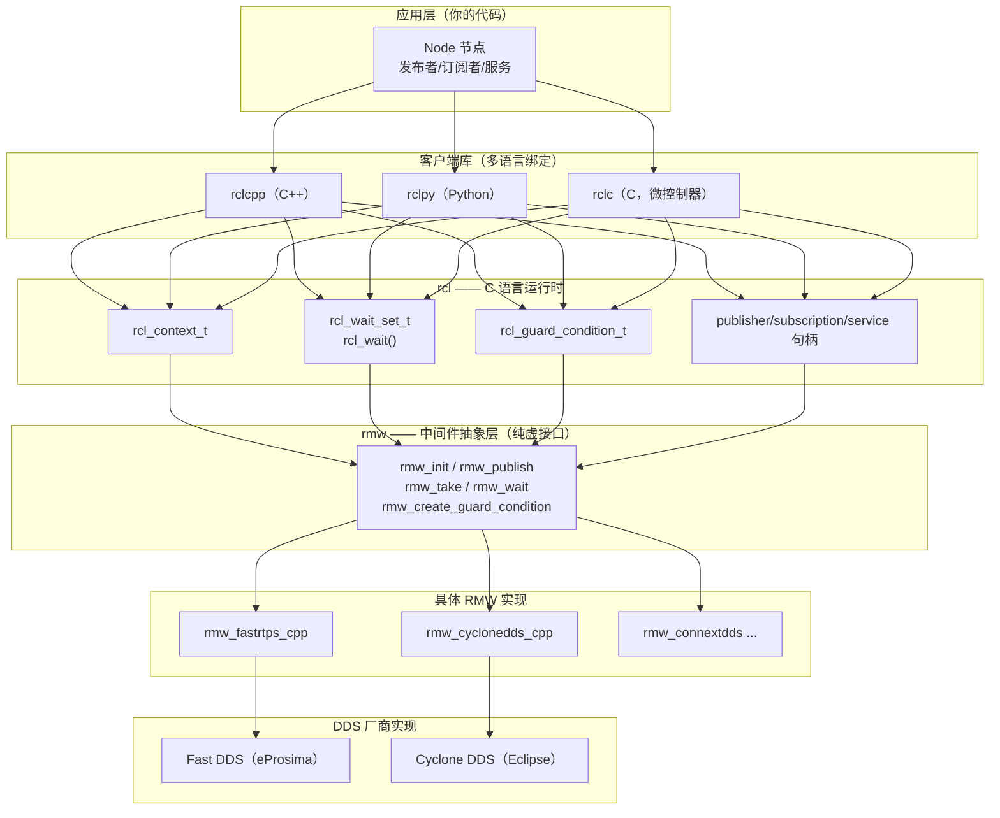

# 01 ROS 2 架构分层详解

> **位置**：`08-ros / 03_高级话题 / 01_ROS2架构分层详解.md`
> **难度**：⭐（高 —— 入门门槛高，面向进阶读者）
> **前置知识**：C++/C 基础、ROS 2 话题/服务/参数的基本使用（见 [模块一 · 基础概念](../01_基础概念/README.md)）、DDS 基本术语（DomainParticipant / DataWriter / DataReader）。
> **交叉引用**：[模块二 · 核心模块](../02_核心模块/README.md)、[模块四 · 工程实践](../04_工程实践/README.md)。

---

## 1. 概述

ROS 2 与 ROS 1 最根本的架构差异之一，是把通信中间件从自研的 ROS Master + TCPROS/UDPROS 协议，替换为 **DDS（Data Distribution Service）**，并在其上叠了一层层**稳定的 C 语言抽象**。理解这层抽象是看懂 ROS 2 一切行为（执行器、实时性、安全、RMW 切换）的前提。

本文回答三个问题：

1. ROS 2 的代码到底分了几层，每层"管什么、不管什么"？
2. `Context`、`waitset`、`guard condition` 这些底层概念如何工作？
3. 各层之间的 **ABI / 接口稳定性** 如何，为什么改 RMW 不需要改上层代码？

---

## 2. 核心概念

### 2.1 分层模型（自顶向下）



### 2.2 Context（上下文）

`rcl_context_t`（头文件 `rcl/context.h`）是整个进程内运行时状态的容器。核心语义：

- 一个 `rcl_context_t` 通过一次 `rcl_init()` 初始化，内部持有一个 `rmw_context_t`（`rmw_init()` 的产物），后者对应 **一个 DDS DomainParticipant**。
- 挂在同一个 context 下的所有 Node 共享这一个 participant；不同 context 之间 **完全隔离**（不同的 participant、不同的发现图、可以不同 domain id、甚至不同 RMW 实现）。
- `rclcpp::Context` 是 `rcl_context_t` 的 C++ 包装；`rclcpp::init()` 初始化一个默认 context，也可以显式创建多个 context 实现"一进程多 participant"的隔离。

### 2.3 waitset 与 guard condition

- `rcl_wait_set_t`（`rcl/wait.h`）把若干"可等待实体"（订阅、定时器、服务、客户端、guard condition、事件）聚合成一个集合。
- `rcl_wait()` 一次性阻塞，直到 **集合中任意一个实体就绪**（有数据、定时到期、被触发）或超时。它向下调用 `rmw_wait()`，再映射到 DDS 的 WaitSet/Condition 机制。
- `rcl_guard_condition_t`（`rcl/guard_condition.h`）是一个"手动唤醒"的可等待句柄：任何线程调用 `rcl_trigger_guard_condition()` 都能把阻塞中的 `rcl_wait()` 唤醒，用于优雅停机、参数变更通知、executor 唤醒等。

### 2.4 rmw 抽象层

`rmw`（ROS MiddleWare interface）是 ROS 2 定义的 **纯 C 接口**，把"我需要发/收/等待"翻译成"任何 DDS 厂商都能实现的一组函数"。关键函数族见第 3 节。因为它是 C ABI 且带版本管理，上层 rclcpp/rclpy 完全不感知底层是 Fast DDS 还是 Cyclone DDS。

### 2.5 DDS 实体

Fast DDS/Cyclone DDS 都遵循 OMG DDS 规范：`DomainParticipant`（域内身份，含发现）、`Publisher`/`Subscriber`、`DataWriter`/`DataReader`（真正的收发对象，一个 topic + 一种 QoS 类型）、`Topic`。rmw 的 publisher/subscription 句柄最终落在一个 DataWriter/DataReader 上。

---

## 3. 技术原理（架构 / 源码级）

### 3.1 rcl 的关键 API 与数据流

以"发布一条消息"和"订阅并回调"两条链路展开（类名/函数名均为真实 API）：

**发布链路（rclcpp 视角）：**

```
rclcpp::Publisher::publish(msg)
  → rcl_publish(&rcl_publisher_t, const void *ros_message, NULL)
     → rmw_publish(&rmw_publisher_t, ros_message, NULL)
        → [rmw_fastrtps] FastDDS DataWriter::write()
           → CDR 序列化 → 写入 DDS HistoryCache → 传输层发出
```

- `rcl_publish`（`rcl/publisher.h`）本身不拷贝消息，它把 `void*` 透传给 `rmw_publish`。
- `rmw_publish`（`rmw/rmw.h`）在 `rmw_fastrtps_cpp` 中的实现通过 `rmw_fastrtps_shared_cpp` 的类型支持（TypeSupport）把 ROS message 序列化为 CDR 字节流，再调用 DDS 的 `write()`。**序列化发生在这一层，且是每次发布至少一次的内存拷贝**（ROS 消息 → CDR 缓冲）。

**订阅 + 执行器链路：**

```
Executor::spin() 循环:
  rcl_wait(&wait_set, timeout)          // 阻塞，等待任意实体就绪
    → rmw_wait(...)
       → [rmw_fastrtps] DDS WaitSet::wait() 或 Listener 回调
  就绪后:
  rcl_take(&subscription, msg, &taken, NULL)   // 取出数据
    → rmw_take(...) → DataReader::take_next_sample()
       → CDR 反序列化 → 填充 ROS message
  Executor 找到订阅所属 callback group → 调用用户回调
```

### 3.2 Context 与 participant 的对应关系（源码级）

关键调用链（`rclcpp::Context` → 底层）：

1. `rclcpp::Context::init()` → `rcl_init(argc, argv, options, &rcl_context_)`。
2. `rcl_init` 内部 `rcl_init_options` 里若配置了 domain id，则调用 `rmw_init(&rmw_init_options, &rmw_context)`。
3. `rmw_init`（`rmw_fastrtps_cpp`）用 domain id 创建并注册一个 `DomainParticipant`。
4. 之后每个 `rclcpp::Node` 的构造 → `rcl_node_init(&node, name, ns, context, options)` → `rmw_create_node(...)`，它 **复用该 context 的 participant**，只新建 Publisher/Subscriber/DataWriter/DataReader。

> 结论：**"一 context 一 participant，多 node 共享同一 participant，多 context 完全隔离"** 是 ROS 2 自 Crystal 之后的核心模型。它带来的好处是：同进程多节点不再各自开 participant（省发现流量与线程），隔离需求通过"多 context"显式实现。

### 3.3 waitset / guard condition 的阻塞模型

`rcl_wait` 之所以能做到"一个线程阻塞在任意实体就绪"而不是"每实体一线程轮询"，是因为：

- 每个可等待实体在 rmw 层都有一个对应的 **DDS Condition**（订阅 → ReadCondition，guard condition → GuardCondition，定时器 → 由 executor 侧的独立定时线程触发 guard condition）。
- `rmw_wait` 把这些 Condition 挂到 DDS `WaitSet` 上，`WaitSet::wait()` 用条件变量 + 内部互斥锁一次性阻塞；任一 Condition 被触发（数据到达、定时到期、手动 trigger）都会唤醒它。

**线程模型与锁粒度分析：**

- 就绪检测在 DDS `WaitSet` 内部用一把互斥锁保护 Condition 集合，`wait()` 的复杂度为 **O(n)**（n = 挂载的实体数），因为需要遍历并触发每个 Condition 的 attach/detach。
- guard condition 触发（`rcl_trigger_guard_condition`）是 **O(1)** 的：置位一个标志 + 通知条件变量，**不分配内存**，因此可安全用于中断/实时线程唤醒 executor。
- `rcl_take` 阶段不加全局锁：DDS DataReader 内部用细粒度锁保护 history cache，多个订阅者并发 `take` 相互独立。

**资源开销定性分析：**

- 每次 `rcl_wait` 涉及一次跨层函数调用（rcl → rmw → DDS），有少量栈帧开销，但无堆分配（waitset 预分配）。
- 跨进程发布一次消息至少经历：**序列化（1 次拷贝）→ 传输层拷贝（SHM 为 1 次 memcpy 进共享段，UDP 还有内核 socket 缓冲拷贝）→ 反序列化（1 次拷贝）**。精确拷贝次数依赖传输方式，见 [04_组件化与进程内通信](./04_组件化与进程内通信.md)。

### 3.4 各层职责边界与版本耦合

| 层 | 职责 | 稳定性 |
|---|---|---|
| 应用 | 业务逻辑 | 随你 |
| rclcpp/rclpy/rclc | C++/Python/C 面向对象封装、executor、参数 | 有 API 演进，但努力兼容 |
| **rcl** | C 运行时：context、node、waitset、guard condition、实体句柄 | **ABI 稳定**（对外承诺，避免频繁重编译） |
| **rmw** | 中间件抽象接口（纯虚函数集） | 接口演进有版本管理，新增功能通过扩展 |
| rmw 实现 | 把 rmw 翻译到具体 DDS | 随厂商发布节奏 |
| DDS 厂商 | 发现、序列化、传输、QoS、安全 | 厂商负责 |

**为什么 RMW 可切换**：上层只依赖 `rmw_*` 符号与 `rmw_qos_profile_t`（`rmw/qos_profiles.h`）等结构体；运行时通过 `RMW_IMPLEMENTATION=rmw_cyclonedds_cpp` 环境变量选择加载哪个 `.so`，见 [06_RMW实现对比](./06_RMW实现对比(FastDDS_vs_CycloneDDS).md)。

**版本耦合的真实约束**：rmw 的 ABI 并不像 rcl 那样被严格冻结——新增 `rmw_*` 函数时，旧 RMW 实现可能缺符号。因此 ROS 2 发布版本（如 Jazzy/Kilted）会锁定一组"经过测试的 RMW 实现版本"。

---

## 4. 实践指南

### 4.1 纯 rcl 手写一个 waitset 循环（C++，展示底层原语）

```cpp
// 示例代码，需根据实际框架调整；仅用于理解 rcl 底层
#include <rcl/rcl.h>
#include <rcl/error_handling.h>

int main(int argc, char ** argv)
{
  rcl_context_t context = rcl_get_zero_initialized_context();
  rcl_init_options_t init_options = rcl_get_zero_initialized_init_options();
  rcl_init_options_init(&init_options, rcl_get_default_allocator());
  rcl_init(argc, argv, &init_options, &context);

  rcl_node_t node = rcl_get_zero_initialized_node();
  rcl_node_options_t node_options = rcl_node_get_default_options();
  rcl_node_init(&node, "raw_node", "", &context, &node_options);

  rcl_wait_set_t wait_set = rcl_get_zero_initialized_wait_set();
  rcl_wait_set_init(&wait_set, /*num_subs=*/1, /*num_guard_conditions=*/1,
                    /*num_timers=*/0, /*num_clients=*/0, /*num_services=*/0,
                    /*num_events=*/0, &context, rcl_get_default_allocator());

  // 订阅初始化省略：rcl_subscription_init + rcl_wait_set_add_subscription

  while (rcl_context_is_valid(&context)) {
    rcl_wait(&wait_set, RCL_MS_TO_NS(100));   // 阻塞等任意实体就绪
    // 若订阅就绪：rcl_take(&sub, &msg, &taken, NULL)
  }

  rcl_wait_set_fini(&wait_set);
  rcl_node_fini(&node);
  rcl_shutdown(&context);
  return 0;
}
```

### 4.2 多 Context 隔离（rclcpp）

```cpp
// 两个 context = 两个 participant，互不发现
auto ctx_a = std::make_shared<rclcpp::Context>();
auto ctx_b = std::make_shared<rclcpp::Context>();
ctx_a->init(0, nullptr);
ctx_b->init(0, nullptr);

rclcpp::NodeOptions opts_a, opts_b;
opts_a.context(ctx_a); opts_b.context(ctx_b);

auto node_a = std::make_shared<rclcpp::Node>("node_a", opts_a);
auto node_b = std::make_shared<rclcpp::Node>("node_b", opts_b);
```

### 4.3 用 guard condition 唤醒 executor

```cpp
auto node = std::make_shared<rclcpp::Node>("n");
auto gc = node->create_guard_condition();   // rclcpp::GuardCondition
// 任意线程：
gc->trigger();   // 唤醒正在 rcl_wait 中的 executor，触发一次空转/检查
```

### 4.4 切换 RMW

```bash
export RMW_IMPLEMENTATION=rmw_cyclonedds_cpp
ros2 run demo_nodes_cpp talker
# 查看当前生效的 RMW
ros2 doctor --report   # 或 printenv RMW_IMPLEMENTATION
```

---

## 5. 方案对比

| 方案 | 隔离性 | 资源开销 | 适用场景 |
|---|---|---|---|
| 单 context 多节点 | 共享 participant | 低（一个发现图、一组 DDS 线程） | 常规同进程多节点 |
| 多 context 单进程 | 完全隔离 | 高（每 context 一套 DDS 线程/发现） | 需要逻辑隔离、多 domain、测试 |
| 多进程 | 天然隔离 | 最高（进程 + DDS 双份） | 崩溃域隔离、安全沙箱 |

> **绝对不适用场景**：在**单机高吞吐、且节点间需要零延迟共享大量数据**时，硬上"多 context 隔离"来"图省事"是反模式——每次跨 context 通信都走完整 DDS 序列化+发现，得不偿失；应改用进程内通信（见 04）或单 context。

---

## 6. 工具链

- `ros2 doctor`：诊断当前 RMW、网络、DDS 配置。
- `rqt_graph` / `ros2 topic info -v`：从上层观察节点/话题，验证 participant 与发现。
- `ldd $(which ros2)` + `RMW_IMPLEMENTATION`：确认实际加载的 rmw 库。
- Fast DDS CLI（`fastdds discovery`）/ Cyclone DDS（`ddsperf`）：直接观测 DDS 层行为。
- 源码阅读入口：`rcl/rcl.h`、`rcl/wait.h`、`rmw/rmw.h`、`rmw_fastrtps_cpp/src/rmw_publish.cpp`。

---

## 7. 参考资料

- ROS 2 设计文档站（分层与概念）：<https://design.ros2.org/>
- 进程内通信设计：<https://design.ros2.org/articles/intraprocess_communications.html>
- 实时系统提案（waitset/executor 背景）：<https://design.ros2.org/articles/realtime_proposal.html>
- 官方文档（Jazzy）：<https://docs.ros.org/en/jazzy/>
- 源码仓库：<https://github.com/ros2/rcl>、<https://github.com/ros2/rmw>、<https://github.com/ros2/rmw_fastrtps>、<https://github.com/ros2/rmw_cyclonedds>
- rclcpp Executor 基类参考：<https://docs.ros.org/en/humble/p/rclcpp/generated/classrclcpp_1_1Executor.html>

---

## 8. 学习路径

1. 先动手跑通 `talker/listener`，用 `ros2 topic info -v` 看 endpoint 与 QoS。
2. 读本文第 3 节的发布/订阅两条调用链，对照 `rmw/rmw.h` 源码。
3. 用 `RMW_IMPLEMENTATION` 在 Fast DDS 与 Cyclone DDS 间切换，观察行为一致性。
4. 进阶到 [02_线程模型与Executor深度解析](./02_线程模型与Executor深度解析.md)，理解 executor 如何驱动 waitset。
5. 结合 [06_RMW实现对比](./06_RMW实现对比(FastDDS_vs_CycloneDDS).md) 理解 rmw 抽象如何屏蔽差异。

---

## 9. 核心面试三问

1. **`rcl_wait` 为什么能让一个线程阻塞在"任意实体就绪"而不是给每个订阅开一个线程？它最终调用了 DDS 的什么机制？**
   → 它把每个实体的 DDS Condition（ReadCondition/GuardCondition）挂到 `WaitSet`，`WaitSet::wait()` 用条件变量一次性阻塞；任一 Condition 触发即唤醒。底层是 `rmw_wait` → `WaitSet::wait()`，避免了每实体一线程的轮询开销。

2. **同一个进程里两个 `rclcpp::Context` 和同一个 context 下两个 Node，在 DDS 层面分别是什么关系？**
   → 每个 context 对应一个 `rcl_init`/`rmw_init`，即一个 `DomainParticipant`；同 context 的多 Node 共享该 participant，只各自建 DataWriter/DataReader；两个 context 则是两个相互隔离的 participant，互不发现。

3. **`rmw_publish` 和 `rcl_publish` 的分工是什么？消息序列化发生在哪一层，为什么说这是一次拷贝？**
   → `rcl_publish` 只是透传 `void*`；`rmw_publish`（rmw_fastrtps_cpp 实现）负责把 ROS 消息经 TypeSupport 序列化为 CDR 字节流，再调 DataWriter::write()。序列化即"从 ROS 消息结构体拷贝到 CDR 缓冲"，是每次发布至少一次的内存拷贝。
