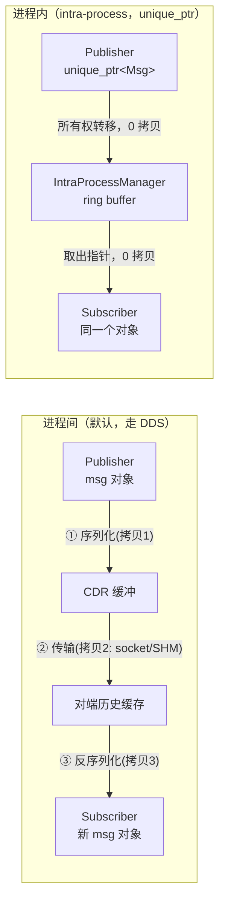

# 04 组件化与进程内通信

> **位置**：`08-ros / 03_高级话题 / 04_组件化与进程内通信.md`
> **难度**：⭐（高 —— 入门门槛高，面向进阶读者）
> **前置知识**：ROS 2 节点/话题基础、CMake 与 package.xml、[01_ROS2架构分层详解](./01_ROS2架构分层详解.md)。
> **交叉引用**：[模块二 · 核心模块](../02_核心模块/README.md)、[06_RMW实现对比](./06_RMW实现对比(FastDDS_vs_CycloneDDS).md)。

---

## 1. 概述

ROS 2 有两个容易混淆、但都叫"更快"的机制：

1. **组件化（Composable Node）**：把多个节点编成 `.so` 动态库，用组件容器（component container）在同一进程里加载，省掉多进程开销、方便管理生命周期。
2. **进程内通信（Intra-process Communication）**：同一进程内的 publisher/subscriber 之间**完全跳过 DDS**，直接把 C++ 对象指针传给订阅者，消除序列化与拷贝。

二者正交但常组合使用：先组件化（同进程），再开 intra-process（零拷贝）。本文讲清两者的机制、收益与坑。

---

## 2. 核心概念

### 2.1 组件（Component）与组件容器

- 组件 = 一个继承 `rclcpp::Node`、编译成共享库（`.so`）的类，通过 pluginlib 机制注册。
- 组件容器（`component_container`）= 一个可执行程序，运行时用 `LoadNode` 服务动态加载组件 `.so` 并实例化 Node。
- 优势：同进程多节点共享资源、可用 composition 管理生命周期、便于 A/B 测试与运行时替换。

### 2.2 intra-process communication

通过 `rclcpp::NodeOptions().use_intra_process_comms(true)` 开启。开启后，**同一 context 内**的 pub/sub 若 topic 名 + QoS 匹配，`rclcpp` 会用 `IntraProcessManager` 在内存中直接投递消息对象，而不是走 DDS。

### 2.3 三种消息传递语义

| 发布方式 | 订阅者拿到 | 拷贝次数 |
|---|---|---|
| `publish(std::unique_ptr<Msg>)` | 独占所有权（`unique_ptr`） | **0 拷贝**（所有权转移） |
| `publish(const Msg &)` | 共享只读（`shared_ptr<const Msg>`） | 至少 1 次拷贝 |
| 默认（未开 intra-process） | 反序列化的新对象 | 序列化+传输+反序列化多次 |

### 2.4 序列化缓冲（SerializedMessage）

`rcl_serialized_message_t`（`rcl/serialized_message.h`）/ `rclcpp::SerializedMessage`：把"已经序列化好的 CDR 字节流"作为一条消息。用于**零反序列化桥接**（如 ros1_bridge 直接转发字节，不 decode 再 encode）。

### 2.5 Fast DDS SharedMemory 传输

Fast DDS 的 SHM（Shared Memory Transport / DataSharing）：在**同一主机不同进程**间用共享内存段传递数据，避免 UDP 回环与内核 socket 拷贝。注意：它仍是"跨进程、走 DDS 发现"的，与 ROS 2 的 intra-process（同进程、不走 DDS）是两回事。

---

## 3. 技术原理（架构 / 源码级）

### 3.1 intra-process 数据流对比



**关键实现点：**

- `rclcpp::Publisher` 在 intra-process 模式下，`publish(unique_ptr<Msg>)` 不调用 `rcl_publish`，而是把指针塞进 `IntraProcessManager` 为每个匹配订阅维护的**环形缓冲**（每订阅一个，容量默认 QoS depth）。
- `SubscriptionIntraProcess` 的 `take` 直接从缓冲弹出对象指针（`shared_ptr` 包装），**不序列化、不反序列化、不 memcpy**。
- 生命周期由 `shared_ptr`/`unique_ptr` 的引用计数/所有权保证：订阅者还拿着对象时，发布者不能提前销毁。

### 3.2 为什么"默认"仍可能有拷贝

`publish(const Msg &)` 是 const 引用，无法转移所有权，`IntraProcessManager` 必须 **copy 一次** 才能安全持有；订阅者以 `shared_ptr<const Msg>` 取出。只有 `unique_ptr` 重载才是真零拷贝。**这是很多人"开了 intra-process 却没提速"的原因。**

### 3.3 序列化缓冲与零反序列化

```cpp
// 订阅端：拿到原始字节，不反序列化（桥接场景）
auto sub = node->create_subscription<Msg>(
  "t", 10, [](std::shared_ptr<rclcpp::SerializedMessage> serialized) {
    const auto & rcl_ser = serialized->get_rcl_serialized_message();
    // 直接转发 rcl_ser.buffer / buffer_length，省一次 decode+encode
  });
```

底层：`rmw_take_serialized_message`（`rmw/rmw.h`）把 CDR 字节原样取出到 `rcl_serialized_message_t`，避免反序列化。跨 DDS 实现时需确认该实现支持 serialized take。

### 3.4 Fast DDS SHM 传输的零拷贝边界

- SHM 传输把数据写进共享内存段；DataSharing 模式下，publisher 与 subscriber **共享同一数据池**，订阅者直接读池中样本，理论上免去"段内拷贝"。
- 但**跨进程的 CDR 序列化仍在**：ROS message 必须先序列化成 CDR 才能进共享段。所以 SHM 省的是"网络栈 + socket 缓冲 + 段内拷贝"，不省序列化。
- ⚠️ 具体拷贝次数与 DataSharing 配置相关，**性能数字待验证**，以 [eProsima 官方文档](https://fast-dds.docs.eprosima.com/) 为准。

### 3.5 复杂度 / 资源开销定性分析

- intra-process：每订阅一个环形缓冲（内存 = depth × sizeof(Msg)），投递 O(1)（入队）+ 取用 O(1)；**无锁**（单生产者/单消费者队列），线程安全由所有权语义保证。
- 组件化：省掉多进程的地址空间、发现图、DDS 线程，但**崩溃域合并**——一个组件段错误整个容器挂。
- 多进程 + SHM：仍有每进程的 DDS 线程与发现，但传输延迟接近内存拷贝。

---

## 4. 实践指南

### 4.1 写一个可组合节点（C++）

**`src/talker_component.cpp`：**

```cpp
#include <rclcpp/rclcpp.hpp>
#include <std_msgs/msg/string.hpp>
#include "rclcpp_components/register_node_macro.hpp"

namespace composition {
class Talker : public rclcpp::Node {
public:
  explicit Talker(const rclcpp::NodeOptions & options)
  : Node("talker", options) {
    pub_ = this->create_publisher<std_msgs::msg::String>("chatter", 10);
    timer_ = this->create_wall_timer(
      std::chrono::seconds(1), [this]() {
        auto msg = std::make_unique<std_msgs::msg::String>();
        msg->data = "hello";
        pub_->publish(std::move(msg));   // unique_ptr 发布，配合 intra-process 可零拷贝
      });
  }
private:
  rclcpp::Publisher<std_msgs::msg::String>::SharedPtr pub_;
  rclcpp::TimerBase::SharedPtr timer_;
};
}  // namespace composition
RCLCPP_COMPONENTS_REGISTER_NODE(composition::Talker)
```

**`package.xml`（关键依赖，插件注册由 CMake 宏自动生成，无需手写 `<exec_plugin>`）：**

```xml
<package format="3">
  <name>my_components</name>
  <version>0.1.0</version>
  <description>composable node demo</description>
  <maintainer email="me@example.com">me</maintainer>
  <license>Apache-2.0</license>
  <buildtool_depend>ament_cmake</buildtool_depend>
  <depend>rclcpp</depend>
  <depend>rclcpp_components</depend>
  <depend>std_msgs</depend>
  <export><build_type>ament_cmake</build_type></export>
</package>
```

**`CMakeLists.txt`（注册节点 = 生成 pluginlib 的 class_libraries XML）：**

```cmake
cmake_minimum_required(VERSION 3.8)
project(my_components)
find_package(ament_cmake REQUIRED)
find_package(rclcpp REQUIRED)
find_package(rclcpp_components REQUIRED)
find_package(std_msgs REQUIRED)

add_library(talker_component SHARED src/talker_component.cpp)
target_compile_definitions(talker_component PRIVATE "COMPOSITION_BUILDING_DLL")
ament_target_dependencies(talker_component rclcpp rclcpp_components std_msgs)

rclcpp_components_register_node(
  talker_component
  PLUGIN "composition::Talker"
  EXECUTOR SingleThreadedExecutor)

install(TARGETS talker_component
        ARCHIVE DESTINATION lib
        LIBRARY DESTINATION lib
        RUNTIME DESTINATION bin)

ament_package()
```

### 4.2 运行时加载组件

```bash
# 独立运行组件（自动用组件容器包装）
ros2 run my_components talker

# 在容器内加载
ros2 run rclcpp_components component_container
ros2 component load /ComponentManager my_components composition::Talker

# 用 composition 包直接组合多组件
ros2 run rclcpp_components component_container_mt   # 多线程容器
```

### 4.3 开启 intra-process

```cpp
rclcpp::NodeOptions options;
options.use_intra_process_comms(true);   // 关键开关
auto node = std::make_shared<rclcpp::Node>("n", options);
// publisher 用 unique_ptr 发布，订阅者用 shared_ptr<const Msg> 接收
```

### 4.4 launch 文件里组合多组件（YAML/XML 示例）

```xml
<launch>
  <node pkg="rclcpp_components" exec="component_container" name="container">
    <composable_node pkg="my_components" plugin="composition::Talker" name="talker"/>
    <composable_node pkg="my_components" plugin="composition::Listener" name="listener"/>
  </node>
</launch>
```

---

## 5. 方案对比

| 维度 | 多进程 + DDS | 多进程 + Fast DDS SHM | 组件化（同进程） | 组件化 + intra-process |
|---|---|---|---|---|
| 序列化 | 有 | 有 | 有（走 DDS 时） | **无**（unique_ptr） |
| 拷贝次数 | 多 | 较少 | 多 | **0** |
| 崩溃隔离 | 好 | 好 | 差（共享进程） | 差 |
| 线程/DDS 资源 | 每进程一份 | 每进程一份 | 共享一份 | 共享一份 |
| 跨主机 | ✅ | ❌（仅同主机） | ❌ | ❌ |

> **绝对不适用场景**：把**关键安全节点与实验性/易崩溃节点**组件化到同一容器还开 intra-process——一旦实验节点段错误或误改共享对象，整个控制容器崩溃，且 intra-process 的对象所有权 bug 极难复现。安全关键路径应保持进程隔离。

---

## 6. 工具链

- `ros2 component list / load / unload / standalone`：组件管理 CLI。
- `rclcpp_components::component_container[_mt|_isolated]`：容器。
- `ros2 node list` + `ros2 topic info -v`：确认节点与 QoS。
- `rqt_graph`：可视化组合后拓扑。
- `ros2 topic echo --no-arr` / `ros2 topic hz`：验证消息流。
- Fast DDS SHM 监控：`fastdds` CLI（具体命令随版本，待验证）。

---

## 7. 参考资料

- 进程内通信设计文档：<https://design.ros2.org/articles/intraprocess_communications.html>
- 进程内通信教程（Jazzy）：<https://docs.ros.org/en/jazzy/Tutorials/Demos/Intra-Process-Communication.html>
- 编写可组合节点教程（Iron/Jazzy）：<https://docs.ros.org/en/iron/Tutorials/Intermediate/Writing-a-Composable-Node.html>
- eProsima 共享内存传输：<https://www.eprosima.com/middleware/add-ons/shared-memory>
- Fast DDS 文档（DataSharing/SHM）：<https://fast-dds.docs.eprosima.com/>
- rclcpp components 源码：<https://github.com/ros2/rclcpp/tree/rolling/rclcpp_components>
- rmw 序列化消息接口：<https://github.com/ros2/rmw/blob/rolling/rmw/include/rmw/rmw.h>

---

## 8. 学习路径

1. 照 4.1 写 talker 组件，`ros2 run` 与 `ros2 component load` 两种方式都跑通。
2. 用 `ros2 component list` 观察容器内节点。
3. 开 `use_intra_process_comms(true)`，分别用 `publish(const Msg&)` 与 `publish(unique_ptr)`，用打点对比延迟，直观体会"所有权转移 vs 拷贝"。
4. 读 `intra_process_manager` 源码，理解环形缓冲与对象生命周期。
5. 进阶：比较同主机多进程 + Fast DDS SHM 与组件化 intra-process 的差异（结合 [06_RMW实现对比](./06_RMW实现对比(FastDDS_vs_CycloneDDS).md)）。

---

## 9. 核心面试三问

1. **开了 `use_intra_process_comms(true)` 就一定是零拷贝吗？为什么很多人开了却没提速？**
   → 不一定。只有 `publish(std::unique_ptr<Msg>)` 通过所有权转移实现零拷贝；`publish(const Msg&)` 因无法转移所有权，`IntraProcessManager` 必须 copy 一次，订阅者以 `shared_ptr<const Msg>` 取出。没提速通常是用错了重载或 QoS 不匹配导致退化回 DDS。

2. **组件化（同进程）与 Fast DDS SHM（跨进程共享内存）在"省了什么"上本质区别是什么？**
   → 组件化是同进程，共享 DDS 线程与发现，若开 intra-process 则连序列化都省（对象指针直传）；SHM 是跨进程仍走 DDS 发现与序列化，只是传输层用共享内存段替代 UDP 回环，省网络栈与 socket 拷贝。

3. **组件化最大的工程风险是什么？为什么安全关键节点不建议和实验节点放同一容器？**
   → 崩溃域合并：一个组件段错误/死锁会让整个容器内所有节点一起挂；且 intra-process 的共享对象所有权 bug 难复现。安全关键路径应保持进程级隔离，牺牲部分资源效率换取故障隔离。
