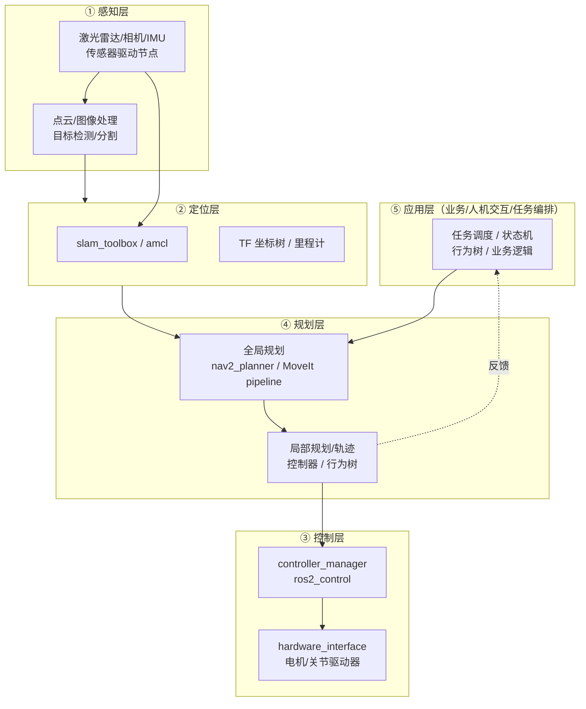

# ROS 2 应用架构设计模式

> **在知识图谱中的位置**：模块四 · 04_工程实践 · 第 1 节
> **难度**：⭐⭐⭐ | **前置知识**：[模块一·基础概念](../01_基础概念/)（节点/话题/服务/Action）、[模块二·核心模块](../02_核心模块/)（rclcpp/rclpy、DDS/QoS）、生命周期节点概念

---

## 1. 概述

量产机器人的软件栈不是"能跑"就行，而是要满足三个硬约束：**可维护**（多人/多团队并行开发不互相踩脚）、**可隔离**（单个模块崩溃不拖垮整机）、**可演进**（升级传感器/算法/硬件时只改局部）。ROS 2 的节点/话题/DDS 机制只是"通信工具"，**架构设计决定这套工具被用成"清晰的分层系统"还是"一团无法调试的网"**。

本节回答四个问题：① 一个量产机器人应用该长成什么样的分层结构？② 什么时候拆进程、什么时候组件化？③ 模块之间的接口契约（消息/服务/Action）如何设计才不会一改就崩？④ 错误如何在模块间隔离、如何传播？

---

## 2. 核心概念

### 2.1 分层参考架构（感知 → 定位 → 规划 → 控制 → 应用）

机器人软件几乎都收敛到同一个五层结构，这是几十年移动/操作机器人工程实践沉淀下来的共识，Nav2、Autoware、MoveIt 的应用栈都遵循它：



**分层原则**：数据只沿相邻层流动（感知→定位→规划→控制），跨层直连（应用直接订阅激光雷达）是反模式。每层对上层暴露的是**抽象接口**（如"目标位姿 + 代价地图"），而不是具体实现（如"某个驱动的话题"）。

### 2.2 进程边界 = 故障域 + 资源域

ROS 2 里"一个进程"是隔离的最小单位：进程崩溃时，它持有的所有节点、内存、线程一起消失，不影响其他进程。因此**进程边界是你主动画出来的"故障隔离墙"和"资源预算单元"**：

- **故障域**：一个进程内任意一个节点的段错误、死锁、OOM，都会杀掉整个进程。把"容易崩/第三方的"模块放进独立进程，等于给它上了保险丝。
- **资源域**：进程可以被操作系统限制 CPU（`cgroup`/`nice`）、内存（`ulimit`）、绑定核（`taskset`/`isolcpus`），量产时通常要求控制环独占一个核。

### 2.3 接口契约：消息是模块间"唯一"的耦合点

两个模块唯一的耦合应该是它们之间交换的 `.msg/.srv/.action` 定义。只要契约（消息 schema + QoS + 话题语义）稳定，模块内部可以自由重构。契约一旦破坏，改动会像多米诺骨牌一样传播。

### 2.4 节点（独立进程）vs 组件（进程内组合）

ROS 2 支持把多个节点**组合进同一进程**（composition，`rclcpp_components`），节点间用**进程内通信（intra-process）**零拷贝传递数据。这让"逻辑上分节点、物理上并进程"成为可能——拆分粒度从"编译期决定"变成"部署期决定"。

### 2.5 错误传播与故障隔离

ROS 2 节点默认"崩溃即静默死亡"——没有异常机制会跨进程传播。系统的健壮性来自**主动设计**：生命周期节点提供"状态可查询、可被外部拉起/关停"的运行态信号，配合进程级 supervisor（`ros2 launch` 的 `on_exit` 重启、systemd、supervisord）实现故障恢复。

---

## 3. 技术原理/方法

### 3.1 节点粒度决策标准

判断"该拆成独立进程还是做成进程内组件"，用下面的决策矩阵，按优先级从上到下：

| 决策维度 | 拆成独立进程（node） | 做成进程内组件（component） |
|---|---|---|
| **故障影响** | 崩溃会拖垮整机（如驱动、规划器） | 崩溃可接受（如日志/调试工具） |
| **CPU 硬实时** | 控制环需要独占核、低抖动 | 纯算法，无需实时 |
| **语言边界** | 需要混用 C++/Python/其他语言 | 同为 C++ 且都基于 rclcpp |
| **团队边界** | 不同团队各自交付、独立发布 | 同一团队内部模块 |
| **数据吞吐** | 大数据（点云/图像）跨进程要走 DDS 序列化 | 大数据需要零拷贝（intra-process） |
| **资源预算** | 需限制内存/CPU（用 cgroup 管） | 无所谓 |

**经验法则**：
1. **进程边界优先划在"会崩的地方"和"要实时的地方"**——感知/规划可重启，控制与硬件抽象必须独立且可快速重启。
2. **组件的价值在"零拷贝 + 统一启动"**，但**组件的成本是"一崩全崩"**——把控制环和规划器组合进同一进程是常见事故源。
3. **跨语言必须拆进程**（`rclcpp` 和 `rclpy` 无法同一进程组合）。
4. **同一团队、低频小消息**的服务类节点，组合能显著降低开销（省掉 DDS 序列化往返）。

> 参考官方设计文档对进程内通信与节点组合的定位：<https://design.ros2.org/articles/intraprocess_communications.html>。

### 3.2 接口契约设计

#### 消息版本化（社区工程惯例，非官方强制）

ROS 2 没有强制的消息版本管理机制，量产团队必须自建纪律，原则是"**只加不改、破坏性变更换新名**"：

- **可加**：新增字段（默认值保证老发布者兼容）、新增可选服务参数。
- **可改**：字段注释、字段顺序重排（无序列化影响但破坏二进制兼容，避免）。
- **不可改**：已有字段的类型、语义、单位；话题/QoS 契约。
- **破坏性变更**：新建消息类型带版本号，如 `PoseStamped2`、`cmd_vel_v2`，而不是原地改 `Twist`。因为 `Twist` 是生态共享类型，改了会连锁破坏。

> ⚠️ 上例中的 `cmd_vel_v2` 为工程命名示例，不是 ROS 官方类型。

#### 语义化话题命名

ROS 2 **官方给出的是"名称合法性规则"**，语义化命名则是社区/工程惯例。官方规则见 <https://design.ros2.org/articles/topic_and_service_names.html>：名称由小写字母、数字、下划线组成，不能以下划线开头/结尾，不能有连续双下划线，`~` 表示私有命名空间。**语义化惯例（社区约定）**是：

```
/<命名空间>/<语义>/<动作_对象>    # 例如 /robot1/perception/image_raw
/robot1/sensing/lidar/scan
/robot1/nav/cmd_vel
```

- **动作_对象**（动词在前）：`cmd_vel`、`get_map`、`set_pose`——描述"做什么+对什么"。
- **语义分组**（`/sensing` `/perception` `/nav` `/control`）对应分层架构，便于权限控制、QoS 批量配置、可视化分组。
- **命名空间 `/robot1`** 前缀支持多机器人同栈部署（`/robot1/...` 与 `/robot2/...` 互不干扰），量产多机场景必须预留。
- **避开硬编码**：话题名一律来自参数（`declare_parameter("scan_topic", "/robot1/sensing/lidar/scan")`），通过 launch 重映射注入，绝不在源码里写死字符串。

> 找不到 ROS 官方"语义命名规范"文档，`/<ns>/<semantic>/<type>` 属于**社区惯例**（Autoware、Nav2、TurtleBot 等真实项目实践），官方只约束名称合法性。

#### QoS 契约要"写进文档"

同一个话题，发布者 `BEST_EFFORT + depth 5`、订阅者 `RELIABLE + depth 10` 会导致**静默收不到数据**（ROS 2 QoS 不匹配时，较新版本默认不报错，只在日志里有 debug 提示）。量产时把每个关键话题的 QoS 约定写进接口文档，并在启动时用 `ros2 topic info --verbose` 核对。

### 3.3 错误传播与故障隔离的实现

**三层隔离机制**：

1. **进程隔离**：驱动/规划器各自独立进程（独立 `executable`），崩溃互不影响。
2. **生命周期管理**：关键节点做成 managed node（`rclcpp_lifecycle`），状态机 `unconfigured → inactive → active`。系统启动时按依赖顺序激活，任一关键节点 `on_error` 进入 `inactive` 即触发上层降级。官方设计：<https://design.ros2.org/articles/node_lifecycle.html>。
3. **进程级监督**：`ros2 launch` 用 `on_exit` 事件实现"崩溃自动重启"（见第 4 节），或交给 systemd `Restart=on-failure` 兜底。

**错误传播的正确姿势**：不要靠"异常跨进程传播"（ROS 2 没有这个机制），而是靠**状态主题/诊断消息**——节点周期发布心跳 + 健康状态（`diagnostic_msgs/DiagnosticStatus`），上层用看门狗判断，详见 [03_诊断监控与故障定位.md](03_诊断监控与故障定位.md)。

### 3.4 反模式清单

| 反模式 | 表现 | 后果 | 修复 |
|---|---|---|---|
| **God node** | 一个节点同时读激光雷达、做定位、发速度 | 无法定位故障、无法独立重启、代码无法并行开发 | 按分层拆；数据流走话题 |
| **过度碎片化** | 每个小逻辑都拆成节点+话题，十几个节点做一件事 | DDS 序列化开销、启动编排复杂、日志分散 | 同进程组合（component） |
| **循环依赖** | A 等 B 的话题，B 又等 A 的服务，启动互相死锁 | 系统起不来、启动顺序地狱 | 用 lifecycle 显式声明依赖顺序，破环 |
| **跨模块硬编码话题** | 规划器源码里写死 `/scan` | 改名/多机/仿真切换全部要改代码 | 参数化 + launch 重映射 |
| **契约隐式化** | 靠"你发的第 3 个字段是速度"这种口头约定 | 改字段即崩、无法 review | 所有跨界通信都用 .msg/.srv/.action 定义 |

---

## 4. 实践指南

### 4.1 可执行配置

**① 组件化注册（package.xml + CMakeLists.txt）**：

```xml
<!-- package.xml -->
<depend>rclcpp_components</depend>
```

```cmake
# CMakeLists.txt
add_library(my_component SHARED src/my_component.cpp)
rclcpp_components_register_node(my_component
  PLUGIN "my_pkg::MyComponent"
  EXECUTABLE standalone_node)   # 同时生成独立进程版本，一个实现两种部署
ament_target_dependencies(my_component rclcpp rclcpp_components)
```

```cpp
// src/my_component.cpp —— 关键：让同一份代码既能独立跑也能组合跑
#include <rclcpp_components/register_node_macro.hpp>
class MyComponent : public rclcpp::Node { /* ... */ };
RCLCPP_COMPONENTS_REGISTER_NODE(my_pkg::MyComponent)
```

**② 组合式启动（run-time composition）**：

```bash
# 手动把多个组件加载进同一个 container 进程
ros2 run rclcpp_components component_container
ros2 component load /ComponentManager my_pkg my_pkg::MyComponent
ros2 component load /ComponentManager nav2_pkg nav2_pkg::Controller
# 查/卸载
ros2 component list
ros2 component unload /ComponentManager 1
```

```python
# launch 文件里声明组合，与进程版本二选一
composable_nodes = ComposableNodeContainer(
    name='my_container', namespace='', package='rclcpp_components',
    executable='component_container_mt',  # -mt 多线程 executor
    composable_node_descriptions=[
        ComposableNode(package='my_pkg', plugin='my_pkg::MyComponent', name='a'),
        ComposableNode(package='other_pkg', plugin='other_pkg::Other', name='b'),
    ], output='screen')
```

**③ 崩溃自动重启（ros2 launch on_exit）**：

```python
# 驱动节点崩溃后自动拉起（限次，避免死循环）
from launch.actions import EmitEvent, RegisterEventHandler, LogInfo
from launch.event_handlers import OnProcessExit
from launch.events import Shutdown
from launch_ros.actions import Node

driver = Node(package='my_pkg', executable='driver_node', output='screen')

RegisterEventHandler(
    OnProcessExit(
        target_action=driver,
        on_exit=[LogInfo(msg='driver exited, restarting...'), driver],
    ))
```

### 4.2 最佳实践

1. **启动顺序交给 lifecycle**，不要靠 `sleep` 拼运气——用 `ros2 lifecycle set /node configure` 显式激活，见第 3.3 节。
2. **一个进程一个 `MultiThreadedExecutor`，控制环用 `ReentrantCallbackGroup` + 单独线程**，避免回调互相阻塞。
3. **大数据（点云/图像）用 intra-process + `SENSOR_DATA` QoS**，跨进程才走 DDS。
4. **所有跨模块话题名参数化**，用一个 launch 文件集中管理命名空间与重映射，仿真/真机/多机三套只改参数。
5. **为每个模块写"接口契约文档"**：话题名 + 消息类型 + QoS + 频率 + 单位，作为 review 和联调的契约。

### 4.3 陷阱

- **QoS 静默不匹配**：`BEST_EFFORT` vs `RELIABLE` 组合收不到数据且无显式报错，是 ROS 2 联调第一大坑。排查见 [03_诊断监控与故障定位.md](03_诊断监控与故障定位.md)。
- **组件化 ≠ 免费**：组合进同一进程后，一个节点死循环会卡住整个 executor，导致进程内所有节点一起"卡死"。关键节点（尤其控制环）别和实验性代码同进程。
- **intra-process 的隐性条件**：两个节点必须**同一进程**、话题类型**完全一致**、且都开启 `use_intra_process_comms`，否则静默退化为 DDS 通信，性能预期落空。
- **Python 节点的 GIL**：`rclpy` 节点同进程组合收益有限，且 Python 回调被 GIL 串行化，硬实时别用 Python。

### 4.4 调优

- **控制环抖动**：`isolcpus` 绑核 + `chrt -f` 提升优先级 + `SingleThreadedExecutor`，把控制节点单独进程，见 [05_导航与运动控制栈.md](05_导航与运动控制栈(Nav2_MoveIt2_ros2control).md) 的 ros2_control 部分。
- **吞吐**：点云话题用 `BEST_EFFORT + depth 1`（只要最新帧），命令话题用 `RELIABLE + depth 10`（一条都不能丢）。
- **进程内通信验证**：`ros2 daemon` 无法直接显示 intra-process 是否生效，用 `ros2 topic echo` 对比关闭前后延迟，或用 `ros2 tracing`（见 [03_诊断监控与故障定位.md](03_诊断监控与故障定位.md)）。

---

## 5. 方案对比

| 方案 | 适用场景 | 隔离性 | 延迟 | 复杂度 | 代表 |
|---|---|---|---|---|---|
| **全部独立进程** | 教学、多团队、需强隔离 | ⭐⭐⭐ 最强 | 中（DDS 序列化） | 低（天然） | TurtleBot3 教程 |
| **关键模块组件化** | 量产、数据密集 | ⭐⭐ 中等 | 低（intra-process） | 中 | Nav2（composable 方式） |
| **全组件单进程** | 单板资源极受限、实验 | ⭐ 最弱（一崩全崩） | 最低 | 高 | 少数嵌入式 demo |
| **混合（进程+组件+lifecycle）** | 量产推荐 | ⭐⭐ 可控 | 可控 | 高（需设计） | Autoware、厂内 AMR |

**绝对不适用场景**：当系统要求"任意单个模块崩溃后整机仍能降级运行"（如安全关键控制环 + 感知），**不要**把控制环与规划/感知组合进同一进程——进程是唯一的故障隔离墙，组件化会直接摧毁这堵墙。

---

## 6. 工具链

| 工具/包 | 用途 | 来源 |
|---|---|---|
| `rclcpp_components` | 节点组件化、composition | 官方（rclcpp） |
| `rclcpp_lifecycle` | managed node 生命周期状态机 | 官方 |
| `ros2 component` / `ros2 lifecycle` | CLI 操作组合与生命周期 | 官方 |
| `ros2 launch` `on_exit`/`OnProcessExit` | 崩溃重启、启动编排 | 官方（launch） |
| `ros2 topic info --verbose` / `ros2 node info` | 核对 QoS、话题/节点拓扑 | 官方 |
| `diagnostic_updater` | 心跳/健康状态发布（配看门狗） | [ros/diagnostics](https://github.com/ros/diagnostics) |
| `rqt_graph` | 拓扑可视化、发现循环依赖 | 官方 |

---

## 7. 参考资料

- ROS 2 官方文档（Jazzy）：<https://docs.ros.org/en/jazzy/>
- Topic/Service 名称映射与命名规则：<https://design.ros2.org/articles/topic_and_service_names.html> ✅
- 进程内通信设计：<https://design.ros2.org/articles/intraprocess_communications.html> ✅
- Managed node（生命周期）设计：<https://design.ros2.org/articles/node_lifecycle.html> ✅
- 组合节点教程：<https://docs.ros.org/en/jazzy/Tutorials/Intermediate/Composition.html> ✅（官方 Composition 教程，位于 Intermediate 系列）
- 诊断栈：<https://github.com/ros/diagnostics> ✅

> 命名规范补充说明：ROS 2 官方未发布强制性的"语义化话题命名规范"文档，`/<ns>/<semantic>/<type>` 为社区工程惯例，本节已明确标注。若需要官方权威命名来源，参见 design 文档的名称合法性规则（上）。

---

## 8. 学习路径

1. **入门**：读 [模块一·基础概念](../01_基础概念/) 的节点/话题/QoS，跑通一个双节点 demo。
2. **上手**：把 demo 改成组件化 + `component_container` 加载，体会组合与进程的区别。
3. **进阶**：给一个三模块应用（感知→处理→控制）套用本节的五层架构，画出 mermaid 拓扑，按 3.1 决策矩阵定拆分粒度。
4. **实战**：引入 lifecycle 启动顺序 + `on_exit` 崩溃重启 + 参数化话题名，形成可复用的工程骨架。
5. **串联**：进入 [02_ROS2测试体系.md](02_ROS2测试体系.md) 为这个骨架补测试，再进入 [03_诊断监控与故障定位.md](03_诊断监控与故障定位.md) 补可观测性。

---

## 9. 核心面试三问

**Q1：什么时候该把一个逻辑拆成独立节点（进程），什么时候该做成组件（进程内组合）？**
> 答：进程是故障隔离墙和资源预算单元，组件是"零拷贝 + 统一启动"的性能优化。判断顺序：① 崩溃影响面——会拖垮整机的（驱动、控制环、规划器）必须独立进程；② 实时性——控制环要绑核低抖动，必须独立；③ 语言/团队边界——跨语言、跨团队交付必须独立；④ 数据吞吐——点云/图像等大数据若同进程可走 intra-process 零拷贝，否则 DDS 序列化是瓶颈。核心教训：**控制环不要和实验性/易崩代码组合进同一进程**，组件化的代价是"一崩全崩"。

**Q2：消息类型要改（比如 cmd_vel 加一个角加速度字段），你会直接改 Twist.msg 吗？为什么？**
> 答：不直接改。`geometry_msgs/Twist` 是生态共享类型，改了会连锁破坏所有下游（导航栈、驱动、可视化）。正确做法：非破坏性扩展优先用"新增消息类型带版本"（如自定义 `CmdVel2`）而不是原地改；若只是加字段且能保证默认值兼容，可新定义自己的消息并做消息桥接。已上线契约遵循"只加不改、破坏性变更换新名"，并通过 rosbag 回放做向后兼容回归。

**Q3：两个节点话题连不上、收不到数据，你怎么第一时间定位是"架构/QoS"问题还是"节点根本没跑"？**
> 答：三步走：① `ros2 node list` / `ros2 topic list` 确认节点和话题存在（节点没跑或话题名写死/未重映射是最高频原因）；② `ros2 topic info /xx --verbose` 对比发布者与订阅者的 **QoS 配置**（reliability/durability/depth）是否一致——BEST_EFFORT 对 RELIABLE 会静默丢数据；③ `ros2 topic echo /xx -q` 确认发布者确实在发、`ros2 topic hz /xx` 看频率。这条链路本身就是"错误隔离"思想的体现：先确认实体存在，再确认契约一致，最后确认数据流。

---

> 下一步：[02_ROS2测试体系.md](02_ROS2测试体系.md) · 模块导读：[README.md](README.md)
