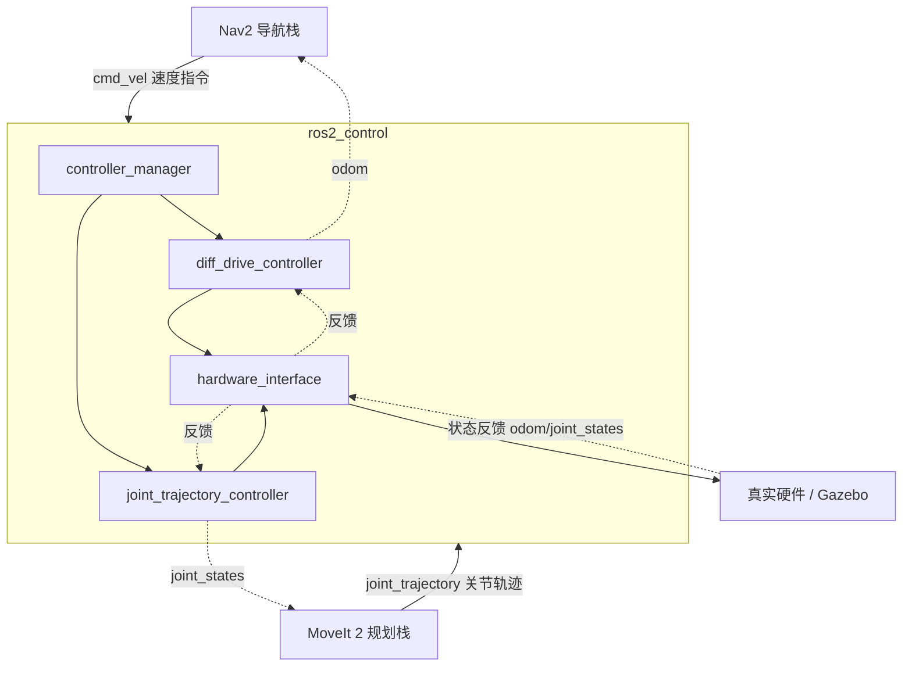

# 导航与运动控制栈（Nav2 / MoveIt2 / ros2_control）

> **在知识图谱中的位置**：模块四 · 04_工程实践 · 第 5 节
> **难度**：⭐⭐⭐ | **前置知识**：[模块二·核心模块](../02_核心模块/)（TF/URDF/传感器话题）、[模块三·高级话题](../03_高级话题/)（行为树/状态机）、[01_ROS2应用架构设计模式.md](01_ROS2应用架构设计模式.md)（分层架构）

---

## 1. 概述

量产机器人最常用的三大开源栈，各管一段，职责清晰：

| 栈 | 定位 | 解决的核心问题 |
|---|---|---|
| **Nav2** | 移动机器人的**平面导航** | 从 A 到 B 怎么走、怎么避开障碍、走不动了怎么恢复 |
| **MoveIt 2** | 机械臂的**运动规划** | 从当前位姿到目标位姿，无碰撞的关节轨迹怎么算 |
| **ros2_control** | **控制器与硬件抽象** | 算出的轨迹/速度指令，怎么变成电机/关节的实际运动 |

三者常协同：Nav2 算底盘速度 → ros2_control 的 diff_drive_controller 驱动底盘；MoveIt 2 算关节轨迹 → ros2_control 的 joint_trajectory_controller 驱动机械臂。**理解三者的"边界"比理解单个细节更重要**——边界划不清，就会在错误的地方调试错误的问题。

---

## 2. 核心概念

### 2.1 Nav2：代价地图 + 行为树 + 恢复行为

Nav2（<https://docs.nav2.org/>）三根支柱：
- **代价地图（costmap_2d）**：全局 costmap（静态地图 + 膨胀）和局部 costmap（以机器人为中心滑动窗口 + 实时障碍），是规划的"可通行性"输入。
- **行为树（behavior_tree）**：把"导航"拆成可编排的动作/条件节点，而非硬编码状态机，`bt_navigator` 执行。
- **恢复行为（recovery behaviors）**：规划/控制失败时自动执行 `spin`（原地转圈重新定位）、`backup`（后退脱困）、`wait`（等待障碍离开）等，是量产可靠性的关键。

### 2.2 MoveIt 2：规划管线 + SRDF

MoveIt 2（<https://moveit.picknik.ai/>）核心抽象是**规划管线（planning pipeline）**：请求 → 请求适配器 → **规划器（planner）** → 响应适配器 → 轨迹。规划器默认 **OMPL**（采样式），另有 **CHOMP/STOMP**（轨迹优化）。机器人模型除 URDF 外，还靠 **SRDF**（Semantic Robot Description Format）描述运动学分组、默认位姿、允许碰撞矩阵。

### 2.3 ros2_control：controller_manager + hardware_interface

ros2_control（<https://control.ros.org/>）是控制器与硬件的中间层：
- **controller_manager**：按生命周期加载/切换/卸载控制器，管理资源。
- **hardware_interface**：把"控制器读写命令/状态"抽象成统一接口，屏蔽真实硬件差异。
- **硬件描述**：在 URDF 的 `<ros2_control>` 标签里声明用哪个 `hardware_plugin`（Gazebo 仿真插件 or 真实机器人插件）。

### 2.4 三栈协同拓扑



---

## 3. 技术原理/方法

### 3.1 Nav2 架构：各 server 职责与 BT 恢复机制

Nav2 由一组**独立 server 节点**组成（可通过 composition 组合），主节点 `bt_navigator` 用行为树调度它们：

| 组件 | 职责 |
|---|---|
| `planner_server` | 全局规划（默认 NavFn/Smac Planner/Theta*，插件式） |
| `controller_server` | 局部控制（默认 Regulated Pure Pursuit/DWB，插件式） |
| `behavior_server` | 恢复行为（spin/backup/wait） |
| `bt_navigator` | 行为树导航主节点 |
| `costmap_2d` | 全局/局部代价地图 |
| `map_server` | 加载静态地图 |
| `amcl` / `slam_toolbox` | 定位（AMCL 或 SLAM） |

**BT 恢复机制**：默认行为树（`navigate_to_pose_w_replanning_and_recovery.xml`）的逻辑是——目标位姿 → 全局规划 → 局部控制，任一环节失败进入恢复子树，按顺序尝试 `spin → backup → wait`，恢复成功则重新规划继续，全部失败才终止任务。这套"失败→恢复→重试"把导航从"撞了就算了"变成"撞不动自己想办法"。

插件算法选择见官方文档：<https://docs.nav2.org/setup_guides/algorithm/select_algorithm.html>。

### 3.2 MoveIt 2 规划管线

规划管线（motion planning pipeline）是 MoveIt 2 的核心数据流，官方概念文档：<https://moveit.picknik.ai/main/doc/concepts/motion_planning.html>：

```
规划请求(目标位姿/约束) → request_adapters(预处理) → planner(OMPL/CHOMP/...)
        → response_adapters(后处理:时间参数化/轨迹平滑) → 关节轨迹
```

- **planner**：默认 **OMPL**（概率路图/RRT 族，概率完备）；**CHOMP/STOMP** 是轨迹优化类，适合平滑优化但非概率完备。
- **kinematics**：正/逆运动学由 `kinematics.yaml` 配置的求解器插件负责（默认 KDL，可换 TRAC-IK 等）。
- **request_adapters**：如 `FixWorkspaceBounds`（补全工作空间）、`FixStartStateBounds`；**response_adapters**：如 `AddTimeParameterization`（给轨迹加时间戳，ros2_control 需要带时间参数的轨迹）。

### 3.3 ros2_control 架构：controller type / hardware_plugin

ros2_control 的两大扩展点（<https://control.ros.org/>）：

1. **controller（控制器插件）**：实现"读状态 → 算指令 → 写指令"的闭环逻辑。
   - `diff_drive_controller`：差速底盘，把 `cmd_vel`（线/角速度）转成左右轮速，并**发布里程计**。
   - `forward_command_controller`：开环直通，直接把话题指令写到硬件接口（无闭环）。
   - `joint_trajectory_controller`：接收 `FollowJointTrajectory` action，插值成逐点关节轨迹发给硬件。
   - `joint_state_broadcaster` / `imu_sensor_broadcaster`：只读硬件状态并广播（无写）。
2. **hardware_plugin（硬件插件）**：实现 `SystemInterface`，暴露 `export_state_interfaces` / `export_command_interfaces`，对接真实驱动（CAN/EtherCAT/串口）或仿真（Gazebo）。

关键点：**控制器不关心硬件，硬件不关心控制器**——它们只通过 `state_interface` / `command_interface` 的名字字符串对接。所以"仿真换真机"只换 hardware_plugin，控制器代码一行不动。URDF 声明：

```xml
<ros2_control name="MyRobot" type="system">
  <hardware>
    <plugin>gazebo_ros2_control/GazeboSystem</plugin>  <!-- 仿真；真机换成厂商插件 -->
  </hardware>
  <joint name="wheel_left_joint">
    <command_interface name="velocity"/>
    <state_interface name="position"/>
    <state_interface name="velocity"/>
  </joint>
</ros2_control>
```

`controller_manager` 文档：<https://docs.ros.org/en/ros2_packages/kilted/api/controller_manager/doc/userdoc.html>；组织：<https://github.com/ros-controls>。

### 3.4 三栈协同与选型注意

1. **Nav2 输出 `cmd_vel`，由 ros2_control 的 diff_drive_controller 承接**——不要绕过 ros2_control 直接写电机，否则失去硬件抽象与里程计闭环。
2. **MoveIt 2 输出带时间参数的关节轨迹，由 joint_trajectory_controller 承接**——MoveIt 的 response adapter 必须加时间参数化。
3. **定位是 Nav2 的前置输入**：`slam_toolbox`（<https://index.ros.org/r/slam_toolbox/>）建图/定位或 `amcl` 重定位，TF 链（map→odom→base_link）必须完整，否则 Nav2 直接报 TF 错误（见 [03_诊断监控与故障定位.md](03_诊断监控与故障定位.md) 的 TF playbook）。

---

## 4. 实践指南

### 4.1 可执行命令

```bash
# Nav2 快速启动（需先有 /map、TF、传感器数据）
ros2 launch nav2_bringup bringup_launch.py map:=/path/map.yaml
# 发导航目标
ros2 run nav2_goal_pose_publisher nav2_goal_pose_publisher
# 或 RViz 2D Goal Estimate / Nav2 Goal 按钮

# MoveIt 2 启动（以官方 demo 为例）
ros2 launch moveit2_tutorials demo.launch.py   # 示例，按实际配置调整

# ros2_control 加载控制器
ros2 control list_controllers
ros2 control load_controller joint_state_broadcaster
ros2 control set_controller_state joint_state_broadcaster active
```

### 4.2 最佳实践

1. **仿真先跑通再上真机**：Gazebo + `gazebo_ros2_control` 跑通三大栈，再只换 hardware_plugin 上真机（见 [06_仿真与硬件生态.md](06_仿真与硬件生态.md)）。
2. **Nav2 参数调优顺序**：先调全局/局部代价地图（膨胀半径、更新频率），再调控制器（RPP 的 lookahead distance），最后调恢复行为触发阈值。
3. **MoveIt 用 SRDF 管理允许碰撞**：机械臂自碰撞/与工作台碰撞矩阵写在 SRDF，别硬编码在代码里。
4. **控制器生命周期**：用 lifecycle 管理 controller（configure→activate），启动顺序 = 先 broadcaster 后 controller。

### 4.3 陷阱

- **TF 链断裂是 Nav2 第一杀手**：`map→odom→base_link` 任一缺失/过期，Nav2 直接拒绝规划。先 `tf2_echo map base_link` 验证。
- **ros2_control 的 interface 名字必须精确匹配**：`command_interface name="velocity"` 与控制器写的名字拼写/大小写不一致 → 运行时静默无输出。
- **MoveIt 轨迹没时间参数化**：response adapter 忘了加 `AddTimeParameterization`，轨迹发给 joint_trajectory_controller 会因缺时间戳失败。
- **代价地图更新频率与传感器不匹配**：激光雷达 10Hz、costmap 5Hz，障碍物感知滞后导致撞障，调优要对齐频率。
- **仿真/真机插件混用**：URDF 里 hardware_plugin 指向 gazebo 插件，真机启动会连不上硬件，需用参数/独立 URDF 切换。

### 4.4 调优

- **Nav2 控制器**：Regulated Pure Pursuit 调 `lookahead_distance`（小=贴轨迹但抖，大=平滑但抄近路）、`max_linear_accel`。
- **规划器选择**：开阔场景 NavFn 快，复杂/停车场景 Smac Planner（Hybrid-A*）轨迹更优但更耗 CPU。
- **ros2_control 更新周期**：`update_rate` 与真实控制周期对齐（差速 50-100Hz，关节 200-1000Hz），过高浪费 CPU，过低抖动。

---

## 5. 方案对比

| 维度 | Nav2 | MoveIt 2 | ros2_control |
|---|---|---|---|
| 解决领域 | 平面移动导航 | 机械臂运动规划 | 控制器/硬件抽象 |
| 核心抽象 | costmap + 行为树 | 规划管线 + SRDF | controller + hardware_interface |
| 默认求解器 | NavFn/Smac + RPP/DWB | OMPL（+CHOMP/STOMP） | 无（控制器插件） |
| 输出 | `cmd_vel` | `joint_trajectory`（带时间） | 硬件指令 |
| 是否需要 ros2_control | 是（底盘） | 是（机械臂） | — |
| 恢复/容错 | 内置恢复行为 | 规划失败重试 | 控制器级软限位 |

**绝对不适用场景**：当机器人是**全向/阿克曼/四足等非差速底盘**时，**不要**直接套 Nav2 默认的 diff_drive 配置和 ros2_control 的 `diff_drive_controller`——Nav2 控制器与底层控制器插件都需要按运动学模型更换（如阿克曼需 `ackermann` 控制器 + 相应运动学插件），直接挪用差速配置会导致里程计和轨迹完全错误。

---

## 6. 工具链

| 工具/包 | 用途 | 来源 |
|---|---|---|
| `nav2_bringup` / `nav2_*` | 导航栈 | [docs.nav2.org](https://docs.nav2.org/) |
| `slam_toolbox` / `amcl` | 建图/定位 | [slam_toolbox](https://index.ros.org/r/slam_toolbox/) |
| `moveit2` / `moveit_config` | 机械臂规划 | [moveit.picknik.ai](https://moveit.picknik.ai/) |
| `ros2_control` / `ros2_controllers` | 控制器框架 | [control.ros.org](https://control.ros.org/) |
| `controller_manager` | 控制器管理 | [用户文档](https://docs.ros.org/en/ros2_packages/kilted/api/controller_manager/doc/userdoc.html) |
| `gazebo_ros2_control` | 仿真硬件插件 | [ros-controls](https://github.com/ros-controls) |
| `rviz2` | 导航目标/轨迹可视化 | 官方 |

---

## 7. 参考资料

- Nav2 官方文档：<https://docs.nav2.org/> ✅
- Nav2 规划/控制器算法选择：<https://docs.nav2.org/setup_guides/algorithm/select_algorithm.html> ✅
- MoveIt 2 官方文档：<https://moveit.picknik.ai/> ✅
- MoveIt 2 运动规划概念（规划管线）：<https://moveit.picknik.ai/main/doc/concepts/motion_planning.html> ✅
- ros2_control 官方文档：<https://control.ros.org/> ✅
- controller_manager 用户文档：<https://docs.ros.org/en/ros2_packages/kilted/api/controller_manager/doc/userdoc.html> ✅
- ros2_control 组织：<https://github.com/ros-controls> ✅
- slam_toolbox：<https://index.ros.org/r/slam_toolbox/> ✅

---

## 8. 学习路径

1. **入门**：Nav2 官方教程跑通一个差速机器人的导航（仿真）。
2. **进阶**：读 Nav2 默认行为树 XML，理解"失败→恢复→重试"；改恢复行为触发阈值观察效果。
3. **机械臂**：MoveIt 2 教程跑通 demo，理解 SRDF 分组与 OMPL 规划管线。
4. **硬件抽象**：写一个最小 ros2_control hardware_plugin，实现 `export_command_interfaces`，理解控制器与硬件解耦。
5. **串联**：三栈合一的移动机械臂仿真，进入 [06_仿真与硬件生态.md](06_仿真与硬件生态.md) 学习仿真器选型与真机迁移。

---

## 9. 核心面试三问

**Q1：Nav2、MoveIt 2、ros2_control 三者边界在哪？一个移动机械臂里它们怎么分工协作？**
> 答：Nav2 管**平面导航**（地图 + 代价地图 + 行为树，输出底盘 `cmd_vel`）；MoveIt 2 管**机械臂运动规划**（URDF/SRDF + OMPL/CHOMP 规划管线，输出关节轨迹）；ros2_control 是**控制器与硬件抽象层**，把两者算出的指令（`cmd_vel`/`joint_trajectory`）翻译成电机/关节实际运动，并回传里程计/关节状态闭环。分工：Nav2→diff_drive_controller→底盘；MoveIt2→joint_trajectory_controller→机械臂。关键是不绕过 ros2_control 直连硬件，否则失去硬件抽象和闭环。

**Q2：Nav2 的行为树 + 恢复行为为什么比传统硬编码状态机更适合量产导航？**
> 答：导航充满"规划失败、卡住、被障碍逼停"等异常，硬编码状态机要为每种异常手工枚举状态与转移，爆炸且难扩展。行为树把动作（spin/backup/wait）和条件（是否失败）做成可组合节点，恢复子树能插拔、能复用，默认 `navigate_to_pose_w_replanning_and_recovery` 在失败时自动按顺序尝试恢复再重规划。这对量产的意义是：机器人遇到预期外场景能"自己脱困"而不是直接死机，可靠性大幅提升。

**Q3：为什么说"ros2_control 让仿真换真机只改一个 hardware_plugin"？接口是怎么解耦的？**
> 答：因为控制器（controller）和硬件（hardware_plugin）只通过 `state_interface`/`command_interface` 的**名字字符串**对接，双方都不知道对方实现。控制器写 `command_interface("velocity")`，仿真插件把它映射到 Gazebo 关节，真机插件映射到电机 CAN 指令。所以同一套控制器，仿真时 URDF 里 `<plugin>` 写 `gazebo_ros2_control/GazeboSystem`，真机换成厂商插件即可，控制器代码零改动。这正是硬件抽象层存在的意义：把"算指令"与"执行指令"彻底解耦。

---

> 下一步：[06_仿真与硬件生态.md](06_仿真与硬件生态.md) · 模块导读：[README.md](README.md)
