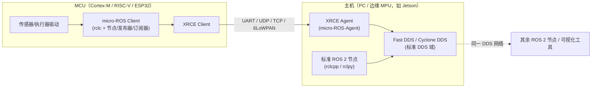

# 01 · micro-ROS 与嵌入式

> **位置**：08-ROS / 05_前沿趋势
> **难度**：⭐（入门级，理解定位与架构即可）
> **前置知识**：[模块一：ROS 2 节点/话题/服务基础](../01_基础概念/)、[模块二：DDS 通信模型与 RMW](../02_核心模块/)
> **最后更新**：2026-08-25

---

## 1. 概述

micro-ROS 是 ROS 2 官方生态中面向 **资源极度受限微控制器（MCU）** 的延伸子项目，目标是把 ROS 2 的编程模型（节点、话题、服务、动作）带到运行 **RTOS 或裸机** 的嵌入式芯片上：ARM Cortex-M 系列、RISC-V、DSP，以及带 Wi-Fi 的 SoC（如 ESP32）。它的核心思路不是"把整个 ROS 2 塞进 MCU"，而是做一个**轻量客户端**，通过网络（串口/UART、UDP、TCP、6LoWPAN）把话题和服务代理到一个跑在 PC 或 MPU 上的 **micro-ROS Agent**，由 Agent 替 MCU 完成与标准 DDS 网络的对接。

一句话定位：**micro-ROS 让一颗几十 KB RAM 的单片机，以"一等公民"身份加入 ROS 2 的 DDS 数据总线**，从而打通"传感器 MCU → 边缘计算 → 云端/整机"的完整链路。

---

## 2. 核心概念

### 2.1 micro-ROS 的定位：ROS 2 的"瘦客户端"

micro-ROS 不是新的机器人框架，而是 ROS 2 的一个**集成层**。它复用了 ROS 2 的标准接口定义（ROS 2 客户端库 API、.msg/.srv/.action 类型、话题/服务/动作语义），但在实现上做了大幅裁剪：

| 维度 | 标准 ROS 2 节点（rclcpp/rclpy） | micro-ROS 节点 |
|------|--------------------------------|----------------|
| 目标硬件 | PC / MPU（Ubuntu、Windows、macOS） | MCU（Cortex-M、RISC-V、ESP32） |
| 操作系统 | Linux / Windows / macOS | RTOS（FreeRTOS、Zephyr、NuttX）或裸机 |
| 中间件 | 完整 DDS（Fast DDS、Cyclone DDS 等） | Micro XRCE-DDS（见 2.2） |
| 内存占用 | 数十 MB 级 | 数十 KB 级（RAM 可低至 10 KB 量级） |

### 2.2 Micro XRCE-DDS：给 DDS 做的"极瘦"协议

DDS 的完整实现（含 RTPS 线协议、发现机制、QoS 协商）对 MCU 太重。micro-ROS 底层采用 **Micro XRCE-DDS**（DDS for eXtremely Resource Constrained Environments），由 eProsima 维护，是一个**客户端-代理（Client–Agent）** 协议：

- **XRCE Client**：运行在 MCU 上，只实现一套精简的请求/响应语义（创建实体、发布/订阅、读写数据）；
- **XRCE Agent**：运行在资源充足的主机上，持有真正的 DDS 实体，代表 Client 与完整 DDS 域通信。

这套设计把重量级的 DDS 发现、序列化、传输细节全部推给 Agent，MCU 只保留最必要的状态机。

### 2.3 Client + Agent 的双进程架构

micro-ROS 的运行时由两部分构成，它们之间通过一条可插拔的**传输层**（transport）通信：

- **micro-ROS Client（节点端）**：MCU 上由 `rclc`（micro-ROS 客户端库，基于 rcl）驱动的节点、发布器、订阅器、服务、执行器；
- **micro-ROS Agent（代理端）**：通常是一个独立进程 `micro-ROS-Agent`，通过命令行指定串口或 UDP 端口接入，并把 Client 的话题桥接到本机的 DDS 域。



### 2.4 与标准 ROS 2 节点的互通

micro-ROS 的**关键价值**在于"透明互通"：Agent 把 Client 侧的话题直接映射到标准 DDS 域后，任何标准 ROS 2 节点（rclcpp/rclpy）都能像订阅普通话题一样订阅 MCU 发出的数据，反之亦然。因此 MCU 侧代码里的 `rclc_publisher_publish()`，在主机的 `ros2 topic echo /imu` 里就能直接看到——开发者无需关心底层的 XRCE 协议细节。

---

## 3. 技术原理 / 现状分析

### 3.1 官方支持平台（已核实）

micro-ROS 官方文档与硬件支持列表明确指出其跨 RTOS、跨芯片的定位（来源见第 7 节）：

- **RTOS 支持**：FreeRTOS、Zephyr、NuttX（以及基于它们的分支）；
- **芯片/开发板**：官方硬件支持页（micro.vulcanexus.org 的 Supported Hardware 页）列出 Olimex STM32-E407、ESP32 系列、Zephyr 支持的大量板卡（Nordic nRF、ST Nucleo 等）；
- **传输层**：串口（UART）、UDP、TCP、自定义传输（如 6LoWPAN、CAN、SPI 等可扩展）；
- **与 RTOS 无关性**：micro-ROS 官方明确其"RTOS 无关 / 硬件无关"的设计目标。

> ⚠️ 提示：硬件列表会随版本演进，具体板卡请以 micro.ros.org 与 micro.vulcanexus.org 的"Supported Hardware"页实时内容为准，本文不逐板卡罗列。

### 3.2 功能覆盖：不是"全部 ROS 2"

micro-ROS 官方提供了一张 **ROS 2 特性对照表**（micro.ros.org 的 "ROS 2 feature comparison" 页），明确标注哪些 ROS 2 特性已支持、部分支持或不支持。要点：

- **支持**：节点、话题发布/订阅、服务客户端/服务端、动作（有限支持）、QoS 基础能力、`.msg/.srv` 类型；
- **受限/不支持**：完整的 DDS 发现与多域能力、部分高级 QoS、部分 rclcpp 高级特性；
- **执行模型**：micro-ROS 提供单线程执行器（executor），由用户显式调用 `rclc_executor_spin_some()`，天然契合 RTOS 的任务调度模型。

### 3.3 典型落地场景

1. **传感器节点**：IMU、编码器、温湿度、距离传感器等直接挂在 MCU 上，以话题对外广播（例如 `/imu`、`/odom`）；
2. **低成本控制器/执行器节点**：电机驱动、舵机、继电器控制，通过服务或话题接收指令；
3. **机群/外设解耦**：把大量低速率外设从主控下放到多个 MCU，主控只跑核心算法。

---

## 4. 实践指南（当前可落地路径）

### 4.1 最小闭环：让 MCU 话题出现在主机 ROS 2 里

**Step 1 — 准备主机侧 Agent**（Ubuntu 上，已装 ROS 2）：

```bash
# 通过官方安装脚本或包管理器安装 micro_ros_agent
sudo snap install micro-ros-agent   # 官方提供 snap（示例，以官方文档为准）
# 以串口方式启动 Agent（/dev/ttyUSB0 为例）
micro-ros-agent serial --dev /dev/ttyUSB0 -b 115200
```

> 示例命令，需根据实际框架/发行版调整。

**Step 2 — 构建 MCU 固件**：使用 `micro_ros_setup` 或直接在工程里引入 `rclc` + `Micro XRCE-DDS`，配置与 Agent 相同的传输（串口波特率、UDP 端口等）。

**Step 3 — 验证互通**：MCU 上电后，在主机执行 `ros2 topic list` 应能看到 MCU 发布的话题；`ros2 topic echo` 可直接读取数据。

### 4.2 选型建议

- **只想快速验证**：ESP32（有成熟社区样例与 Arduino 库 micro_ros_arduino）；
- **要量产/低功耗**：Cortex-M + FreeRTOS/Zephyr，配合自研传输；
- **已有 RTOS 工程**：优先评估 Zephyr（官方支持度高），其次 FreeRTOS。

---

## 5. 方案对比

| 方案 | 适用目标 | 资源需求 | 与标准 ROS 2 互通 | 典型场景 |
|------|----------|----------|-------------------|----------|
| **micro-ROS** | MCU / RTOS | 极低（几十 KB RAM） | 通过 Agent 透明互通 | 传感器/执行器/低成本节点 |
| **标准 ROS 2（rclcpp/rclpy）** | MPU / Linux | 高（数十 MB+） | 原生 | 定位、建图、规划、视觉 |
| **裸 UART/自定义协议 + 网关** | 极简外设 | 最低 | 需自写桥接 | 非 ROS 生态的既有外设 |
| **ROS 1（roscpp）在嵌入式** | 老系统兼容 | 中 | 需 ros1_bridge | 存量 ROS 1 设备 |

**绝对不适用场景**：需要高吞吐、大数据量（如原始点云/图像流）的**本地实时处理**。micro-ROS 的目标是低速率的控制与传感器数据，把高清视频流走 XRCE 到 MCU 既无意义也会击穿其带宽与内存设计边界；这类负载应直接由 MPU 上的标准 ROS 2 节点承担。

---

## 6. 工具链

| 工具/组件 | 作用 | 来源 |
|-----------|------|------|
| `micro-ROS-Agent` | 主机侧代理进程 | micro-ROS 官方仓库 |
| `micro_ros_setup` | 工程/固件脚手架生成 | micro-ROS 官方仓库 |
| `rclc` | MCU 侧客户端库（基于 rcl） | micro-ROS 官方仓库 |
| Micro XRCE-DDS | 底层 Client–Agent 协议 | eProsima |
| `micro_ros_arduino` | Arduino 生态封装 | micro-ROS 官方仓库 |
| Vulcanexus micro | eProsima 打包的 micro-ROS 发行版与文档 | micro.vulcanexus.org |
| Docker 镜像 | 官方编译/调试环境 | micro-ROS/docker |

---

## 7. 参考资料（均经核实）

- micro-ROS 官网：<https://micro.ros.org/>
- micro-ROS 源码组织：<https://github.com/micro-ros>
- 官方硬件支持列表：<https://micro.vulcanexus.org/docs/overview/hardware/>
- Micro XRCE-DDS 概念文档：<https://micro.vulcanexus.org/docs/concepts/middleware/Micro_XRCE-DDS/>
- eProsima Micro XRCE-DDS 产品页：<https://www.eprosima.com/middleware/add-ons/micro-xrce-dds>
- ROS 2 特性对照表：<https://micro.ros.org/docs/overview/ROS_2_feature_comparison/>
- micro-ROS Docker：<https://github.com/micro-ROS/docker>
- micro_ros_arduino（系统要求）：<https://github.com/micro-ROS/micro_ros_arduino>

---

## 8. 学习路径

1. **打底**：先理解 ROS 2 话题/服务的语义（模块一），再理解 DDS/RMW 的角色（模块二）；
2. **跑通样例**：用 ESP32 + 官方 Arduino 样例，让 `/imu` 出现在主机 `ros2 topic list`；
3. **看懂协议**：通读 Micro XRCE-DDS 概念文档，弄清 Client/Agent 的实体生命周期；
4. **进阶**：把 micro-ROS 接入自研 Cortex-M 工程（FreeRTOS/Zephyr），自定义传输层；
5. **纵向延伸**：结合 [模块五 04 · 跨平台与 Web 节点](04_ROS2跨平台与Web节点.md) 理解边缘侧（Jetson）如何承接 MCU 与云端之间。

---

## 9. 核心面试三问

**Q1：micro-ROS 为什么能跑在几十 KB RAM 的 MCU 上，却还能和标准 ROS 2 节点互通？**
答：它把完整 DDS 的重量级工作（发现、序列化、QoS 协商、传输）委托给主机侧的 **micro-ROS Agent**，MCU 侧只跑一套极瘦的 **XRCE Client**（Micro XRCE-DDS 协议），通过串口/UDP 等轻量传输与 Agent 通信；Agent 把 MCU 的实体映射进标准 DDS 域，因此对 rclcpp/rclpy 节点"透明"。

**Q2：micro-ROS 和"标准 ROS 2 装进嵌入式 Linux（如 Raspberry Pi）"有什么本质区别？**
答：二者目标不同——Pi 属于 MPU，跑完整 Linux + 完整 DDS，是"标准 ROS 2"；micro-ROS 面向 **MCU/RTOS**，靠 Client–Agent 代理接入。判断边界看资源与 OS：能跑 Linux 就用标准 ROS 2，只有 MCU/RTOS 才需要 micro-ROS。

**Q3：micro-ROS 最大的局限是什么？在什么场景下你会放弃它？**
答：带宽与功能子集。它适合低速率的控制/传感器数据，不适合大吞吐流（原始点云/图像）；且部分高级 QoS、多域 DDS 能力受限。遇到高带宽本地处理、强实时确定性控制（需硬实时）或需要完整 DDS 语义的场景，我会改用 MPU + 标准 ROS 2（必要时配合实时内核，见模块三实时性内容）。
