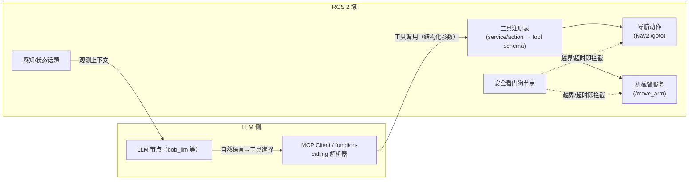

# 02 · ROS 2 与大模型融合

> **位置**：08-ROS / 05_前沿趋势
> **难度**：⭐（趋势判断与技术选型，重在看清方向与风险）
> **前置知识**：[模块一：服务/动作通信](../01_基础概念/)、[模块二：节点生命周期与参数](../02_核心模块/)、对 LLM function calling 有基本了解
> **最后更新**：2026-08-25

---

## 1. 概述

"大模型 + 机器人"是 2024–2026 年最热的前沿交叉点之一。把它放到 ROS 2 语境下，本质是一道**接口工程题**：如何让一个"说自然语言、输出不确定结果"的大模型（LLM/VLM/VLA），安全、实时地驱动一个"确定性、强约束、对错误零容忍"的机器人软件栈。ROS 2 在这里扮演的不是"被替代者"，而是**执行层的骨架与边界**——规划、感知、控制仍是 ROS 2 节点，LLM 只是新增的一类"高层决策/理解节点"。

本文四个方向（VLA 动作模型、LLM 工具调用、点云+语言多模态、语义地图/具身智能）均只引用经核实存在的论文与开源项目（详见第 7 节）。

---

## 2. 核心概念

### 2.1 VLA（Vision-Language-Action）模型

VLA 把"视觉观测 + 语言指令"直接映射为**机器人动作**（末端位姿、关节增量等），跳过传统的"感知→规划→控制"显式管线。代表工作 OpenVLA、RT-2 见 3.1。

### 2.2 LLM 工具调用（Function Calling）与 ROS 2 服务/动作的映射

LLM 不是直接发话题，而是输出一个"想调用哪个工具、传什么参数"的**结构化调用**；这个"工具"可以 1:1 映射为 ROS 2 的**服务（.srv）**或**动作（.action）**。这是当前 LLM 与 ROS 2 融合最成熟、最可落地的模式。

### 2.3 MCP（Model Context Protocol）作为中间层

MCP 是连接 LLM 应用与外部工具/数据的开放协议。把 ROS 2 能力封装成 **MCP Server**（暴露 topic/service/action 为"工具"），可以让任意支持 MCP 的 LLM 客户端直接操作 ROS 2，而不必把 ROS 2 绑死在某一家 LLM SDK 上。

### 2.4 语义地图 / 具身智能（Embodied AI）

把"3D 场景结构 + 开放词汇语义"编码进地图（如 3D 场景图），使机器人能用语言查询和推理空间对象（"在冰箱旁边找杯子"），是具身智能与 ROS 2 集成的前沿方向。

---

## 3. 技术原理 / 现状分析

### 3.1 VLA 模型（已核实代表工作）

- **OpenVLA**（《OpenVLA: An Open-Source Vision-Language-Action Model》，arXiv:2406.09246，代码开源在 github.com/openvla/openvla）：一个 7B 参数的开放 VLA 模型，基于 Prismatic VLM 微调，在 Open X-Embodiment 数据集上训练，支持跨机器人/跨任务的动作生成。它证明了"开放权重 + 可本地部署"的 VLA 是现实可行的。
- **RT-2**（《RT-2: Vision-Language-Action Models Transfer Web Knowledge to Robotic Control》，arXiv:2307.15818，Google DeepMind）：把 VLM 与机器人控制 token 联合训练，让模型把"网络知识"迁移到物理动作，是 VLA 范式的标志性工作之一。

> 现状判断：VLA 目前以**研究型开放模型**为主，端到端动作生成的**成功率与确定性仍不足以直接替代经典规划控制栈**，更多作为"高层技能选择/抓取位姿建议"的辅助。

### 3.2 LLM 工具调用 → ROS 2 服务/动作（已核实代表工作）

- **bob_llm**（github.com/bob-ros2/bob_llm）：一个 ROS 2 包，提供连接任意 OpenAI 兼容 API 的 LLM 节点，管理对话历史，并暴露**可动态加载的工具系统**，让 LLM 直接调用机器人功能。
- **ros2ai**（index.ros.org/r/ros2ai，作者 fujitatomoya）：面向 ROS 2 命令行与开发的 AI 助手，演示了 LLM 接入 ROS 2 开发工作流的路径。
- **robochain**（github.com/NoneJou072/robochain）：基于 ROS 2 + LLM 的机器人交互任务仿真框架，用于"大模型时代"的机器人交互研究。
- **ROS 2 MCP Server**：`amazing-ros2-mcp`（github.com/proxi666/amazing-ros2-mcp）、`rosclaw-nav2-mcp`（github.com/ros-claw/rosclaw-nav2-mcp）等，把 ROS 2 话题/服务/Nav2 能力封装为 MCP 工具，供 AI 助手调用。

**可落地集成模式（架构草图）**：



### 3.3 多模态感知：点云 + 语言（已核实代表工作）

- **Point-BERT**（《Point-BERT: Pre-training 3D Point Cloud Transformers with Masked Point Modeling》，arXiv:2111.14819，CVPR 2022）：把 BERT 式掩码预训练引入 3D 点云 Transformer，是点云自监督预训练的代表作。
- **Point-MAE**（《Masked Autoencoders for Point Cloud Self-supervised Learning》，arXiv:2203.06604，ECCV 2022）：用掩码自编码器在点云上做自监督学习，是点云"MAE"路线的代表。
- **PointLLM**（《PointLLM: Empowering Large Language Models to Understand Point Clouds》，arXiv:2308.16911）：把点云编码器与大语言模型对齐，让 LLM 理解 3D 点云并回答关于物体的问题，是"点云→语言"的代表。

> 现状判断：点云自监督预训练（Point-BERT/Point-MAE）已相对成熟，可产出更好的点云表征；但"点云+语言"（PointLLM 这类）仍偏研究，落地多用于场景理解与检索，而非实时控制。

### 3.4 语义地图 / 具身智能（已核实代表工作）

- **ConceptGraphs**（项目页 concept-graphs.github.io，开源实现见 GitHub）：从 RGB-D/点云构建**开放词汇 3D 场景图**，把物体与语义关系编码进地图，供 LLM 做空间推理与任务规划，是"语义地图 + 具身智能"方向被广泛引用的代表工作。

---

## 4. 实践指南（当前可落地路径）

### 4.1 落地路线（由易到难）

1. **最稳**：把 LLM 作为"任务分解器"，只输出**结构化指令**，动作仍由 ROS 2 经典节点执行（规划器/控制器不变）；
2. **常用**：LLM function calling 映射到**已封装的服务/动作**（导航、抓取、巡检），配合白名单工具集与参数校验；
3. **进阶**：用 MCP Server 统一暴露 ROS 2 能力，接入任意 MCP 客户端（Claude Desktop、自研 Agent 等）；
4. **研究性**：接入 VLA 或点云-语言模型做感知/动作建议，但必须有确定性的兜底控制。

### 4.2 最小示例（function calling → 服务，示意）

```python
# 伪代码示意：把 LLM 的 tool_call 转成 ROS 2 服务调用
# 需根据实际框架（bob_llm / 自研 MCP server）调整
tool = llm_output["tool_calls"][0]              # {"name":"navigate","args":{"x":1.0,"y":0.5}}
if tool["name"] == "navigate":
    req = NavigateToPose.Request()
    req.pose.header.frame_id = "map"
    req.pose.pose.position.x = tool["args"]["x"]
    req.pose.pose.position.y = tool["args"]["y"]
    future = nav_client.send_goal_async(req)    # Nav2 动作
    # 超时/越界由安全看门狗节点兜底
```

> 示例代码，需根据实际框架调整。

---

## 5. 方案对比

| 融合模式 | 模型可控性 | 实时性 | 安全隔离难度 | 当前成熟度 | 适用场景 |
|----------|-----------|--------|--------------|-----------|----------|
| LLM 只做任务分解（输出结构化指令） | 高 | 高（动作仍实时） | 低 | 高 | 巡检、分拣、服务机器人 |
| Function calling → 服务/动作 | 中 | 中 | 中（需白名单+校验） | 中高 | 自然语言操作机器人 |
| MCP Server 统一暴露 ROS 2 | 中 | 中 | 中 | 中 | 多客户端 AI 助手集成 |
| VLA 端到端动作生成 | 低 | 低（推理延迟） | 高 | 低（研究性） | 实验室研究、抓取建议 |
| 点云+语言语义理解 | 中 | 低 | 中 | 低（研究性） | 场景检索、语义标注 |

**绝对不适用场景**：需要**确定性硬实时安全闭环**（如工业机械臂避障、自动驾驶纵向控制）且无任何兜底控制的环节。LLM/VLA 的推理延迟不可预测、输出存在幻觉，直接让模型输出底层控制量而没有确定性看门狗，等于把安全交给概率。

---

## 6. 工具链

| 工具/项目 | 作用 | 来源 |
|-----------|------|------|
| bob_llm | ROS 2 的 LLM 接口节点 + 工具系统 | github.com/bob-ros2/bob_llm |
| ros2ai | ROS 2 CLI/开发 AI 助手 | index.ros.org/r/ros2ai |
| robochain | ROS 2 + LLM 交互仿真框架 | github.com/NoneJou072/robochain |
| amazing-ros2-mcp / rosclaw-nav2-mcp | ROS 2 的 MCP Server | 对应 GitHub 仓库 |
| openvla/openvla | 开源 VLA 模型与推理代码 | github.com/openvla/openvla |
| ConceptGraphs | 开放词汇 3D 场景图 | concept-graphs.github.io |
| Nav2 | 被 LLM 调用的导航动作后端 | 模块二/模块三相关文档 |

---

## 7. 参考资料（均经核实）

- OpenVLA 论文（arXiv:2406.09246）：<https://arxiv.org/abs/2406.09246>；代码：<https://github.com/openvla/openvla>
- RT-2 论文（arXiv:2307.15818）：<https://arxiv.org/abs/2307.15818>
- Point-BERT（arXiv:2111.14819）：<https://arxiv.org/abs/2111.14819>
- Point-MAE（arXiv:2203.06604）：<https://arxiv.org/abs/2203.06604>
- PointLLM（arXiv:2308.16911）：<https://arxiv.org/abs/2308.16911>
- ConceptGraphs 项目页：<https://concept-graphs.github.io/>
- bob_llm：<https://github.com/bob-ros2/bob_llm>
- ros2ai：<https://index.ros.org/r/ros2ai/>
- robochain：<https://github.com/NoneJou072/robochain>
- amazing-ros2-mcp：<https://github.com/proxi666/amazing-ros2-mcp>
- rosclaw-nav2-mcp：<https://github.com/ros-claw/rosclaw-nav2-mcp>

---

## 8. 学习路径

1. **补接口基础**：确认你清楚 ROS 2 服务与动作的语义（模块一）——这是 function calling 映射的落点；
2. **跑通一个 LLM 节点**：用 bob_llm 或自写一个 `LLM 节点 → 服务调用` 的最小闭环；
3. **理解 MCP**：把一个小型 ROS 2 服务封装成 MCP tool，接入一个 MCP 客户端；
4. **读 VLA 论文**：通读 OpenVLA、RT-2 的动机与局限，理解"为什么端到端还不能替代规划控制"；
5. **安全设计**：研究如何加"白名单 + 参数校验 + 看门狗"（结合 [模块五 03 · 安全标准与自动驾驶](03_ROS2安全标准与自动驾驶.md) 的安全网关思路）。

---

## 9. 核心面试三问

**Q1：为什么不直接让 LLM 输出话题消息或底层控制量，而是要走服务/动作 + function calling？**
答：话题是无状态流、缺少"请求-应答-反馈-取消"语义与生命周期管理；服务/动作天然有结构化请求、返回、反馈、可取消，便于做参数校验、白名单、超时与看门狗。让 LLM 输出有边界的高层意图（调用哪个动作），而不是无界的连续控制流，是工程上可控性最强的落点。

**Q2：VLA 和"LLM function calling + 经典规划控制"两条路线各自的适用边界是什么？**
答：VLA 适合**开放场景、任务多样、对动作精度要求相对宽松**的抓取/操作研究，优势是少写规则、泛化好，劣势是推理延迟不确定、成功率不可证、难做安全认证；function calling + 经典栈适合**结构化、可枚举、需可审计可认证**的场景（巡检、工业、导航），动作仍由确定性算法执行，LLM 只做意图层。

**Q3：把 LLM 接入 ROS 2，三大风险（幻觉、实时性、安全隔离）你分别怎么缓解？**
答：幻觉→白名单工具集 + 参数类型/范围校验 + 执行前确认；实时性→LLM 只跑在非实时侧，动作节点保持硬实时，LLM 输出延迟不进入控制回路；安全隔离→把 LLM 放进独立节点/容器与受限网络域，经"安全网关"转发（见模块三安全网关模式），并对所有动作设超时与越界拦截。
