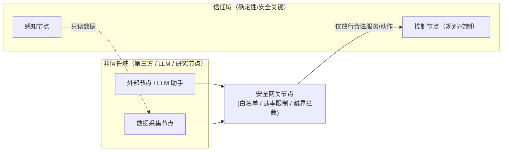

# 03 · ROS 2 安全标准与自动驾驶

> **位置**：08-ROS / 05_前沿趋势
> **难度**：⭐（偏行业判断与架构选型，不涉及深入认证流程）
> **前置知识**：[模块三：ROS 2 安全架构（DDS-Security/SROS 2）](../03_高级话题/05_ROS2安全架构(SROS2).md)、[模块二：DDS 与 QoS](../02_核心模块/)
> **最后更新**：2026-08-25

---

## 1. 概述

自动驾驶是 ROS 2 在"产业侧"最有想象空间、也最苛刻的落地场景。这里的核心矛盾在于：ROS 2 天生是一个**研究/原型友好、但默认不承诺功能安全（Functional Safety）与确定性**的中间件，而车规量产要求 **ISO 26262（道路车辆功能安全）** 下的可认证、可追溯、确定性行为。因此，自动驾驶方向的 ROS 2 前沿，本质是两条线索：

1. **用 ROS 2 做原型/验证/仿真**（研究、测试、数据回灌）——已经很成熟；
2. **把 ROS 2 或它的衍生品推进到"可认证"**——由 Apex.AI 等公司推动，仍有大量工作，本文只陈述可核实的公开事实。

---

## 2. 核心概念

### 2.1 DDS-Security：通信层的安全底座

ROS 2 通过 DDS-Security 提供**身份认证、访问控制、加密**（详见 [模块三：ROS 2 安全架构](../03_高级话题/05_ROS2安全架构(SROS2).md)）。在自动驾驶栈里，它的作用是防止**未授权节点**订阅感知/控制话题或注入恶意指令——这是"多源软件栈"上车的最低安全门槛，但它只解决通信安全，**不解决功能安全**。

### 2.2 ISO 26262 / ASIL：功能安全等级

ISO 26262 针对道路车辆电子电气系统的功能安全，按风险划分 **ASIL A–D**（D 最高）。ROS 2 原版并不自带 ASIL 认证；把 ROS 2 用于安全相关功能，需要**衍生实现 + 认证证据链**。

### 2.3 确定性与实时性

车规控制要求**确定性调度、有界延迟**。ROS 2 通过 executor 回调、QoS、实时内核（PREEMPT_RT）等可以接近实时，但"默认 Linux + 默认 DDS"不提供硬实时保证——这是 ROS 2 上车必须显式处理的问题。

### 2.4 安全网关（Safety Gateway）模式

一个工程上常用的隔离手段：把系统划分为**信任域**（安全关键、确定性）与**非信任域**（研究/第三方/L 大模型节点），中间用一个**安全网关节点**做白名单过滤、速率限制、越界拦截，只放行合法的服务/动作请求。

---

## 3. 技术原理 / 现状分析

### 3.1 ROS 2 + ISO 26262：公开工作现状（已核实）

- **Apex.AI**（apex.ai，公司官网可查）提供 **Apex.OS**——一个面向量产自动驾驶的软件平台，官方定位为"通过 ISO 26262 ASIL-D 认证的 ROS 2 衍生实现"。这是当前"ROS 2 路线走向车规"最直接的商业代表。
- **社区讨论**：Open Robotics Discourse 存在专题讨论《How to enable ROS to pass the safety certification of the automotive industry?》（discourse.openrobotics.org/t/27819），可见"ROS 过车规认证"是社区持续关注但**尚无官方统一方案**的话题。

> 现状判断：**"原版 ROS 2 整体通过 ISO 26262"目前没有公开可查的官方认证案例**；公开路径是"衍生实现（Apex.OS）+ 针对性认证"，以及"把 ROS 2 限定在非安全相关/ASIL-QM 环节"。其余声称请视为待验证。

### 3.2 飞行与自动驾驶栈中的 ROS 2 角色

#### PX4 + ROS 2（已核实）

PX4 自动驾驶仪（无人机/无人车飞控）与 ROS 2 的桥接有**官方文档**：PX4 User Guide 的 `ros/ros2_comm.md` 说明 PX4 通过 **uXRCE-DDS**（在 ROS 2 侧即 `microdds_client` 或 `ros2` + XRCE 支持）与 ROS 2 节点通信。典型分工：**PX4 负责底层姿态/位置控制（安全关键），ROS 2 负责上层规划、感知、任务逻辑**——这是一个清晰的"确定性底层 + 灵活上层"分层范例。

#### Autoware（已核实）

Autoware 是**基于 ROS 2 的开源自动驾驶软件栈**（autowarefoundation.github.io 提供官方文档），覆盖感知、定位、规划、控制全链路，被广泛用于研究、仿真与商业衍生（如 AutoCore 的 PCU，见 96boards 博客）。它是"ROS 2 作为自动驾驶主框架"最成熟的开源证据。

### 3.3 车厂/企业的真实公开案例（已核实，其余标注待验证）

| 主体 | 公开事实 | 来源 |
|------|----------|------|
| Apex.AI | Apex.OS 定位为 ASIL-D 认证的 ROS 2 衍生 OS | apex.ai/about |
| AutoCore | 基于 Autoware 的自动驾驶控制器 PCU | 96boards.org 博客 |
| ADLINK | 提供 ROS 2 工业控制器/计算机（ROScube 等） | adlinktech.com |
| Woven by Toyota | Toyota 软件子公司，公开活动涉及 ROS/机器人软件 | woven.toyota |

> ⚠️ 说明：**具体整车厂"某款量产车使用了 ROS 2"的公开声明较少**，多为"研究/原型使用 ROS 2 + 量产走衍生实现"。本文不把任何未经核实的量产车型断言写死，相关细节统一视为"公开资料有限，待补充验证"。

---

## 4. 实践指南（当前可落地路径）

### 4.1 分层落地方案

1. **非安全侧**：直接用标准 ROS 2（Autoware、仿真、数据回灌、感知原型）——零门槛；
2. **桥接安全侧**：PX4 + ROS 2 官方桥接，让确定性飞控与灵活上层解耦；
3. **安全关键侧**：评估 Apex.OS 等衍生实现，并配套功能安全流程（HARA、安全分析、验证证据链）；
4. **通信安全**：启用 DDS-Security（模块三），配置身份/权限/加密。

### 4.2 安全网关模式示意

> 网关通常实现为：只暴露少量 `.srv/.action` 白名单、校验参数范围、对控制类请求限流与超时、记录审计日志。示例架构，需按实际框架实现。

---

## 5. 方案对比

| 方案 | 安全等级可达 | 确定性 | 工程量 | 适用场景 |
|------|-------------|--------|--------|----------|
| 标准 ROS 2（默认 DDS） | QM / 研究 | 低 | 低 | 研究、仿真、原型 |
| ROS 2 + DDS-Security | 通信安全增强 | 低 | 中 | 多源节点隔离、防注入 |
| ROS 2 + 实时内核 + QoS 调优 | 接近实时 | 中 | 中高 | 要求有界延迟的非 ASIL 环节 |
| Apex.OS（ROS 2 衍生） | ASIL-D（厂商宣称） | 高 | 高 | 量产安全关键功能 |
| PX4 + ROS 2 桥接 | 底层飞控已有安全设计 | 中高 | 中 | 无人机/无人车上层规划 |

**绝对不适用场景**：直接把**原版 ROS 2（默认 Linux + 默认 DDS，无认证证据链）**用于需要 ISO 26262 ASIL 认证的**安全关键功能**并声称"已满足车规"。功能安全是流程 + 证据 + 实现共同作用的结果，不是换个中间件就能达成的。

---

## 6. 工具链

| 工具/项目 | 作用 | 来源 |
|-----------|------|------|
| SROS 2 / DDS-Security | ROS 2 通信安全 | 模块三：ROS 2 安全架构 |
| PX4 + uXRCE-DDS | 飞控与 ROS 2 桥接 | PX4 User Guide（ros2_comm.md） |
| Autoware | 开源自动驾驶栈 | autowarefoundation.github.io |
| micro-ROS Agent（XRCE） | PX4 桥接的 XRCE 侧 | 见 [01 micro-ROS](01_microROS2与嵌入式.md) |
| Apex.OS | ROS 2 车规衍生实现（商业） | apex.ai |
| ADLINK ROScube | 工业/车规 ROS 2 硬件 | adlinktech.com |

---

## 7. 参考资料（均经核实）

- PX4 ROS 2 通信官方文档：<https://github.com/PX4/PX4-user_guide/blob/main/en/ros/ros2_comm.md>
- Autoware 官方文档：<https://autowarefoundation.github.io/autoware-documentation/>
- Apex.AI 官网：<https://www.apex.ai/about>
- ROS 车规安全认证社区讨论：<https://discourse.openrobotics.org/t/how-to-enable-ros-to-pass-the-safety-certification-of-the-automotive-industry/27819>
- AutoCore PCU（96boards 博客）：<https://www.96boards.org/blog/autocore_pcu_1/>
- ADLINK ROS 2 方案：<https://www.adlinktech.com/en/ros2-solution>
- Autoware Core（ROSCon JP 2025 演讲）：<https://roscon.ros.org/jp/2025/presentations/11.pdf>

---

## 8. 学习路径

1. **安全底座**：先吃透 [模块三：ROS 2 安全架构](../03_高级话题/05_ROS2安全架构(SROS2).md) 的 DDS-Security/SROS 2；
2. **跑通分层栈**：用 PX4 SITL + ROS 2 官方桥接跑一个仿真闭环，体会"确定性底层 + 灵活上层"；
3. **摸清车规**：读 ISO 26262 概要与 Apex.AI 的公开材料，理解 ASIL、HARA、认证证据链；
4. **动手隔离**：实现一个安全网关节点（白名单 + 限流 + 审计），体会隔离域设计；
5. **回看 LLM 风险**：结合 [02 · 大模型融合](02_ROS2与大模型融合.md)，把 LLM 节点归入"非信任域"并走网关。

---

## 9. 核心面试三问

**Q1：ROS 2 能用 DDS-Security 加密通信了，是不是就满足车规安全了？**
答：不是。DDS-Security 解决的是**通信安全**（认证、授权、加密，防注入/窃听），而车规要求的是**功能安全（ISO 26262）**——即使通信完全可信，节点本身的逻辑错误、时序不可预测、失效行为仍会导致危险。二者是正交的：安全关键系统两者都要，但不能互相替代。

**Q2：为什么量产自动驾驶很少看到"直接用原版 ROS 2"，而是用 Apex.OS 这类衍生实现？**
答：因为功能安全认证需要**确定性、可追溯、可验证的实现与完整证据链**，而原版 ROS 2 默认 Linux + DDS 不承诺硬实时与确定性，也难以整体取证。衍生实现（Apex.OS）保留 ROS 2 生态/接口兼容性，同时重构/加固底层以满足 ASIL 证据要求。原版 ROS 2 更多承担研究、原型与非安全环节。

**Q3：无人机里 PX4 和 ROS 2 是怎么分工的？为什么这么分？**
答：PX4 负责底层姿态/位置控制与安全关键飞行逻辑（确定性、已在飞控侧做安全设计），ROS 2 负责上层规划、感知、任务编排。这么分是因为**安全关键功能放在有确定性保证的飞控侧**，而灵活多变的上层逻辑放在开发效率高的 ROS 2 侧，二者通过 uXRCE-DDS 桥接——这也是"分层安全"的典型体现。
