# 第零章 · ROS 2 技术全景图谱

> **目标**：建立 ROS 2 的全景视角，理解其演进、分支、架构、选型。
> **覆盖范围**：80%+ 关键技术 | **更新时间**：2026-08-25
> **读者假设**：有 C++/Python 基础，对发布订阅、中间件有初步概念。

---

## 0.1 ROS 2 技术演进时间线

```
2008       2012        2014-2016     2016         2019-2021       2022           2024            2025          2026
  |          |            |            |             |              |               |               |             |
[ROS 1 开]→[OSRF 成立]→[ROS 2 立项]→[Ardent 首发]→[每 9 个月 1 版]→[Humble LTS]→[Jazzy LTS 发布]→[Kilted 发布]→[L 系列]
[开源]     [基金会]     [设计阶段]    [首个发行版]   [Crystal 起     [5 年支持      [5 年支持,       [年度发布,    [Lyrical Luth
                                                   冻结发行版]     至 2027]     Python 3 全面]   多平台成熟]  官方公告发布

```

### 各阶段详解

| 阶段 | 时间 | 核心特征 | 代表技术/项目 |
|------|------|----------|--------------|
| ROS 1 时代 | 2008-2016 | Willow Garage / Stanford 起源的开源机器人软件框架；`master` 单点协调；单机假设；无内建安全 | ROS 1 (ros.ros.org), moveit, nav_stack (ros1) |
| 治理成型 | 2012-2014 | 非营利基金会出现（2012 年社区资料记载的基金会成立），项目治理从单一公司走向社区/基金会 | OSRF（非营利，具体沿革以官方页为准，待细核） |
| ROS 2 设计与落地 | 2014-2016 | 为"多机、实时、安全、多平台"重新设计通信底座；选 DDS 替代自研通信 | Ardent Aesthetics（2016 首个发行版） |
| 年度发行版节奏 | 2019-2021 | Crystal/Dashing/Eloquent/Foxy/Galactic：约 9-12 个月一个发行版，字母序命名 | rclcpp/rcl/rmw 分层稳定，ros2cli 成型 |
| LTS 常态化 | 2022 | Humble Hawksbill（2022-05）为 5 年支持的 LTS 版 | Humble + nav2/moveit2 全面 ROS 2 化 |
| 当前主力 LTS | 2024-2029 | **Jazzy Jalisco**（2024-05 发布）：官方定位 LTS、5 年支持 | Jazzy + Gazebo(gz) 生态 |
| 年度版 | 2025-2026 | **Kilted Kaiju**（2025-05 发布）；**Lyrical Luth**（2026-05 发布，✅ 官方公告：[ROS 2 Lyrical Luth Released!](https://discourse.openrobotics.org/t/ros-2-lyrical-luth-released/55021)；官方文档已含 `lyrical` 分支，如 [Windows-Install-Binary](https://docs.ros.org/en/lyrical/Installation/Windows-Install-Binary.html)） | Kilted, Lyrical, rolling |

> 发行版名称遵循"字母序 + 押韵词"惯例（Ardent → Bouncy → … → Kilted → Lyrical），每版冻结后独立维护；
> **Jazzy（以及前序 Humble）是当前的 LTS 主力**（官方：[Jazzy Jalisco Released](https://www.openrobotics.org/blog/2024/5/ros-jazzy-jalisco-released)，Kilted 发布说明：[Release-Kilted-Kaiju](https://docs.ros.org/en/rolling/Releases/Release-Kilted-Kaiju.html)）；
> Kilted 与 Lyrical 为年度版（Lyrical Luth 于 2026-05 官方公告发布，其支持级别以官方文档为准）。
> 完整发行版与支持周期以官方 [Releases](https://docs.ros.org/en/rolling/Get-Started/Releases.html) 与 [Roadmap](https://docs.ros.org/en/humble/The-ROS2-Project/Roadmap.html) 为准。

---

## 0.2 ROS 2 技术分支知识图谱

```mermaid
graph TD
    Root["ROS 2（中间件 + 工具集 + 生态）"]

    Root --> M1["核心运行时"]
    Root --> M2["通信与 QoS"]
    Root --> M3["应用框架"]
    Root --> M4["机器人功能栈"]
    Root --> M5["工程化"]
    Root --> M6["安全与实时"]

    M1 --> M1a["rcl（C 运行时：context/waitset/guard condition）"]
    M1 --> M1b["rclcpp（C++ 客户端库）"]
    M1 --> M1c["rclpy（Python 客户端库）"]
    M1 --> M1d["executors / callback groups（调度模型）"]

    M2 --> M2a["DDS（Fast DDS / Cyclone DDS / 其他）"]
    M2 --> M2b["RMW 抽象层（rmw 接口屏蔽 DDS 差异）"]
    M2 --> M2c["QoS 策略（reliability/durability/history/liveliness）"]
    M2 --> M2d["进程内通信 / 组件化 / 共享内存"]

    M3 --> M3a["launch 系统（python/xml 声明式启动）"]
    M3 --> M3b["ros2 CLI（node/topic/srv/param/action/bag 等动词）"]
    M3 --> M3c["参数系统与动态重配置"]
    M3 --> M3d["rosbag2（记录回放，mcap 存储插件）"]
    M3 --> M3e["lifecycle 节点（状态机管理）"]
    M3 --> M3f["TF2（坐标变换树）"]

    M4 --> M4a["Nav2（移动机器人导航：BT 行为树）"]
    M4 --> M4b["MoveIt 2（机械臂运动规划：OMPL 等）"]
    M4 --> M4c["ros2_control（控制器/硬件抽象统一接口）"]
    M4 --> M4d["感知栈（SLAM / ekf_localization / 点云）"]
    M4 --> M4e["仿真（Gazebo(gz) / Isaac Sim* / Webots*）"]

    M5 --> M5a["colcon + ament 构建体系"]
    M5 --> M5b["index.ros.org 二进制包仓库"]
    M5 --> M5c["CI/CD 与构建农场"]
    M5 --> M5d["测试（gtest/pytest + 集成 + 仿真回归）"]

    M6 --> M6a["SROS2 / DDS-Security（认证/加密/访问控制）"]
    M6 --> M6b["实时化（RT 纪律 / PREEMPT_RT / 调度）"]
    M6 --> M6c["micro-ROS（MCU 侧 ROS 2）"]
```



> 带 * 的项目为具体支持情况以官方文档为准（见 04 模块与 05 模块，个别条目标注待验证）。

### 分层心智模型（自上而下）

```
┌─────────────────────────────────────────────────────────────┐
│  应用层：你的节点 + Nav2 / MoveIt2 / ros2_control / 感知      │
├─────────────────────────────────────────────────────────────┤
│  客户端库：rclcpp (C++) / rclpy (Python)                     │
├─────────────────────────────────────────────────────────────┤
│  rcl：C 语言运行时（context · waitset · guard condition）     │
├─────────────────────────────────────────────────────────────┤
│  rmw：中间件抽象纯虚接口（rmw_send / rmw_take / rmw_wait…）   │
├─────────────────────────────────────────────────────────────┤
│  RMW 实现：rmw_fastrtps / rmw_cyclonedds / …                 │
│  DDS 厂商：eProsima Fast DDS / Open Source(C++) Cyclone DDS / │
└─────────────────────────────────────────────────────────────┘
```

**关键设计**：rcl/rmw 的解耦使"同一份应用代码可以换底层 DDS"——这是 ROS 2 相对 ROS 1 最大的架构进步（详见 [03_ROS2架构分层详解](03_高级话题/01_ROS2架构分层详解.md)）。

---

## 0.3 技术选型指南

### 按场景选择

| 场景 | 推荐方案 | 备选方案 | 理由 |
|------|----------|----------|------|
| 学习/原型 | Jazzy LTS | Kilted | LTS 文档/包最齐，5 年支持 |
| 生产部署（长生命周期） | Jazzy LTS | Humble（存量项目） | 官方 LTS 定位，生态成熟 |
| 需要新特性/新 API | Lyrical / rolling | Kilted | Lyrical 为最新年度版（2026-05），新特性先进 rolling |
| MCU 传感器节点 | micro-ROS | 标准 ROS 2（x86） | micro-ROS 专为 Cortex-M/RISC-V 设计（详见 [05_microROS2](05_前沿趋势/01_microROS2与嵌入式.md)） |
| 实时控制环（≥1kHz） | C++ 组件化 + RT 纪律 + 共享内存 | Python 不可 | 详见 [03_实时性](03_高级话题/03_实时性与任务调度.md) |
| 机械臂规划 | MoveIt 2 | 自研 IK/规划器 | 成熟求解器栈 |
| 移动底盘导航 | Nav2 | ROS 1 nav（仅存量） | BT 恢复、多机、QoS |
| 跨 DDS 性能敏感链路 | 按 RMW 对比选型 | 默认 Fast DDS | 详见 [06_RMW对比](03_高级话题/06_RMW实现对比(FastDDS_vs_CycloneDDS).md) |

### 按团队规模选择

| 团队规模 | 推荐栈 | 理由 |
|----------|--------|------|
| 1-3 人 | Jazzy + Python(rclpy) + 单层 launch | 上手快，单 distro 即可 |
| 5-20 人 | Jazzy + C++/Python 混编 + ament 分包 + CI(pre-commit+colcon test) | 接口契约化，测试兜底 |
| 20+ 人 | 上述 + 独立 DDS/RMW 选型组 + 安全组(SROS2) + 仿真回归流水线 | 多域隔离、审计与可维护性成为主要矛盾 |

### 语言选型

| 层 | 推荐语言 | 理由 |
|----|----------|------|
| 高实时控制环、驱动、感知热点 | C++ | 无 GIL、可 RT 纪律 |
| 业务逻辑、规划、学习/数据 | Python | 开发效率高（注意 GIL 限制，见 [02_线程模型](03_高级话题/02_线程模型与Executor深度解析.md)） |
| 混合 | 同进程组件化 | 进程内通信省序列化/拷贝 |

---

## 0.4 核心术语表

| 术语 | 英文 | 定义 |
|------|------|------|
| 节点 | Node | ROS 2 进程内的可复用计算单元（可组件化、可多 context 隔离） |
| 话题 | Topic | 发布订阅的命名通道，节点间解耦通信 |
| 发布者/订阅者 | Publisher/Subscriber | 话题两端；默认 QoS reliable + volatile + keep_last(10) |
| 服务 | Service | 请求-应答语义，适合短任务 |
| 动作 | Action | 目标-反馈-结果三段式，适合长任务可取消 |
| 参数 | Parameter | 节点级可动态读写配置，类型化 |
| QoS | QoS | 质量策略四维：reliability/durability/history/liveliness |
| DDS | DDS | OMG 数据分发中间件，ROS 2 的通信底座之一 |
| RMW | rmw | ROS 2 中间件抽象层，屏蔽具体 DDS 实现 |
| rcl | rcl | ROS 2 的 C 运行时（context/waitset/guard condition） |
| Executor | executor | rclcpp/rclpy 的事件调度循环（wait → take → invoke） |
| 回调组 | Callback group | 同一 group 内互斥/可重入的回调调度单元 |
| 生命周期节点 | Lifecycle node | 带状态机（unconfigured→inactive→active…）的节点 |
| TF2 | tf2 | ROS 2 的坐标变换库（frame 为节点、transform 为边的有向图） |
| ROSBag2 | rosbag2 | 话题记录/回放系统，存储插件机制（mcap 默认，sqlite3 旧） |
| 发行版 | Distro | ROS 2 按字母序冻结的发布版本（Jazzy/Kilted/…） |
| 工作空间 | Workspace | `src/` + 构建产物，colcon 构建的基本单元 |
| 进程内通信 | Intra-process | 同进程订阅跳过 DDS，直接传对象 |
| 组件节点 | Composable node | 可编译成 .so、同进程加载的节点 |
| micro-ROS | micro-ROS | MCU 侧的 ROS 2 轻量实现（agent 代理模式） |
| SROS2 | SROS2 | ROS 2 安全方案（DDS-Security：认证/加密/访问控制） |

---

## 0.5 行业生态

### 主流厂商/组织

| 组织 | 定位 | 代表产品 |
|------|------|----------|
| Open Robotics（公司） | ROS 2 的核心开发与发布方 | Jazzy/Kilted 等发行版、ros2_control、导航/移动平台 |
| eProsima | Fast DDS 厂商；ROS 2 TSC RMW 报告贡献方 | Fast DDS、rmw_fastrtps |
| Cyclone DDS 维护方（社区/Open Source 组织，具体署名以官方为准） | Cyclone DDS 生态 | rmw_cyclonedds |
| ROS 2 TSC（技术指导委员会） | 跨包版本治理、发布决策 | 发行版发布流程（见 [Releases](https://docs.ros.org/en/rolling/Get-Started/Releases.html)） |
| Open Robotics 博客 / ROSCon | 社区与会议 | [Open Robotics Blog](https://www.openrobotics.org/blog/)、ROSCon（[roscon.ros.org/2026](https://roscon.ros.org/2026/)，Toronto） |
| Index | 二进制包仓库 | [index.ros.org](https://index.ros.org/help/tutorial/) |
| ros2（GitHub org） | 核心源码仓库集合（rcl/rclcpp/rmw_*/ros2cli…） | [github.com/ros2](https://github.com/ros2) |

### 社区资源

- 官方文档（Jazzy）：https://docs.ros.org/en/jazzy/
- 发行版说明：https://docs.ros.org/en/rolling/Get-Started/Releases.html
- 路线图：https://docs.ros.org/en/humble/The-ROS2-Project/Roadmap.html
- ros2_control 文档：https://control.ros.org/
- TSC RMW 年度报告：https://osrf.github.io/TSC-RMW-Reports/humble/eProsima-response.html（eprosima 回应页；同目录含其他 RMW 报告）
- 社区论坛（Discourse）：https://discourse.openrobotics.org/（✅ 已验证，主域名；discourse.ros.org 亦可见上传资源，具体主站以官方指引为准）
- Lyrical Luth 发布公告（2026-05）：https://discourse.openrobotics.org/t/ros-2-lyrical-luth-released/55021（✅ 已验证）
- REP 2000（ROS 2 Releases and Target Platforms）：https://docs.ros.org/en/independent/api/rep/html/rep-2000.html（✅ 已验证）
- ROSCon 活动：https://roscon.ros.org/2026/（Toronto 2026，✅ 已验证）
- 二进制包仓库 index.ros.org：https://index.ros.org/help/tutorial/（✅ 已验证）
- Windows 预编译安装：https://docs.ros.org/en/lyrical/Installation/Windows-Install-Binary.html（✅ 已验证，注意官方文档分支已含 lyrical）

> 组织署名与具体产品归属建议以各官方页为准；本表不做强断言，待细核后回填。

---

## 0.6 本章总结

- **ROS 2 的本质**：一套"中间件 + 工具集 + 生态"，不是操作系统；通信底座是 DDS，分层为 rcl/rmw/DDS 三层（[架构详解](03_高级话题/01_ROS2架构分层详解.md)）。
- **演进主线**：从"单机"假设到"多机/实时/安全/多平台"四支柱（[01_什么是ROS2](01_基础概念/01_什么是ROS2.md)）。
- **当前 LTS**：Jazzy Jalisco（2024-05，5 年支持），Kilted Kaiju（2025-05）是年度版；**Lyrical Luth**（2026-05 官方公告发布，✅ 已核实）为最新年度版。
- **功能栈三大件**：Nav2（移动导航）/ MoveIt 2（机械臂）/ ros2_control（控制抽象），叠加感知与仿真形成完整机器人栈（[05_导航与运动控制栈](04_工程实践/05_导航与运动控制栈(Nav2_MoveIt2_ros2control).md)）。
- **工程化成熟**：colcon/ament 构建、index 包仓库、CI/测试、SROS2 安全、micro-ROS 到 MCU，构成从实验室到量产的完整链条（[04_模块导读](04_工程实践/README.md)）。

---

**📅 最后更新**：2026-08-25
